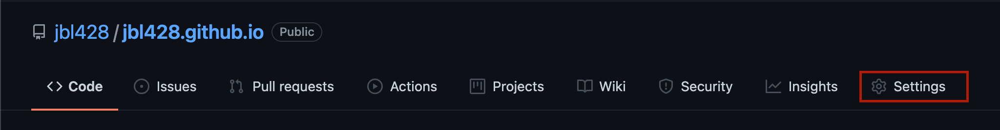
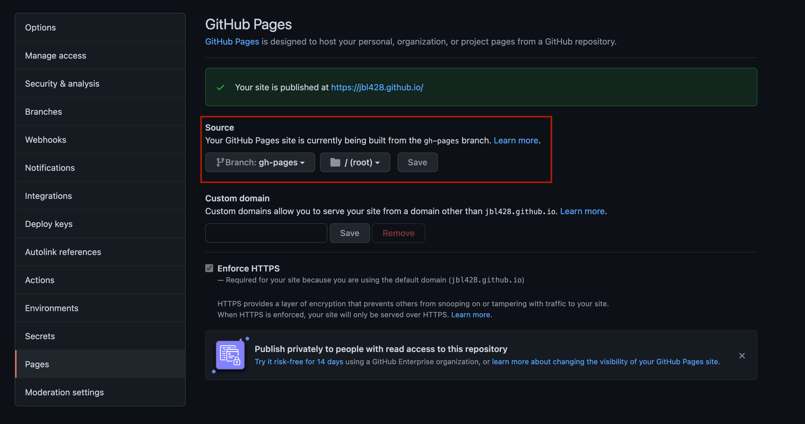

기술 블로그를 위해 어떤 플랫폼을 사용할지 고민하다가 직장 동료가 `Docusaurus` 를 추천해주었다.  
다크모드를 지원하고 크게 커스텀하지 않아도 쓸만한 블로그를 만들 수 있을거같았다.  
그래서 첫 블로그 글로 구축한 내용을 공유하려고 한다.

<!--truncate-->

개인적으로 기술관련 환경을 세팅할 때에는 블로그 보다는 공식문서를 활용한다.  
블로그 글은 작성 당시에는 맞는 설치방법이었지만 시간이 지나 버전이 올라가는 경우 그대로 따라하면 제대로 동작하지 않는 경우가 많기 때문이다.  
그렇기에 이 글을 그대로 따라하여 구축하기 보다 참고용으로 활용하고 공식문서를 주로 이용하기를 권장한다.

## 환경

블로그를 위해 사용한 기술과 각 버전은 다음과 같다.

- Docusaurus (with typescript): 2.0.0-beta.15
- GitHub Page
- GitHub Action

관련 저장소는 아래 링크를 참조한다.

https://github.com/jbl428/jbl428.github.io

## GitHub 저장소 생성

`GitHub Page` 는 깃허브에서 제공하는 무료 호스팅 서비스이다. 블로그나 포트폴리오 같은 정적 사이트로 주로 사용된다.  
깃허브에 들어가서 저장소를 생성하는데 이름은 `<사용자이름>.github.io` 형태로 설정해주고 나머지 옵션은 상황에 따라 적절히 설정한다.  
이후 해당 저장소를 clone 한다.

```shell
git clone https://github.com/<사용자이름>/<사용자이름>.github.io.git
```

## Docusaurus 설치

저장소 루트 디렉토리로 이동한 다음 아래 명령어를 수행한다.

```shell
npm init docusaurus@latest temp classic --typescript
```

`temp` 디렉토리에 docusaurus 관련 파일이 들어가는데 저장소 루트로 모두 이동한다.

```shell
mv temp/* .
mv temp/.* .
```

## 기본설정

`docusaurus.config.js` 파일에는 `Docusaurus` 에 대한 설정이 들어있다.  
각 항목에 대한 설명은 [문서](https://docusaurus.io/ko/docs/docusaurus.config.js) 를 참조한다.

```jsx {3-11} title="docusaurus.config.js"
module.exports = {
  // ...
  title: "사이트 제목",
  tagline: "사이트 설명",
  url: "https://<사용자이름>.github.io",
  baseUrl: "/",
  onBrokenLinks: "throw",
  onBrokenMarkdownLinks: "warn",
  favicon: "img/favicon.ico",
  organizationName: "<사용자이름>",
  projectName: "<사용자이름>.github.io",
  // ...
};
```

## 배포 설정

`GitHub Action` 을 활용해서 `main` 브랜치에 푸시가 일어나면 빌드를 수행하고 `gh-pages` 브랜치로 결과를 푸시하는 설정을 해준다.  
[링크](https://docusaurus.io/ko/docs/deployment#triggering-deployment-with-github-actions) 를 참조해서 5번 단계까지 작업을 해준다.  
마지막 6번 단계인 `workflow` 파일을 만드는 부분만 아래처럼 해준다.

:::info
`<이메일>` 과 `<이름>` 부분을 적절히 수정하도록 한다.  
:::

```yaml title=".github/workflows/blog.yml"
name: blog

on:
  push:
    branches: [main]

jobs:
  gh-release:
    runs-on: ubuntu-latest
    steps:
      - uses: actions/checkout@v1
      - uses: actions/setup-node@v1
        with:
          node-version: "12.x"
      - uses: webfactory/ssh-agent@v0.5.0
        with:
          ssh-private-key: ${{ secrets.GH_PAGES_DEPLOY }}
      - name: Release to GitHub Pages
        env:
          USE_SSH: true
          GIT_USER: git
          DEPLOYMENT_BRANCH: gh-pages
          CURRENT_BRANCH: main
        run: |
          git config --global user.email "<이메일>"
          git config --global user.name "<이름>"
          if [ -e yarn.lock ]; then
            yarn install --frozen-lockfile
          elif [ -e package-lock.json ]; then
            npm ci
          else
            npm i
          fi
          npm run deploy
```

## 보관소 페이지 추가

처음에는 [John Reilly archive](https://blog.johnnyreilly.com/blog-archive) 처럼 모든 게시글을 연도별로 정리한 페이지를 추가하고자 이분의 저장소 코드를 복사해서 사용했다.  
하지만 공식문서를 보니 이미 위와 같은 기능이 `Docusaurus` 에 반영된 것을 확인하였다.  
아래처럼 적절한 경로에 값을 추가하면된다.

```jsx {7,15} title="docusaurus.config.js"
module.exports = {
  // ...
  presets: [
    [
      {
        blog: {
          archiveBasePath: "archive",
        },
      },
    ],
  ],
  // ...
  themeConfig: {
    navbar: {
      items: [{ to: "/archive", label: "Archive", position: "left" }],
    },
  },
  // ...
};
```

## i18n 설정

기본 언어 설정을 한글로 하기위해 로케일 설정을 해준다.

```jsx {3-6} title="docusaurus.config.js"
module.exports = {
  // ...
  i18n: {
    defaultLocale: "ko",
    locales: ["ko"],
  },
  // ...
};
```

그리고 아래 명령어를 수행하면 `i18n` 디렉토리 밑에 각종 레이블에 대한 json 파일이 생성된다.

```shell
yarn docusaurus write-translations
```

내용을 살펴보면 한글로 번역이 안된 부분이 있는데 적절히 수정해준다.

```json title="i18n/ko/code.json"
  "theme.blog.archive.title": {
    "message": "보관소",
    "description": "The page & hero title of the blog archive page"
  },
  "theme.blog.archive.description": {
    "message": "모든 게시물",
    "description": "The page & hero description of the blog archive page"
  }
```

```json title="i18n/ko/docusaurus-plugin-content-blog/options.json"
  "sidebar.title": {
    "message": "최근 게시물",
    "description": "The label for the left sidebar"
  }
```

## GitHub Page 로 사용할 브랜치 설정

저장소의 어떤 브랜치의 특정 경로를 웹페이지로 사용할 것인지 설정해야한다.  
배포설정을 통해 `gh-pages` 브랜치의 루트에 정적파일이 생성되므로 아래 화면처럼 설정한다.





## 마지막

이제 `https://<사용자이름>.github.io` 페이지에 접속하면 만든 블로그를 확인할 수 있다.  
하지만 댓글을 작성할 수 있는 기능은 없는데 추후 게시글로 작성하려고 한다.

## 참고자료

- Docusaurus 공식문서: https://docusaurus.io/ko/docs
