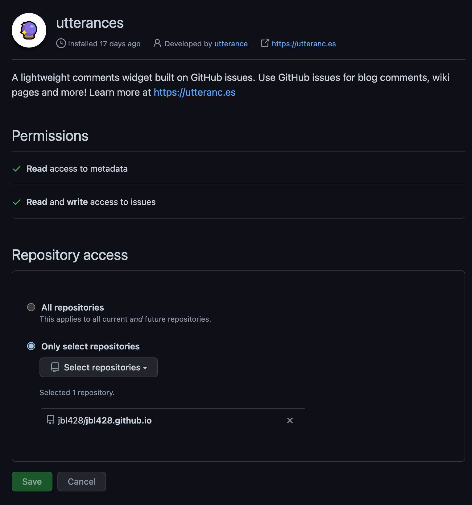

[utterances](https://utteranc.es/) 는 `GitHub 이슈` 를 이용해서 원하는 사이트의 댓글 기능을 만들어주는 서비스이다.  
따라서 github 계정이 존재해야 댓글 작성이 가능하지만 개발에 관련 글을 작성할 예정이라 큰 문제는 아니었다.  
만약 다른 소셜 로그인도 지원하고 싶다면 [disqus](https://disqus.com/) 같은 서비스를 사용하면 된다.

<!--truncate-->

`docusaurus` 에 `utterances` 를 연동하는 방법에 관한 문서를 검색해보았는데 딱 하나 존재했다.

- https://younho9.dev/docusaurus-manage-docs-2

해당 글을 참조해서 연동하였지만 모든 부분을 그대로 따라하지는 않았다.  
테마에 따라 `utterances` 의 테마도 똑같이 수정하는 코드는 많은 도움이 되었다.

## utterances 사전 설정

utterances 연동하려면 github 저장소가 public 이어야 한다.  
저장소가 [utterances app](https://github.com/apps/utterances) 을 사용하도록 설정해야 한다.  
링크를 누른 후 `Configure` 를 누른 후 github 로그인 후 아래 화면처럼 저장소를 선택한고 `Save` 를 누른다.



## docusaurus 테마 컴포넌트 수정

검색한 글에서는 `swizzle` 명령어를 통해서 `docusaurus` 가 내부적으로 사용하는 컴포넌트를 직접 수정해서 사용했다.  
하지만 [공식문서](https://docusaurus.io/ko/docs/using-themes#swizzling-theme-components) 를 보면 권장하는 방법은 아니다.  
해당 컴포넌트가 버전이 올라가면 변경될 가능성이 있기 때문이다.  
따라서 해당 글의 아래 부분에 있는 [테마 컴포넌트 감싸기](https://docusaurus.io/ko/docs/using-themes#wrapping-theme-components) 기능을 사용했다.  
그러면 기존 컴포넌트의 소스는 건들지 않고 utterances 를 위한 로직만 추가하면 되기에 더 안전하다.  
테마에 따라 utterances 의 테마도 바뀌는 로직을 포함한 전체 코드는 아래와 같다.

:::info
`<사용자이름>` 부분을 적절히 수정한다.  
:::

```jsx title="src/theme/BlogPostItem.tsx"
import React, { useEffect, useRef } from "react";
import OriginalBlogPostItem from "@theme-original/BlogPostItem";
import { useColorMode } from "@docusaurus/theme-common";

const utterancesSelector = "iframe.utterances-frame";

function BlogPostItem(props) {
  const { isDarkTheme } = useColorMode();
  const utterancesTheme = isDarkTheme ? "github-dark" : "github-light";
  const containerRef = useRef(null);

  useEffect(() => {
    if (!props.isBlogPostPage) return;

    const utterancesEl = containerRef.current.querySelector(utterancesSelector);

    const createUtterancesEl = () => {
      const script = document.createElement("script");

      script.src = "https://utteranc.es/client.js";
      script.setAttribute("repo", "<사용자이름>/<사용자이름>.github.io");
      script.setAttribute("issue-term", "pathname");
      script.setAttribute("label", "comment");
      script.setAttribute("theme", utterancesTheme);
      script.crossOrigin = "anonymous";
      script.async = true;

      containerRef.current.appendChild(script);
    };

    const postThemeMessage = () => {
      const message = {
        type: "set-theme",
        theme: utterancesTheme,
      };

      utterancesEl.contentWindow.postMessage(message, "https://utteranc.es");
    };

    utterancesEl ? postThemeMessage() : createUtterancesEl();
  }, [utterancesTheme]);

  return (
    <>
      <OriginalBlogPostItem {...props} />
      {props.isBlogPostPage && <div ref={containerRef} />}
    </>
  );
}

export default BlogPostItem;
```

`src/theme/` 경로 밑에 `<컴포넌트 이름>.tsx` 파일을 생성하면 해당 컴포넌트를 커스텀 할 수 있다.  
`@theme-original/<컴포넌트>` 를 import 하면 원본 컴포넌트를 가져올 수 있고 해당 컴포넌트에 utterances 관련 내용만 추가하면 된다.

```jsx {2,7-11} title="src/theme/BlogPostItem.tsx"
import React, { useEffect, useRef } from "react";
import OriginalBlogPostItem from "@theme-original/BlogPostItem"; // 원본 컴포넌트 가져오기
import useThemeContext from "@theme/hooks/useThemeContext";

  ...

  return (
    <>
      <OriginalBlogPostItem {...props} />
      {props.isBlogPostPage && <div ref={containerRef} />} // 댓글 화면 추가
    </>
```

이제 댓글 기능이 제대로 되는지 확인해본다.

## 공식문서를 읽자

이전 글에서 말한 내용이지만 블로그 글은 참조용으로만 사용하고 공식문서를 메인으로 활용하는게 중요하다고 생각한다.  
만약 블로그 글만 참조했다면 `테마 컴포넌트 감싸기` 라는 기능을 몰랐을테고 더 좋은 연동방법을 적용하지 못했을것이다.  
이 글도 누군가에게 참고용으로만 사용되기를 바라며 더 좋은 방법을 찾아보고 적용하셨으면 좋겠다.

## 참고자료

- Docusaurus로 문서 관리하기 - 2: https://younho9.dev/docusaurus-manage-docs-2
