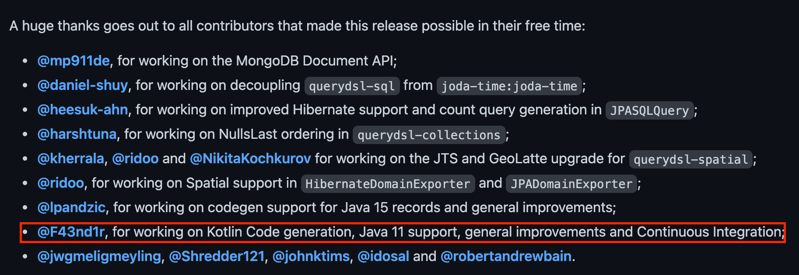

최근에 코틀린과 스프링을 활용해 사이드 프로젝트를 하면서 querydsl 사용을 위해 세팅한 작업을 남기려고 한다.  
자바로 된 querydsl 관련 블로그 글은 많은데 생각보다 코틀린은 적었고 제대로 적용이 안되어 고생을 하게되었다.

<!--truncate-->

## 최종 설정

결론부터 먼저 말하면 querydsl 버전을 현재 시점 최신버전인 `5.0.0` 을 사용하면 정상적으로 동작한다.  
그리고 `kotlinOption 의 jvmTarget` 버전과 `java.sourceCompatibility` 에 지정한 버전이 일치해야한다.  
gradle 설정은 아래와 같다.

```kotlin title="build.gradle.kts"
import org.jetbrains.kotlin.gradle.tasks.KotlinCompile

plugins {
    id("org.springframework.boot") version "2.6.2"
    id("io.spring.dependency-management") version "1.0.11.RELEASE"

    kotlin("jvm") version "1.6.10"
    kotlin("plugin.spring") version "1.6.10"
    kotlin("plugin.jpa") version "1.6.10"
    // highlight-next-line
    kotlin("kapt") version "1.6.10" // kapt 추가
}

repositories {
    mavenCentral()
}

// highlight-next-line
java.sourceCompatibility = JavaVersion.VERSION_11 // jvmTarget 과 같은 버전으로 지정

dependencies {
    // highlight-start
    // querydsl 관련 패키지 추가. 버전은 5.0.0 으로 지정
    implementation("org.springframework.boot:spring-boot-starter-data-jpa")
    implementation("com.querydsl:querydsl-jpa:5.0.0")
    kapt("com.querydsl:querydsl-apt:5.0.0:jpa")
    // highlight-end
}

tasks.withType<KotlinCompile> {
    kotlinOptions {
        freeCompilerArgs = listOf("-Xjsr305=strict")
        // highlight-next-line
        jvmTarget = "11" // java.sourceCompatibility 과 같은 버전 지정
    }
}

tasks.withType<Test> {
    useJUnitPlatform()
}
```

## 문제 상황

querydsl 공식문서에는 gradle 설정은 없고 maven 만 존재해서 여러 블로그 글을 참조해서 설정하려고 했다.  
문서에도 모두 4.x.x 버전을 쓰고있고 공식 홈페이지에도 4.4.0 이 최신버전인지라 그대로 사용했지만 Qclass 생성 시 아래 메시지가 출력되고 아무런 파일이 생성되지 않았다.

```shell
gradle clean compileKotlin
> Task :kaptKotlin
[WARN] Can't find annotation processor class com.querydsl.apt.jpa.JPAAnnotationProcessor: com/mysema/codegen/model/Type
```

`annotation processor` 관련 문제로 보여 관련 문서를 검색해고 제시된 해결방법을 시도해보았지만 여전히 같은 에러를 출력했다.  
kotlin 을 최신버전을 사용하고 있어서 새로운 호환성 문제가 생긴건지 의심이 들었고 querydsl 도 최신버전으로 올려서 시도해보았다.  
이후 해당 메시지는 사라졌지만 새로운 메시지가 출력됐다.

```shell
gradle clean compileKotlin
> Task :kaptKotlin
'compileJava' task (current target is 17) and 'compileKotlin' task (current target is 11) jvm target compatibility should be set to the same Java version.
```

이번 에러는 메시지만 봐도 쉽게 해결할 수 있는 내용이었고 `jvmTarget` 과 `java.sourceCompatibility` 를 동일하게 맞추니 정상적으로 동작했다.  
querydsl 5.0.0 릴리즈 노트를 보면 아래 내용이 있는데 자바 11 지원과 코틀린 코드 생성과 관련된 작업을 한것이 해결이 된 원인으로 보인다.


