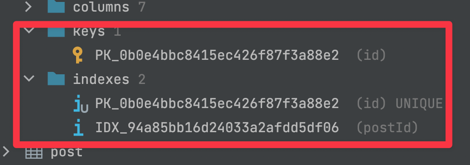
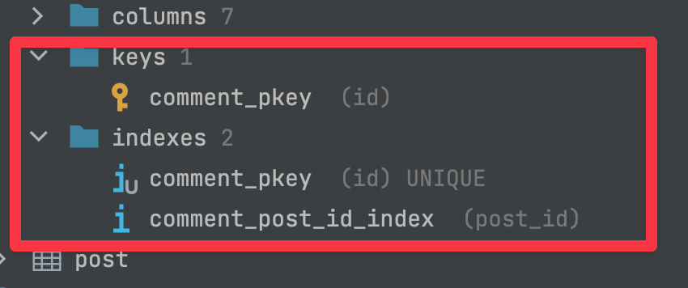
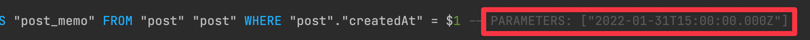
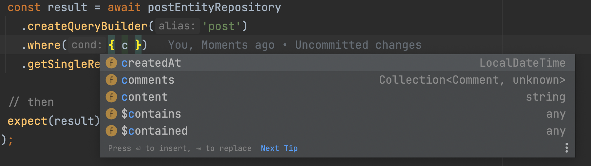
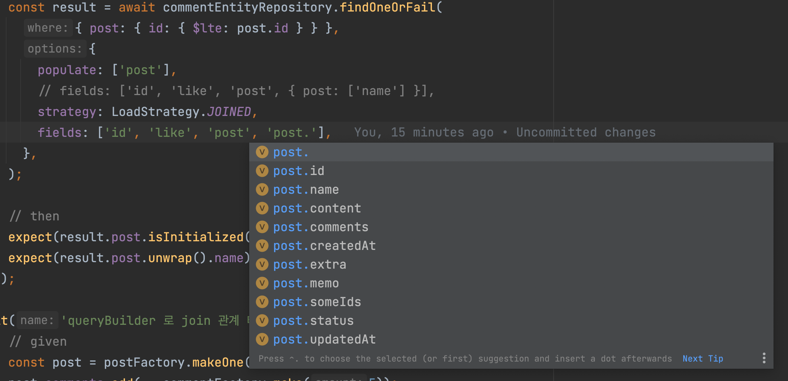
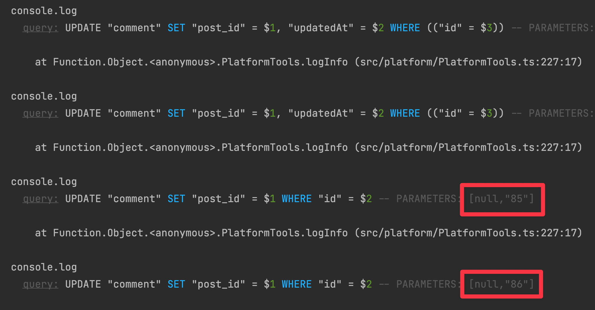

import Tabs from "@theme/Tabs";
import TabItem from "@theme/TabItem";

이번 글은 ts 환경에서 주로 사용되는 ORM 인 `TypeORM` 를 사용하면서 발생한 문제점을 소개하고 또 다른 ORM 인 `MikroORM` 에서 어떻게 해결하고 있는지에 대한 내용을 담고있다.

<!--truncate-->

## TypeORM

TypeORM 은 `JavaScript` 와 `TypeScript` 환경에서 사용하는 ORM (Object–relational mapping) 이다.  
주로 ts 진영에서 많이 사용하며 `Active Record` 와 `Data Mapper` 패턴을 지원한다.

처음 이 라이브러리를 발견했을 때에는 굉장히 마음에 들었지만 실무에서 계속 사용해보니 이름에 비해 생각만큼 typesafe 하지 않다고 느꼈으며 여러 이슈를 자주 겪었다.  
특히 이 라이브러리는 아직도 첫 major 버전이 나오지 않았을 정도로 업데이트가 더딘 상황이다.  
하지만 `TypeORM` 외에 더 나은 대안이 없는 상황이라 계속 사용하고 있었다.

## MikroORM

`MikroORM` 은 오랜기간 PHP 개발자였던 [Martin Adámek](https://github.com/B4nan) 가 Node.js 로 넘어오면서 만든 ORM 라이브러리다.  
넘어오면서 `TypeORM` 을 써봤는데 실망을 느껴 직접 만들었다고 한다.

> 이와 관련된 글은 [링크](https://medium.com/dailyjs/introducing-mikro-orm-typescript-data-mapper-orm-with-identity-map-9ba58d049e02) 에서 확인할 수 있다.

`MikroORM` 은 `Data Mapper`, `Unit of Work` 와 `Identity Map` 패턴을 지원한다.  
공식문서를 살펴보고 직접 예제를 만들어 보면서 느낀점은 `TypeORM` 에서 제대로 동작하지 않았던 **문제가 깔끔하게 해결되며 훨씬 typesafe** 하다는 것이었다.

이제 두 라이브러리를 기능과 타입안정성 측면에서 비교해보자.

:::info
이후 나오는 코드 `Nest.js` 환경에서 `Data Mapper` 패턴을 사용한 예제이며 전체 코드는 [링크](https://github.com/jbl428/study-note/tree/master/nodejs/orm) 를 참조한다.  
:::

## Entity 정의 방식

두 라이브러리 모두 클래스와 프로퍼티에 데코레이터를 추가해 엔티티를 정의한다.  
`MikroORM` 는 추가로 `EntitySchema` 라는 방식을 지원하며 스키마를 프로그래밍 하듯이 생성할 수 있다.  
이번 글에서는 주로 사용하는 데코레이터 방식을 사용할 것이다.

컬럼의 타입정보와 데코레이터의 메타데이터 정보를 얻기 위해 두 라이브러리 모두 `reflect-metadata` 를 사용한다.  
하지만 `MikroORM` 은 `ts-morph` 를 사용하는 방식을 추가로 지원하며 이를 사용하면 엔티티 선언이 더 간결해진다.

예제로 만들 엔티티는 `Post` 와 `Comment` 로 하나의 포스트에 여러 댓글이 존재하는 1:N 관계이다.  
먼저 `TypeORM` 의 경우 아래와 같이 선언한다.

<Tabs groupId="orm">
  <TabItem value="post" label="post.entity.ts" default>

```ts
@Entity()
export class Post extends BaseEntity {
  @Column()
  name: string;

  @Column()
  content: string;

  @Column({ type: "varchar", length: 10, transformer: new PostStatusType() })
  status: PostStatus; // 커스텀 타입

  @Column({ nullable: true })
  memo?: string;

  @OneToMany(() => Comment, (comment) => comment.post, {
    cascade: ["insert", "update"],
  })
  comments: Comment[];
}
```

  </TabItem>
  <TabItem value="comment" label="comment.entity.ts">

```ts
@Entity()
export class Comment extends BaseEntity {
  @Column()
  content: string;

  @Column()
  like: number;

  @Column({ nullable: true })
  memo?: string;

  @ManyToOne(() => Post, (post) => post.comments, {
    createForeignKeyConstraints: false,
    nullable: false,
  })
  @Index("idx_post_id")
  @JoinColumn({ name: "post_id", referencedColumnName: "id" })
  post: Post;
}
```

  </TabItem>
</Tabs>

`MikroORM` 은 다음과 같이 선언한다.

<Tabs groupId="orm">
  <TabItem value="post" label="post.entity.ts" default>

```ts
@Entity()
export class Post extends BaseEntity {
  @Property()
  name: string;

  @Property()
  content: string;

  @Property({ type: PostStatusType })
  status: PostStatus; // 커스텀 타입

  @Property()
  memo?: string;

  @OneToMany(() => Comment, (comment) => comment.post)
  comments = new Collection<Comment>(this);
}
```

  </TabItem>
  <TabItem value="comment" label="comment.entity.ts">

```ts
@Entity()
export class Comment extends BaseEntity {
  @Property()
  content: string;

  @Property()
  like: number;

  @Property()
  memo?: string;

  @ManyToOne({ index: true })
  post: IdentifiedReference<Post>;
}
```

  </TabItem>
</Tabs>

두 라이브러리 간의 차이점을 살펴보자

### 필드의 NULL 선언

원하는 필드를 `NULL` 로 설정하려면 `TypeORM` 에서는 데코레이터에 직접 `nullable` 값을 true 로 설정해야 한다.  
하지만 `MikroORM` 에서는 프로터티 타입을 nullable 로 선언하기만 하면 된다.  
이는 더 간결할 뿐만아니라 **ts 타입과 실제 컬럼의 타입의 동일함**을 보장해준다.

실제로 실무에서 데코레이터에는 `nullable` 로 선언했지만 ts 타입을 required 로 선언하는 경우가 많았다.  
이로인해 `Optional Chaining` 사용하지 않고 프로터피를 참조하다가 런타임 에러가 발생하는 경우가 많았다.  
ts 의 `strictNullCheck` 옵션을 활성화하면 nullable 타입을 참조하기 전에 null 체크를 필수로 해야하기에 더 안전한 개발이 가능하다.

### Foreign Key 제약조건 해제

테이블 연관관계 설정 시 `foreign key` 추가를 원하지 않을 때 `TypeORM` 에서는 매번 데코레이터에 `createForeignKeyConstraints` 옵션을 추가해야 한다.  
하지만 `MikroORM` 에서는 디비 관련 설정에서 FK 생성여부 기본값을 설정할 수 있다.  
다만 스키마 동기화 방법을 두 가지를 지원하는데 `schemaGenerator` 방식은 해당 옵션이 존재하지만 `migration` 방식은 직접 generator 를 구현해야 한다.

```ts
// migration 방식에서는 직접 foreign key 생성은 건너뛰도록 로직을 구현해야 한다
class CustomMigrationGenerator extends TSMigrationGenerator {
  createStatement(sql: string, padLeft: number): string {
    if (sql.includes(" add constraint ") || sql.includes(" drop constraint "))
      return "";

    return super.createStatement(sql, padLeft);
  }
}

const config: MikroOrmModuleOptions = {
  // ... 생략
  schemaGenerator: {
    // highlight-next-line
    createForeignKeyConstraints: false, // FK 생성하지 않도록 설정
  },
  migrations: {
    // highlight-next-line
    generator: CustomMigrationGenerator, // 커스텀 generator 설정
  },
};
```

### Index 명

:::info
TypeORM 에서 Naming strategy 를 통해 인덱스 명을 커스텀하게 지정할 수 있다는게 확인되서 두 라이브러리 간 차이는 없다.
https://orkhan.gitbook.io/typeorm/docs/naming-strategy
:::

FK 제약조건을 해제하면 참조 컬럼에 index 또한 생성되지 않는다.  
하지만 join 성능을 위해 index 는 필요하므로 직접 추가해야 한다.  
`TypeORM` 에서는 `@Index` 데코레이터를 사용하지만 `MikroORM` 에서는 `@ManyToOne` 데코레이터의 index 옵션을 사용하면 된다.

따로 인덱스명을 지정하지 않은경우 `TypeORM` 아래 사진처럼 알아보기 힘든 이름으로 사용하기에 (PK 도 동일) 에러 발생시 로그를 해석하기 어려워진다.  
따라서 직접 인덱스명을 지정해야 한다.



반면 `MikroORM` 은 읽기 쉬운 이름으로 생성하기에 직접 이름을 지정할 필요가 없다.



### 컬럼명 규칙

`TypeORM` 은 컬럼명의 네이밍 규칙이 `camelCase` 인 관계로 `snake-case` 을 원하는 경우 직접 이름을 지정해주어야 한다.  
물론 `namingStrategy` 설정과 `typeorm-naming-strategies` 라이브러리를 활용할 수 있지만 연관관계 컬럼명에는 적용이 안되기에 결국 `JoinColumn` 데코레이터에 직접 지정해야 한다.  
반면 `MikroORM` 은 기본값이 `snake-case` 이기에 따로 지정할 필요가 없다.

## Custom Type

두 라이브러리리 모두 필드에 기본 ts 타입대신 커스텀 타입으로 선언할 수 있는 방법을 제공한다.  
`TypeORM` 에서는 데코레이터의 transformer 설정이며 `MikroORM` 은 type 이다.  
커스텀 타입을 선언하는 방법은 두 라이브러리 모두 비슷하게 특정 interface 를 구현한 클래스를 만들면 된다.

날짜 관련 필드에 js date 대신 `js-joda` 의 `LocalDateTime` 을 사용하기 위한 커스텀 타입 구현부를 살펴보자.

<Tabs>
  <TabItem value="TypeORM" label="TypeORM" default>

```ts
export class LocalDateTimeType implements ValueTransformer {
  to(entityValue: LocalDateTime): Date {
    return convert(entityValue).toDate();
  }

  from(databaseValue: Date): LocalDateTime {
    return LocalDateTime.from(nativeJs(databaseValue));
  }
}
```

  </TabItem>
  <TabItem value="MikroORM" label="MikroORM">

```ts
export class LocalDateTimeType extends Type<LocalDateTime, Date> {
  convertToDatabaseValue(
    value: LocalDateTime | Date,
    platform: Platform
  ): Date {
    if (value instanceof Date) {
      return value;
    }

    return convert(value).toDate();
  }

  convertToJSValue(
    value: LocalDateTime | Date,
    platform: Platform
  ): LocalDateTime {
    if (value instanceof LocalDateTime) {
      return value;
    }

    if (typeof value === "number") {
      return LocalDateTime.from(nativeJs(new Date(value)));
    }

    return LocalDateTime.from(nativeJs(value));
  }

  getColumnType(prop: EntityProperty, platform: Platform) {
    return `timestamptz`;
  }
}
```

  </TabItem>
</Tabs>

두 라이브러리 모두 database 와 Node.js 간의 데이터 처리로직을 메소드에 작성한다.  
`TypeORM` 의 경우 단순히 from, to 메소드만 제공하지만 `MikroORM` 은 추가로 여러 상황에 사용되는 메소드를 제공한다.

> 어떤 메소드를 제공하는 지에 대한 내용은 [문서](https://mikro-orm.io/docs/custom-types) 를 참조한다.  
> 추가로 `MikroORM` 에서 기본으로 제공하는 타입도 있다.

#### 이슈

두 라이브러리 모두 `query builder` 를 사용하는 경우 커스텀 타입의 변환로직이 동작하지 않는 이슈가 있다.  
다음 테스트 코드를 살펴보자.

<Tabs>
  <TabItem value="TypeORM" label="TypeORM" default>

```ts
it("queryBuilder where 에 string 형태로 사용하는 경우 조회에 실패한다", async () => {
  // given
  const createdAt = LocalDateTime.of(2022, 2, 1);
  const post = PostFactory.make({ createdAt });
  await postRepository.save({
    ...post,
    updatedAt: LocalDateTime.now(),
  });

  // when
  const result = await postRepository
    .createQueryBuilder("post")
    .where("post.createdAt = :createdAt", { createdAt })
    .getMany();

  // then
  expect(result).toHaveLength(0);
});
```

  </TabItem>
  <TabItem value="MikroORM" label="MikroORM">

```ts
it("queryBuilder where 에 string 형태로 사용하는 경우 조회에 실패한다", async () => {
  // given
  const createdAt = LocalDateTime.of(2022, 2, 1);
  const post = postFactory.makeOne({ createdAt });
  await postEntityRepository.persistAndFlush(post);

  // when
  const result = await postEntityRepository
    .createQueryBuilder("post")
    .where("post.created_at = ?", [createdAt])
    .getResult();

  // then
  expect(result).toHaveLength(0);
});
```

  </TabItem>
</Tabs>

테스트 코드를 보면 먼저 given 절에서 임의의 post 하나를 insert 하였다.  
when 에서 `query builder` 를 사용해 post 를 가져오는데 where 절을 살펴보면 두 라이브러리 모두 첫 번째 파라미터에 컬럼명을 문자열로 지정하였다.  
이렇게 지정하면 두 번째 파라미터로 제공한 `createdAt` 변수의 타입인 `LocalDateTime` 의 변환로직이 실행되지 않는다.

실제 where 절에 어떤 값이 들어갔는지 살펴보면


`createdAt` 필드의 타입은 `timestamptz` 인데 위와 같이 타임존 값이 없는 데이터로 조회하면 database 의 타임존 설정에 따라 정상적으로 동작하지 않을 수 있다.  
위와 같은 상황에서는 두 라이브러리 모두 변환로직 대신 `LocalDateTime` 의 `toJSON` 메소드가 실행되며 해당 메소드는 타임존 값을 제거한 결과를 제공한다.

```ts
const date = LocalDateTime.of(2022, 2, 1);
console.log(date.toJSON()); // 2022-02-01T00:00
```

이를 해결하기 위해 직접 `toJSON` 메소드를 override 하면된다.

```ts
// highlight-start
// toJSON override
LocalDateTime.prototype.toJSON = function () {
  return convert(this).toDate().toISOString();
};
// highlight-end

... 생략

// when
const result = await postRepository
  .createQueryBuilder('post')
  .where('post.createdAt = :createdAt', { createdAt })
  .getMany();

// then
expect(result).toHaveLength(1); // 조회 성공
```



아니면 두 라이브러리 모두 where 절에 문자열 대신 json 을 활용해 컬럼을 지정하면 정상적으로 변환로직이 실행된다.

```ts
const result = await postRepository
  .createQueryBuilder("post")
  .where({ createdAt })
  .getMany();
```

추가로 `MikroORM` 은 where 절에서 엔티티 필드명에 대한 intellisense 를 지원한다.  
잘못된 필드명을 지정한 경우 타입 에러가 발생하지 않는점은 아쉽지만 오타를 작성할 확률을 낮춰주기 때문에 유용하다.



## QueryBuilder 로 특정 필드 select

두 라이브러리 모두 `select` 메소드를 통해 원하는 필드만 지정해서 가져올 수 있다.  
하지만 `TypeORM` 에서는 연관관계 필드 select 에 대한 이슈가 있다.

다음 코드를 살펴보자.

```ts
const result = await commentRepository
  .createQueryBuilder("comment")
  .select(["comment.id", "comment.post.id"])
  .where({ post: { id: post.id } })
  .getOneOrFail();

console.log(result); // Comment { id: 1n }
console.log(result.post); // undefined
```

Comment 엔티티의 id 필드와 post_id 필드만 가져오기 위해 select 절에 직접 지정하였다.  
하지만 결과를 보면 id 는 담기지만 post 는 undefined 가 된다.

쿼리 로그를 확인하면 올바르게 쿼리를 수행한 것을 확인할 수 있지만 그 결과를 인스턴스에 담을 때 연관관계 필드는 제대로 넣지 못하는 문제가 있다.

```sql
SELECT "comment"."id" AS "comment_id", "comment"."post_id" AS "comment_post_id"
FROM "comment" "comment"
WHERE "comment"."post_id" = $1
```

이를 해결하려면 `getOneOrFail` 대신 `getRawOne` 을 사용해 json 형태로 가져오거나 join 문을 명시적으로 지정해야 한다.

```ts
const result = await commentRepository
  .createQueryBuilder("comment")
  .select(["comment.id", "post.id"])
  .innerJoin("comment.post", "post") // join 지정
  .getOneOrFail();
```

엔티티 파일에 연관관계 컬럼에 대한 필드를 추가로 선언하는 방법(`RelationId` 데코레이터)도 있지만 transformer 가 동작하지 않는 문제와 필드를 가져오는 방법이 두 가지로 나눠지는 문제가 있다.

반면 `MikroORM` 에서는 위와 같은 문제가 발생하지 않는다.

```ts
const result = await commentEntityRepository
  .createQueryBuilder("comment")
  .select(["id", "post"])
  .where({ post: { id: post.id } })
  .getSingleResult();

console.log(result.post.id); // 값이 존재
```

하지만 join 테이블의 id 컬럼 외 다른 필드를 select 하려는 경우에 제대로 동작하지 않는 이슈가 있다.

```ts
const result = await commentEntityRepository
  .createQueryBuilder("c")
  .select(["c.id", "c.like", "post", "p.name"])
  .join("c.post", "p")
  .getSingleResult();

console.log(result.post.unwrap().name); // undefined
```

select 구문에 `p.name` 을 선언해 이름필드를 가져오도록 설정했지만 결과에는 담기지 않는다.  
그래서 join 대신 joinAndSelect 를 사용해야 하는데 이는 모든 엔티티의 필드를 select 하기에 비효율적이다.

```ts
const result = await commentEntityRepository
  .createQueryBuilder("c")
  .select(["c.id", "c.like", "post", "p.name"])
  .joinAndSelect("c.post", "p") // post 의 모든 필드 가져옴
  .getSingleResult();
```

## Smart Query Conditions

두 라이브러리 모두 `query builder` 관련 이슈가 존재하지만 `MikroORM` 의 경우 `Smart Query Conditions` 를 활용하면 복잡한 조회조건을 typesafe 하게 만들 수 있다.  
따라서 `query builder` 를 사용하지 않아도 대부분의 쿼리를 실행할 수 있다.  
예를들면 다음 조건을 만족하는 comment 들을 조회하는 상황을 가정해보자.

- post id 가 100
- 댓글 내용에 "text" 를 포함하거나 like 수가 10 이상

다음과 같은 코드를 작성하면 된다.

```ts
await commentEntityRepository.find({
  $and: [
    { post: { id: 100n } },
    { $or: [{ content: { $like: "%text%" } }, { like: { $gte: 10 } }] },
  ],
});
```

실제 수행하는 쿼리는 다음과 같다.

```sql
SELECT "c0".*
FROM "comment" AS "c0"
WHERE "c0"."post_id" = '100'
  AND ("c0"."content" LIKE '%text%' OR "c0"."like" >= 10)
```

find 메소드 파라미터의 키 중에 `$` 로 시작하는 것은 `MikroORM` 에서 지원하는 연산자로 `$and`, `$or` 와 같은 논리연산자와 `like`, `>=` 같은 비교연산자가 있다.  
만약 조건절에 지원하지 않는 연산자나 잘못된 필드명, 타입에 맞지않는 값을 전달하는 경우 타입에러가 발생하기 때문에 typesafe 한 장점이 있다.

> 지원하는 모든 연산자를 보려면 [링크](https://mikro-orm.io/docs/query-conditions) 를 참조한다.

## Repository 기본 조회 메소드

`find`, `findOne` 와 같은 조회 메소드의 경우 `TypeORM` 은 다음과 같은 단점이 존재한다.

- select 절에 join 하는 테이블의 필드는 지정할 수 없음
- 테이블 join 방식이 left join 으로 고정
- join 테이블 지정 옵션(relations) 의 타입이 단순 string 이라 intellisense 지원이 안되고 잘못 입력하면 런타임 에러 발생
- where 절에 유효하지 않는 필드명을 넣으면 런타임 에러 발생

이제 `MikroORM` 를 사용하면 어떻게 해결되는지 살펴보자.

### join 테이블 컬럼 select

intellisense 를 지원하며 join 필드의 경우에도 정상적으로 동작한다.



### join 방식

연관관계 테이블의 데이터를 조회할 시 `TypeORM` 처럼 left join 으로 가져올 수도 있고 select in 방식을 사용할 수 있다.  
strategy 옵션을 사용하며 따로 설정하지 않은 경우 기본값은 select in 이다.

select in 방식은 기본 엔티티만 먼저 조회 후 각 join 테이블에 대해서 각각 추가 쿼리를 실행한다.  
예를 들면 다음과 같은 코드를 실행한 경우

```ts
// like 수가 100 개가 넘어가는 comment 와 post 정보를 가져온다
const result = await commentEntityRepository.find(
  { like: { $gt: 100 } },
  {
    populate: ["post"],
    strategy: LoadStrategy.SELECT_IN, // select in 방식으로 조회
    fields: ["id", "like", "post", "post.name"],
  }
);
```

아래와 같은 두 개의 쿼리가 수행되며 그 결과를 병합해 Comment 인스턴스에 담는다.

```sql
select "c0"."id", "c0"."like", "c0"."post_id" -- post_id 자동으로 조회
from "comment" as "c0"
where "c0"."like" > 100

select "p0"."id", "p0"."name"
from "post" as "p0"
where "p0"."id" in ('1', '2', '3') -- 위 쿼리의 결과의 post_id 가 1, 2, 3 인 경우
order by "p0"."id" asc
```

:::info
TypeORM 도 0.3.0 버전 이후로 `relationLoadStrategy` 옵션을 통해 select in 방식을 사용할 수 있다.
:::

### join 테이블 지정

조회할 연관관계 테이블 지정 시 존재하지 않는 필드명을 넣으면 타입에러가 발생하며 nested 하게 지정할 수도 있다.  
만약 테이블과 관련없는 필드명을 넣은경우는 무시된다.

```ts
await commentEntityRepository.findOneOrFail(100n, {
  populate: ["post", "post.comments", "like"], // like 는 무시
});
```

### where 절 필드 지정

이전 `Smart Query Conditions` 에서 언급한 것처럼 유효하지 않는 필드명을 넣으면 타입에러가 발생한다.

## Cascade 및 Transaction

`TypeORM` post 엔티티의 comment 필드선언을 보면 `cascade` 옵션이 있는 것을 확인할 수 있다.

```ts
@OneToMany(() => Comment, (comment) => comment.post, {
  cascade: ['insert', 'update'],
})
comments: Comment[];
```

위 옵션은 post 엔티티에 save 액션이 일어난 경우 comment 도 같이 수정하려는 목적으로 쓴다.  
insert 에서는 큰 문제는 없으나 update 시 문제가 발생할 수 있다.  
다음 테스트 코드를 살펴보자.

```ts
it("transaction 테스트", async () => {
  // given
  const post = PostFactory.make();
  post.comments = [CommentFactory.make(), CommentFactory.make()];
  await postRepository.save(post);

  // when
  const update = () =>
    getManager().transaction(async (manager) => {
      post.content = "new content";
      await manager.save(post); // post.comment 도 같이 update 수행
    });

  // then
  await expect(update).rejects.toThrowError("violates not-null constraint");
});
```

post 에는 두 개의 comment 가 존재하고 트랜잭션 내에서 post 의 content 필드 수정 후 save 를 수행했다.  
comment 의 내용은 전혀 수정하지 않았기에 post 만 업데이트를 수행할것으로 기대하지만 실제로는 에러가 발생한다.

쿼리로그를 보면 comment 에 대해서 4 번의 update 가 발생하고 post_id 필드를 `null` 로 설정하려는 시도를 하며 `not null` 조건에 의해 에러가 발생하는 것이다.



이와같이 비정상적인 쿼리를 수행할 수 있기에 cascade 옵션 사용은 지양하는게 좋다.

반면 `MikroORM` 에서는 `Unit of Work` 와 `Identity Map` 패턴으로 인해 위와같은 문제가 발생하지 않는다.  
다음 테스트 코드를 살펴보자.

```ts
const post = await postEntityRepository.findOneOrFail(100n, {
  populate: ["comments"],
});

// 트랜잭션 내에서 persist 를 직접 호출하지 않아도 update 수행된다
await orm.em.transactional(async () => {
  post.content = "new content";
  post.comments[0]!.like = 12345;
});

// 또는 아래처럼 수행해도 같은 결과가 나온다
await postEntityRepository.persistAndFlush(post);
```

`MikroORM` 은 JPA 의 변경감지와 같은 기능이 있어 조회 메소드 결과를 내부적으로 캐시한 후 트랜잭션이 끝나면 두 값을 비교해 변경한 항목에 대해서만 update 를 수행한다.  
또한 `TypeORM` 의 save 와 같은 persist 메소드를 직접 호출하지 않아도 트랜잭션이 끝나면 작업을 수행한다.

`MikroORM` 은 JPA 의 영속성 컨텍스트와 같은 개념이 적용되어 있기에 이미 캐시에 존재하는 데이터를 찾는 경우에는 쿼리를 수행하지 않고 캐시에 있는 것을 바로 전달한다.

```ts
const post = postFactory.makeOne();
post.comments.add(...commentFactory.make(5));

// post 생성
await postEntityRepository.persistAndFlush(post);

// 동일한 post 조회
const newPost = await postEntityRepository.findOneOrFail(post.id, {
  populate: ["comments"],
});

// 두 변수는 동일한 인스턴스를 가리킴
console.log(newPost === post); // true
```

## Sqlite 지원

데이터베이스를 사용하는 통합 테스트 작성시 JVM 진영에서는 보통 h2 와 같은 경량 데이터베이스를 활용한다.  
Node.js 에서는 `sqlite` 를 활용해 테스트할 수 있지만 `TypeORM` 에서는 커스텀 타입 관련 이슈가 발생한다.

기본 엔티티 파일을 살펴보면 `createdAt` 필드를 js 내장 `Date` 대신 `LocalDateTime` 을 사용했다.

```ts
@Column({
  type: 'timestamptz',
  transformer: new LocalDateTimeType(),
  nullable: false,
  update: false,
})
createdAt: LocalDateTime;
```

sqlite 관련 설정을 한 후 테스트 코드를 실행하면 아래와 같은 에러가 발생한다.

```text
DataTypeNotSupportedError: Data type "timestamptz" in "Comment.createdAt" is not supported by "better-sqlite3" database.
```

기본 `Date` 타입 사용하면 정상적으로 동작하지만 테스트를 위해 커스텀 타입을 포기해야 하는 문제가 발생한다.  
반면 `MikroORM` 은 해당 이슈가 발생하지 않으며 커스텀 날짜 타입은 unix time 으로 변환되어 들어간다.

## 마무리

TypeScript 와 같은 정적 언어를 사용할 때의 큰 장점은 컴파일 단계 이전에 개발자의 실수를 사전에 잡아낼 수 있다는 것이다.  
`TypeORM` 을 사용하면서 위와 같은 장점을 얻기를 바랐지만 그동안 사용하면서 느낀점은 이름에 비해 생각보다 typesafe 하지 않다는 것이었다.

또한 여러 이슈가 발생해 해결방법을 찾는데 많은시간을 들였고 라이브러리의 발전속도가 느려 아쉬움이 많았다.  
이번에 `MikroORM` 을 살펴보면서 아직 사용자가 많지 않아 문서가 적다는 단점을 제외하면 상당히 잘 만들어진 라이브러리라고 느꼈다.  
현재 꾸준히 업데이트를 진행하고 있고 [nest.js 공식문서](https://docs.nestjs.com/recipes/mikroorm) 에도 포함되었기 때문에 사용자가 늘어날 가능성이 있다고 생각한다.
