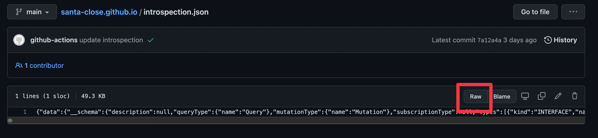

이번 글에서는 Github Page 를 GraphQL 스키마 서버로 활용하는 과정을 기술하려고 한다.

<!--truncate-->

## 상황

최근 GraphQL 을 사용하는 사이드 프로젝트를 진행하고 있는데 FE 에서 [graphql-codegen](https://www.graphql-code-generator.com/) 을 활용해 스키마 타입정보를 만들어야 하는 (codegen) 상황이 생겼다.  
보통 타입정보를 만들때에는 `introspection` 을 지원하는 GraphQL 서버 URL 을 제공하거나 schema 파일 경로를 지정해야 한다.  
당시 GraphQL 서버를 따로 띄우기 위한 세팅이 없었고 서버를 사용하는 것 자체가 비용이 들기때문에 기존에는 FE 저장소에서 BE 저장소의 스키마 파일을 복사해서 사용하였다.

이 방식의 단점은 스키마 변경 시 매번 BE 저장소에서 복사하는 과정을 거쳐야 하기에 매우 번거로웠다.  
BE 작업이 끝나면 스키마가 변경되었음을 매번 FE 에게 알려주어야 하는 것 또한 불편하였다.  
처음에는 무료로 GraphQL 서버를 제공해주는 서비스를 찾아보려고 했다.  
하지만 생각해보니 codegen 을 위해서 Graphql 서버의 모든 기능이 필요한게 아니라 `introspection` 결과만 내려줄 수 있으면 되기에 정적 페이지 기능만 있으면 충분하다고 생각했다.  
따라서 이번 글은 Github Page 를 활용하는 과정을 담고 있지만 다른 정적 페이지를 제공하는 어느 서비스를 사용해도 동일하게 적용할 수 있다.

## Introspection

GraphQL 에서 `introspection` 이란 스키마 타입과 필드같은 메타정보를 제공하는 것을 의미한다.  
이를 통해 서버가 제공하는 Query, Mutation, Subscription 의 이름, 필드 타입같은 정보를 확인할 수 있게된다.  
`graphql-codegen` 이나 `apollo-sandbox` 와 같은 스키마 정보가 필요한 라이브러리가 이 기능을 활용한다.  
스키마 정보에 대한 상세한 정보를 전달하기에 보통 운영환경에서는 이 기능을 제공하지 않도록 설정해야 한다.

데이터를 가져오기 위한 요청은 GraphQL 요청방법을 그대로 사용하면 되며 단순히 body 원하는 정보를 넣어준다.  
예를들면 아래와 같은 요청을 하면 서버가 제공하는 모든 타입이름을 얻을 수 있다.

- 요청

```graphql
query {
  __schema {
    types {
      name
    }
  }
}
```

- 응답

```json
{
  "data": {
    "__schema": {
      "types": [
        {
          "name": "Query"
        },
        {
          "name": "String"
        },
        ... 생략
      ]
    }
  }
}
```

codegen 에서는 위처럼 단순히 type name 뿐만 아니라 모든 스키마 정보를 요구하기에 요청 body 에 굉장히 많은 내용이 들어간다.  
codegen 이 graphql 서버로 요청할 때 어떤 body 를 사용하는지 확인하려면 `graphql-js` 라이브러리의 `getIntrospectionQuery` 함수를 호출하면 된다.

```typescript
import { getIntrospectionQuery } from 'graphql';

console.log(getIntrospectionQuery());
```

## GraphQL 의 GET 요청

GraphQL 은 보통 대부분의 요청에 `POST` 메소드를 사용하지만 GraphQL 스팩문서를 보면 `GET` 메소드도 지원해야 한다.

- https://graphql.org/learn/serving-over-http/#http-methods-headers-and-body

GET 메소드로 요청하려면 기존 body 에 넣었던 내용을 단순히 querystring 에 넣어주면 된다.

> http://myapi/graphql?query=`GraphQL body`

codegen 또한 GraphQL 서버로 요청 시 어떤 메소드를 사용할 것인지 지정할 수 있다.

지금까지 알아본 내용을 정리해보면 codegen 을 위해서는 모든 스키마 정보를 위해 `introspection` 요청을 하며 `GET` 또는 `POST` 메소드를 사용한다.  
이는 꼭 GraphQL 서버가 아니더라도 `introspection` 요청의 응답 body 를 파일로 만든 다음에 url 로 해당 파일에 접근할 수 있게한다면 codegen 을 사용하는데 전혀 문제가 없다는 것을 의미한다.  
즉 S3 같은 버킷 서비스나 정적 페이지 서비스를 활용할 수 있다.
하지만 현재 코드 저장소로 Github 을 사용하고 있으므로 스키마 파일도 Github 저장소로 관리하고 싶었기에 Github Page 를 사용하기로 하였다.

## 설정

### Introspection 파일 생성

먼저 `introspection` 요청의 응답 json 을 파일로 저장해야 한다.  
`graphql-js` 라이브러리는 GraphQL 스키마를 읽어서 `introspection` 결과로 만들어주는 함수를 제공한다.  
만약 스키마 파일이 존재한다면 해당 파일을 읽어서 `buildSchema` 함수를 통해 스키마 객체로 만든 후 `introspectionFromSchema` 함수를 호출하면 된다.

```ts
import { readFileSync, writeFileSync } from 'fs';
import { buildSchema, introspectionFromSchema } from 'graphql';

const schema = readFileSync('스키마 파일 경로');

const introspectionQuery = introspectionFromSchema(
  buildSchema(schema.toString())
);

writeFileSync(
  'introspection.json',
  // GraphQL 응답은 항상 data 필드안에 들어가므로 아래와같이 감싸주어야 한다
  JSON.stringify({ data: introspectionQuery })
);
```

### Github Action 설정

이제 스키마의 변경이 발생한 경우 Github Page 로 동작하는 스키마 저장소에 올라갈 `introspection` 파일을 갱신하는 작업이 필요하다.  
BE 저장소의 `main` 브랜치에 커밋이 푸시되면 스키마 저장소의 workflow 를 실행하는 방법으로 해결할 수 있다.  
해당 workflow 는 BE 저장소를 가져와 `introspection` 파일을 만들고 이를 커밋해 저장소에 push 하는 과정이 필요하다.

:::info
스키마 저정소를 따로 분리하지 않고 GraphQL 서버 저장소 하나로 통일할 수도 있다.  
`Github content API` 를 활용하면 저장소에 올라간 파일내용만 응답으로 받을 수 있기에 `introspection` 파일만 Github 에 푸시하면 된다.  
해당 파일을 가져오는 주소를 알려면 아래 웹 화면에서 `raw` 버튼을 클릭하면 된다.  
해당 주소를 codegen 에 제공하면 정상적으로 동작한다.


:::

먼저 서로 다른 저장소의 workflow 를 실행해야 하는데 `repository_dispatch` 이벤트를 활용해 해결할 수 있다.  
다음 블로그 글을 참조하면 토큰 발급이나 설정방법을 확인할 수 있다.

- https://blog.outsider.ne.kr/1589

만약 스키마 저장소가 `santa-close/santa-close.github.io` 라 한다면 GraphQL 서버 저장소의 workflow 파일에 아래와 같은 내용을 넣어준다.  
SCHEMA_PAGE_TOKEN 는 `Personal access token` 으로 발급방법은 블로그 글을 참조한다.

```yaml
jobs:
  gradle:
    runs-on: ubuntu-latest
      steps:
      - name: Trigger dispatch to generate graphql schema
        run: gh api /repos/santa-close/santa-close.github.io/dispatches -f event_type='schema'
        env:
          GITHUB_TOKEN: ${{ secrets.SCHEMA_PAGE_TOKEN }}
```

스키마 저장소의 workflow 파일에서는 서버 저장소를 checkout 후 `introspection` 파일 생성 후 변경사항을 커밋해 푸시한다.

```yaml
name: Update graphql introspection

on:
  repository_dispatch:
    types: [ schema ] # 이벤트 유형이 schema 일 때 workflow 실행

jobs:
  schema:
    runs-on: ubuntu-latest

    steps:
      - name: Checkout server repo
        uses: actions/checkout@v3
        with:
          repository: santa-close/santa-close-server # 서버 저장소를 먼저 checkout
          ref: main

      - name: Setup node.js
        uses: actions/setup-node@v3
        with:
          cache: 'yarn'

      - name: Install dependencies
        run: yarn install

      - name: Generate introspection
        run: yarn run generate # 이 명령어는 예시이며 introspection 파일을 특정 경로에 만들어주는 스크립트라 가정하자.

      - name: Checkout main repo
        uses: actions/checkout@v3
        with:
          path: main-repo # with 옵션에 path 가 없다면 본 저장소 (스키마 저장소) 를 checkout 하며 그 위치는 main-repo 가 된다.
          ref: main

      - name: Commit introspection.json
        working-directory: ./main-repo
        continue-on-error: true
        # introspection 파일을 저장소로 복사하는 cp 명령어는 생성한 파일명과 위치에 따라 달라야한다.
        # 마지막에 신규 introspection 결과를 저장소에 푸시한다.
        run: |
          git config user.name github-actions
          git config user.email github-actions@github.com
          cp ../introspection.json . 
          git add introspection.json
          git commit -m "update introspection"
          git push 
```

이제 갱신한 파일을 Github Page 주소를 통해 확인할 수 있으며 해당 url 을 codegen 에 제공하면 정상적으로 동작한다.

## 참고사항

이번 글에서 나온 세팅은 모두 아래 저장소에서 확인할 수 있다.

- 서버 저장소 : https://github.com/santa-close/santa-close-server
- 스키마 저장소 : https://github.com/santa-close/santa-close.github.io
- Introspection url: https://santa-close.github.io/introspection.json
