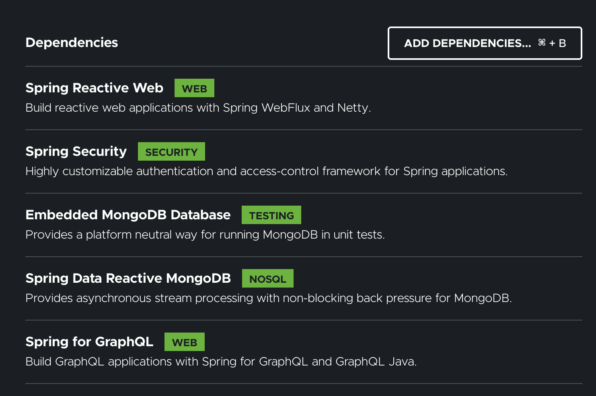

이번 포스트에서는 `Spring for GraphQL` 프로젝트가 GA 되어 샘플 프로젝트를 만드는 과정을 기술하려고 한다.  
다음과 같은 기술을 사용해서 구현하였다.

- [Kotlin](https://kotlinlang.org)
- [Spring Boot (WebFlux)](https://spring.io/projects/spring-boot)
- [Spring GraphQL](https://spring.io/projects/spring-graphql)
- [Spring Security](https://spring.io/projects/spring-security)
- [Spring Data MongoDB (Reactive)](https://spring.io/projects/spring-data-mongodb)
- [Gradle](https://gradle.org)

> 샘플 프로젝트 코드는 [github](https://github.com/jbl428/study-note/tree/master/kotlin/spring-graphql) 에서 볼 수 있다.

<!--truncate-->

## 초기 프로젝트 세팅

[Spring Initializr](https://start.spring.io) 에 접속해서 초기 스프링 프로젝트 세팅을 시작한다.  
`Gradle Project` 를 선택하고 Language 는 `Kotlin` 을 선택한다.  
의존성은 아래 화면에 보이는 것을 선택하면 된다.



## MongoDB 설정

보통 스프링 프로젝트에서 [Spring Data JPA](https://spring.io/projects/spring-data-jpa) 를 활용하는 예제가 많다.  
하지만 코틀린에서는 엔티티 선언시 `data class` 를 사용하지 못하고 필드를 `var` 로 선언해야 하는 등 여러 문제가 있다.  
그래서 이번에는 코틀린을 잘 지원하는 `Spring Data MongoDB` 를 사용하며 reactive 기반의 프로젝트를 만들어보려고 한다.

먼저 docker-compose.yml 파일을 생성해 아래와 같은 내용을 넣어준다.

```yaml title="docker-compose.yml"
services:
  mongo:
    image: mongo:5.0.6
    restart: always
    ports:
      - "27017:27017"
    environment:
      MONGO_INITDB_DATABASE: test
      MONGO_INITDB_ROOT_USERNAME: test
      MONGO_INITDB_ROOT_PASSWORD: test
```

이제 `docker-compose up` 명령어를 실행하면 27017 포트에 MongoDB 서버가 실행된다.  
프로젝트 환경변수 파일을 통해 디비 접속정보를 넣어준다.

```yaml title="src/main/resources/application.yml"
spring:
  data:
    mongodb:
      host: localhost
      port: 27017
      database: test
      username: test
      password: test
      authentication-database: admin
```

테스트 코드에서는 실제 해당 서버를 사용하지 않고 `Embedded MongoDB` 데이터베이스를 사용할 수 있다.  
아래와 같이 version 에 원하는 버전을 넣어주면 해당버전으로 동작하는 내장 데이터베이스를 사용한다.

:::info
위와 같은 내장 데이터베이스로 하는 테스트가 실제 서버에서 하는 테스트를 완전히 대체할 수 없다.  
Embedded 에서 특정 기능이 제대로 지원하지 않는 경우나 더 엄격한 테스트를 원한다면 실제 디비서버로 테스트 해야한다.
:::

```yaml title="src/test/resources/application.yml"
spring:
  mongodb:
    embedded:
      version: '5.0.6'
```

## Repository

단순한 예제를 위해 `Book` document 를 의미하는 클래스를 생성한다.  
JPA 와 달리 `data class` 로 선언할 수 있으며 필요한 annotation 개수도 적다.

```kt title="Book.kt"
data class Book(
    val title: String,
    val author: String,
    val isbn: String,
    val publishers: List<Publisher> = emptyList(),
    val info: Info? = null
) {
    // 이 필드는 _id 를 의미하며 insert 시 자동 할당되므로 lateinit 으로 선언했다
    @Id
    lateinit var id: String
}

data class Publisher(
    val name: String,
    val email: String,
)

data class Info(
    val preface: String,
)
```

기본적인 CRUD 를 담당할 repository 를 생성한다.

```kt title="BookRepository.kt"
import org.springframework.data.mongodb.repository.ReactiveMongoRepository

interface BookRepository : ReactiveMongoRepository<Book, String>
```

## Service

이번 예제에서는 `Book` 를 생성하고 조회하는 로직만 구현하려고 한다.  
`BookService` 는 `BookRepository` 를 이용하여 `Book` 를 생성하고 조회한다.  
Kotlin 의 suspend 함수와 `kotlinx-coroutines-reactor` 패키지에서 제공하는 확장함수를 활용하면 기존 reactive 기반에서 사용하는 `Mono`, `Flux` 사용을 대체할 수 있다.

```kt title="BookService.kt"
@Service
class BookService(private val bookRepository: BookRepository) {

    // java 를 사용했다면 이 메소드는 Flux<Book> 을 반환할 것이다
    suspend fun find(): List<Book> =
        bookRepository
            .findAll()     // reactive 기반에서는 Flux 를 반환한다
            .collectList() // Flux 를 Mono 로 만들어주는 메소드
            .awaitSingle() // 이 확장함수 덕분에 반환값은 List<Book> 이 될 수 있다

    // Book 을 생성하고 반환한다 id 필드는 자동으로 설정된다
    suspend fun create(input: CreateBookInput): Book =
        Book(
            title = input.title,
            author = input.author,
            isbn = input.isbn,
        ).run {
            bookRepository.save(this)
        }.awaitSingle()
}
```

위 서비스 로직을 `Embedded MongoDb` 를 활용해 테스트 코드를 작성해보자.  
테스트 프레임워크는 `Junit` 대신 코틀린 dsl 을 활용하는 `kotest` 를 사용했다.  
junit 에서는 suspend 함수를 테스트하려면 `runBlocking` 함수를 사용해야 하는 등 번거로운 작업이 필요한지만 kotest 는 test scope 자체가 suspend 함수를 지원하기에 더 간결한 코드를 작성할 수 있다.

먼저 다음 패키지를 설치해야 한다.

```kts title="build.gradle.kts"
dependencies {
    testImplementation("io.kotest:kotest-runner-junit5:5.3.0")
    testImplementation("io.kotest.extensions:kotest-extensions-spring:1.1.1")
}
```

다음은 kotest 에서 제공하는 여러 spec 중 `FreeSpec` 을 활용한 테스트 코드이다.

```kt title="BookServiceTest.kt"
@DataMongoTest
internal class BookServiceTest(
    private val bookRepository: BookRepository,
) : FreeSpec({
    val bookService = BookService(bookRepository)

    beforeSpec {
        // 각 테스트 케이스간의 독립성을 위해 book 컬렉션의 데이터를 모두 삭제한다
        // block 을 사용해 삭제 작업이 끝날때까지 기다린다
        // 만약 awaitSingle 을 사용하면 아직 삭제가 완료되지 않았는데도 테스트를 실행할 수 있으므로 주의
        bookRepository.deleteAll().block()
    }

    "find" {
        // given
        val book = Book(
            title = "The Lord of the Rings",
            author = "J.R.R. Tolkien",
            isbn = "0-395-07477-1",
        )
        // awaitSingle 확장함수는 suspend 함수에서만 호출할 수 있다
        bookRepository.save(book).awaitSingle()

        // when
        val foundBook = bookService.find()

        // then
        foundBook shouldBe listOf(book)
    }

    "create" {
        // given
        val input = CreateBookInput(
            title = "The Lord of the Rings",
            author = "J.R.R. Tolkien",
            isbn = "0-395-07477-1",
        )

        // when
        val result = bookService.create(input)

        // then
        assertSoftly(result) {
            title shouldBe input.title
            author shouldBe input.author
            isbn shouldBe input.isbn
        }
    }
})
```

## Controller

이제 GraphQL 과 연관된 작업을 수행하는 컨트롤러를 작성해보자.  

### 구현 방법

그전에 용어에 대한 설명을 하려고한다.  

GraphQL api 를 개발할 때 다음 두 방식중 하나를 선택하게 된다.

- code first 
- schema first

code first 는 이름 그대로 코드를 먼저 작성하고 GraphQL 스키마를 자동 생성하는 방법이다.  
반대로 schema first 는 GraphQL 스키마를 먼저 작성하고 코드를 자동 생성하거나 직접 구현하는 방법이다.  

code first 방식은 실제 코드와 스키마가 항상 일치하는 것을 보장하지만 FE 에서 필요한 스키마를 위해서 백엔드 작업을 기다려야 한다.  
schema first 방식은 반대로 스키마를 먼저 만들기에 FE, BE 동시 개발이 가능하지만 스키마와 실제코드간의 불일치가 발생하지 않도록 주의해야 한다.

> 글 작성일 기준 Spring GraphQL 은 schema first 방식만 지원한다.

### 스키마 작성

`src/main/resources/graphql` 경로에 `graphqls` 나 `gqls` 확장자를 가진 파일을 생성하면 스프링이 해당 스키마를 읽는다.  
이번에는 간단한 예제로 책을 생성하고 목록을 조회하는 api 를 구현한다고 가정하자.

```graphql title="schema.graphqls"
type Query {
    books: [Book!]!
}

type Mutation {
    createBook(input: CreateBookInput!): Book!
}

input CreateBookInput {
    title: String!
    author: String!
    isbn: String!
}

type Book {
    id: ID!
    title: String!
    author: String!
    isbn: String!
}
```

### 컨트롤러 작성

이제 위 스키마에 대응하는 컨트롤러 코드를 작성해보자.  
우선 REST API 와 동일하게 `@Controller` 를 사용해 컨트롤러를 정의한다.  
REST API 와 다른점은 `@GetMapping` 과 같은 어노테이션 대신 `@QueryMapping` 과 `@MutationMapping` 를 사용한다.  
각각 이름 그대로 Query 와 Mutation 을 위한 것이며 메소드명이 GraphQL 필드명이 된다.  
메소드의 반환값은 요청의 응답으로 매핑된다.

GraphQL input 객체는 `@Argument` 어노테이션을 사용해 정의한다.  
객체의 타입이 `CreateBookInput` 이며 스키마에 정의한 input 명과 일치하지만 꼭 일치할 필요는 없다.  
다만 객체의 프로퍼티명과 타입이 input 에 지정한 것과 같아야 올바르게 작동한다.

```kt title="BookController.kt"
@Controller
class BookController(private val bookService: BookService) {

    @QueryMapping
    suspend fun books(): List<Book> = bookService.find()

    @MutationMapping
    suspend fun createBook(@Argument input: CreateBookInput): Book = bookService.create(input)
}
```

### 테스트 코드

작성중

## Security

작성중
