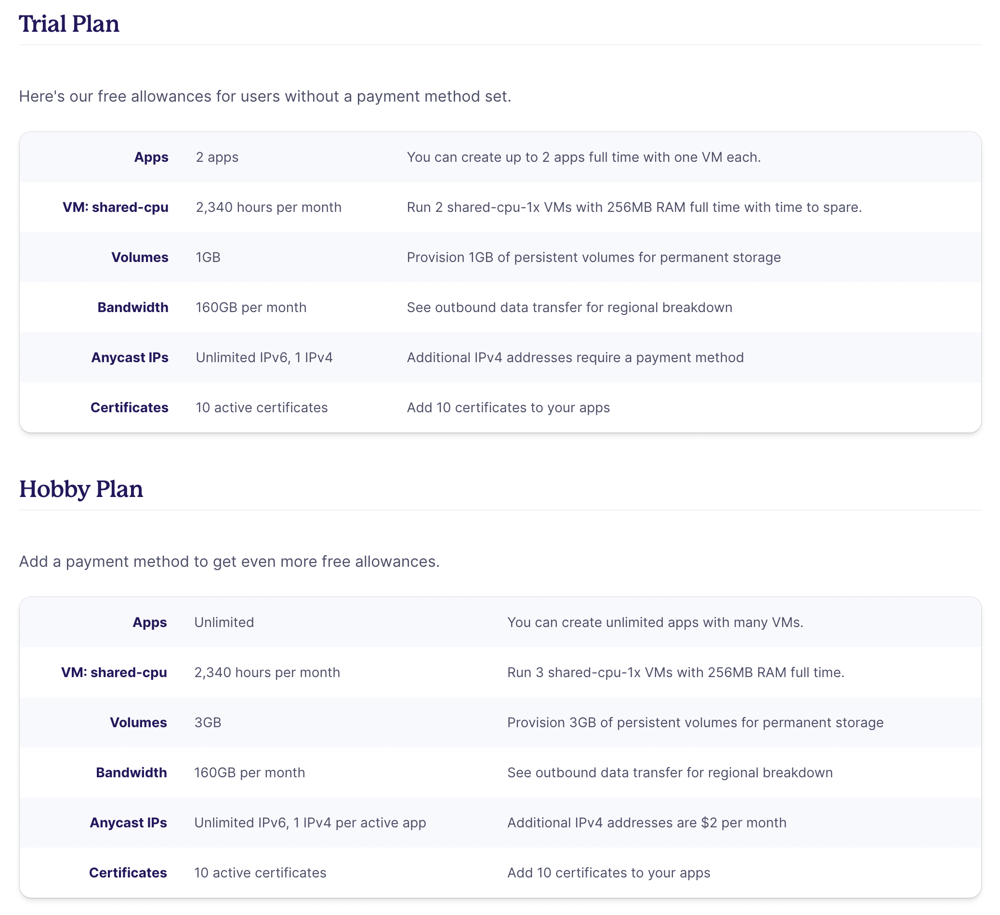
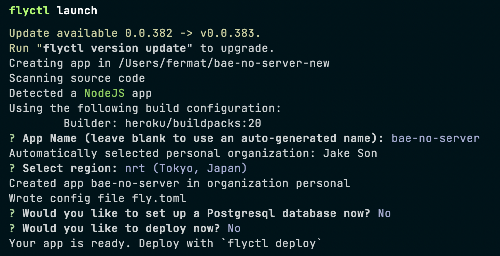
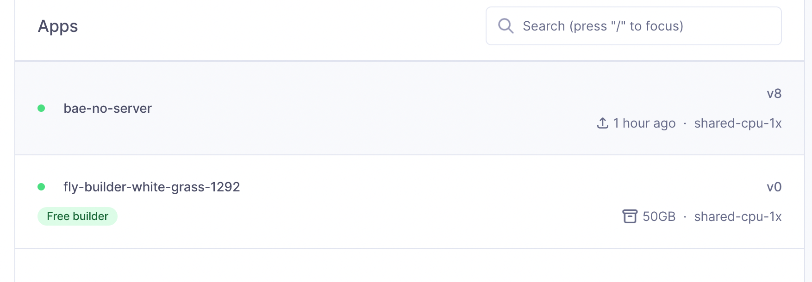
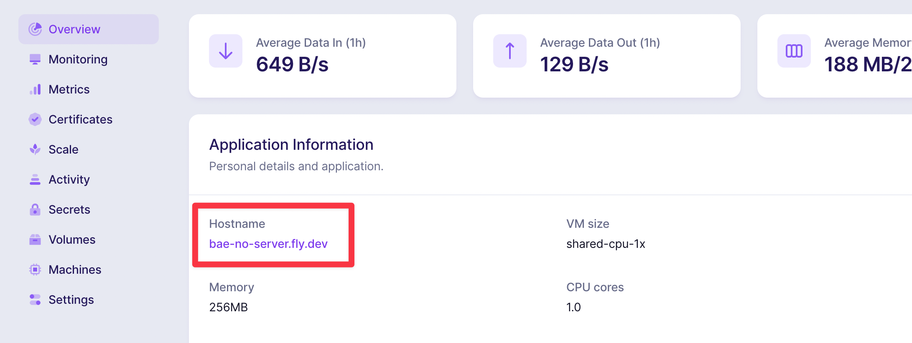
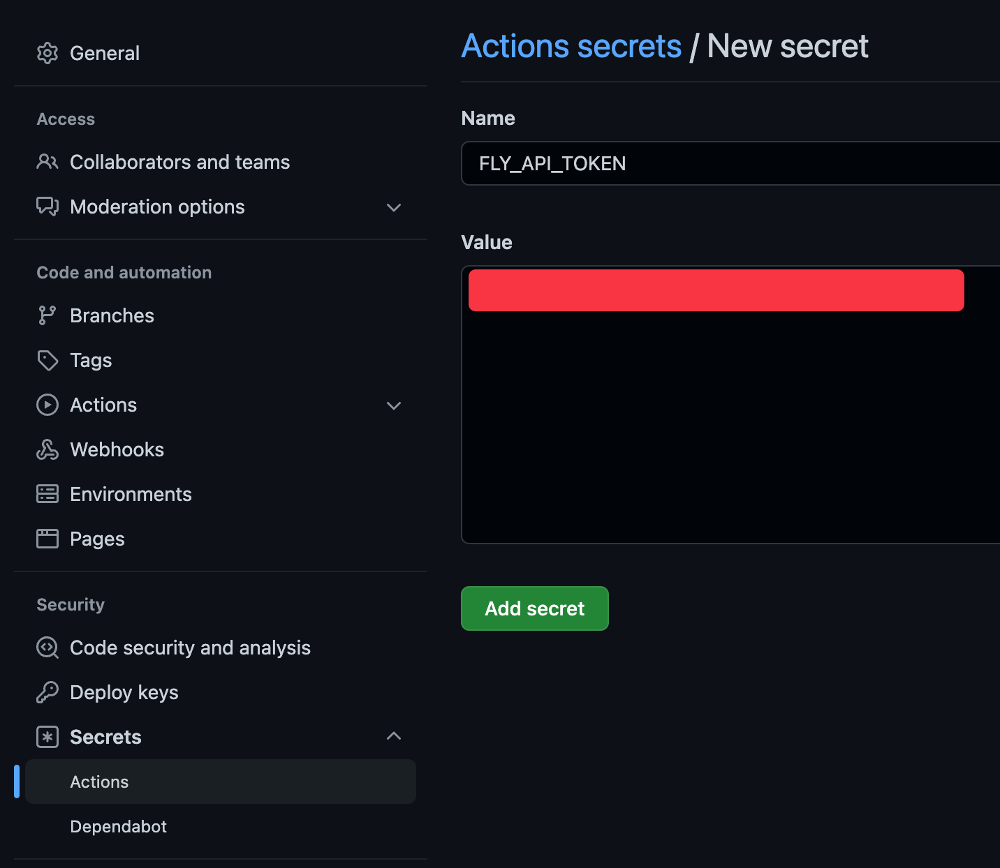
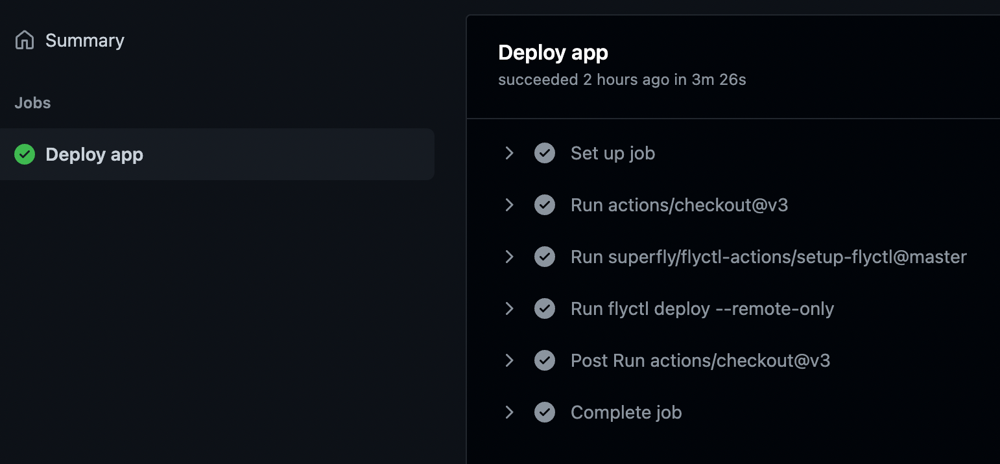

호스팅 서버로 이용중인 Heroku 가 11월 이후로 더 이상 무료플랜을 지원하지 않아 이전부터 눈여겨본 `Fly.io` 로 이전한 과정을 담고있다.

<!--truncate-->

## Fly.io

[Fly.io](https://fly.io)는 도커 컨테이너를 쉽게 배포할 수 있는 플랫폼이다.  
기본적인 도커 지식이 있다면 쉽게 서버를 배포할 수 있다.  
`Trial Plan` 이 있어 회원가입만 해도 서버스를 무료로 이용할 수 있으며 결제정보를 추가하면 `Free Plan` 으로 변경되며 조금 더 많은 사용량을 얻을 수 있다.  
두 플랜의 차이점은 아래 사진을 참조한다.



:::info
추후에 달라질 수 있는 내용이라 공식 사이트에서 직접 확인하는 것을 권장한다.
:::

## flyctl 설치

배포 과정은 대부분 `flyctl` 로 불리는 cli 도구를 활용해 터미널 환경에서 진행된다.  
Mac 에서는 homebrew 가 설치된 환경이라면 아래 명령어를 통해 설치할 수 있다.

```shell
brew install flyctl
```

없는 경우라면 다음 명령어를 활용한다.

```shell
curl -L https://fly.io/install.sh | sh
```

Windows 라면 PowerShell 에서 다음 명령어를 활용한다.

```powershell
iwr https://fly.io/install.ps1 -useb | iex
```

## 회원가입 & 로그인

서비스를 이용하기 위해서 회원가입이 필요하며 아래 명령어를 수행하면 자동으로 브라우저가 열리면서 회원가입을 진행 할 수 있다.

> 만약 이미 회원가입을 했다면 로그인 과정을 진행하도록 한다.

```shell
flyctl auth login
```

Github 계정을 활용하거나 이메일 주소를 입력해 회원가입을 진행하며 다음 과정에서 결제정보를 입력하거나 스킵한다.


## 설정 파일 생성

배포를 원하는 서버의 코드가 있는 저장소 위치로 이동해 다음 과정을 진행한다.  
배포에 대한 설정은 `fly.toml` 파일을 통해 이루어지며 다음 명령어를 활용해 해당 파일을 쉽게 생성할 수 있다.

```shell
flyctl launch
```

해당 명령어는 현재 디렉토리의 코드를 분석해서 어떤 빌드도구를 활용할지 판단해 설정파일을 생성한다.  
따라서 간단한 코드인 경우에는 도커지식이 없어도 바로 서버를 배포할 수 있는 장점이 있다.

:::info
이번 포스트에서는 pnpm 을 패키지 매니저로 사용하고 nest.js 를 사용하는 다음 저장소를 기준으로 설명한다.
https://github.com/bae-no/bae-no-server
:::



명령어를 실행하면 여러 선택지를 물어보게 되는데 상황에 따라 적절할 항목을 선택하도록 한다.

- App Name: 배포 App 이름, 원하는 이름으로 설정한다.
- Region: 컨테이너가 올라갈 지역, 서버 이용자에게 가까운 지역을 선택하도록 한다.
- Set up Postgresql database: postgresql 을 서버를 fly.io 로 만들어 사용할 목적이라면 yes 를 선택한다.
- Deploy: 바로 배포를 진행할 것인지 여부, 설정파일을 확인하기 위해 No 를 선택한다.

## 설정파일 확인

자동 생성한 `fly.toml` 파일을 살펴보고 상황에 따라 수정해야 한다.  
이번 포스트에서 사용한 저장소에서는 pnpm 을 패키지 매니저로 사용하는데 `heroku/buildpack` 이 지원하지 않기에 builder 라인을 삭제했다  
이 경우에는 직접 저장소 root 에 `Dockerfile` 를 생성해 빌드설정을 진행하게 된다.

```toml title="fly.toml"
app = "bae-no-server"
kill_signal = "SIGINT"
kill_timeout = 5
processes = []

[build]
  # 빌드에 사용할 도커 이미지
  # 만약 직접 Dockfile 를 만드는 경우라면 아래 라인을 삭제한다
  builder = "heroku/buildpacks:20"

[env]
  PORT = "8080" # 환경변수 설정

[[services]]
  http_checks = []
  internal_port = 8080 # 서버가 사용하는 포트 번호로 변경해준다
  processes = ["app"]
  protocol = "tcp"
  script_checks = []
```

:::info
Nest.js 의 기본 서비스 포트는 3000 이지만 fly.toml 의 internal_port 를 3000 으로 바꾸지 않았다.  
그 이유는 `main.ts` 에서 `process.env.PORT` 를 사용해 포트번호를 설정하도록 코드를 수정하였고 `fly.toml` 의 env 설정에서 PORT 를 8080 으로 설정하였기 때문이다.

```ts
await app.listen(process.env.PORT || 3000);
```

:::

## Dockerfile 생성

대부분의 서버 코드는 배포전에 빌드과정이 필요한데 heroku 에서는 이를 buildpack 을 통해 수행한다.  
fly.io 는 이 개념을 채택해 사용하기에 `flyctl launch` 를 실행하면 `heroku/buildpack` 이 builder 옵션에 들어가는 것을 볼 수 있다.

다만 해당 buildpack 은 pnpm 을 지원하지 않기에 커스텀 buildpack 을 사용하거나 직접 Dockerfile 을 만들어야한다.  
이번 포스트에서는 Dockerfile 을 만드는 방법을 선택하였다.

```dockerfile
FROM node:16-alpine

RUN npm install -g pnpm

COPY .npmrc package.json pnpm-lock.yaml ./
RUN pnpm install --frozen-lockfile

COPY . .
RUN npm run build

EXPOSE 3000
CMD [ "node", "dist/apps/app/src/main" ]
```

해당 파일을 보면 직접 `패키지 설치 + 빌드 + 실행`명령어를 넣어준 것을 확인할 수 있다.

## secret 설정

대부분의 경우 서버를 실행하기 위한 환경변수가 필요한 경우가 있다.  
`fly.toml` 의 env 설정을 통해 환경변수를 설정할 수 있으나 데이터베이스 접속정보 같은 민감한 내용을 넣어 공개 github 저장소에 올리는 것은 위험하다.  
fly.io 에서는 이러한 정보를 저장하기 위해 secret 을 제공한다.

secret 은 내부 값들을 암호화해서 저장하며 컨테이너 내부에서는 복호화한 값으로 참조할 수 있게 만들어준다.  
`flyctl` 을 통해 secret 을 관리할 수 있으며 `flyctl secret set` 을 활용해 여러 key, value 를 설정할 수 있다.

```shell
flyctl secret set SECRET=VALUE SECRET2=VALUE2 ...
```

설정한 값들은 아래 명령어를 통해 확인할 수 있으며 value 부분은 암호화된 것을 확인할 수 있다.

```shell
flyctl secrets list

NAME              	DIGEST                          	CREATED AT
SECRET      	    5q97fbe12c037e0359f7a2c43827ca27	13h5m  ago
SECRET2   	        34173cb3zf07f89dd2ebc2ac9128303f	12h59m ago
```

## 배포

이제 모든 설정을 마치고 아래 명령어를 수행해 배포를 진행한다.

```shell
flyctl deploy
```

출력되는 메시지들을 살펴보면 도커 이미지를 빌드할 때 자주 보게되는 내용을 확인할 수 있다.  
이는 도커가 설치된 외부 서버를 활용하는 경험을 제공해준다.  
실제로 [fly.io 대시보드](https://fly.io/dashboard/personal) 에 들어가면 빌드용도의 새로운 app 이 생성된 것을 확인할 수 있다.



위와 같은 나만의 build app 을 가질 수 있는 장점은 docker layer 캐시를 활용할 수 있다는 점이다.  
첫 배포시에는 캐시가 없으므로 Dockerfile 에 지정된 모든 과정을 진행해 시간이 걸리지만 이후에는 수정된 스탭만 수행하기에 배포시간이 단축된다.  
배포 이후 대시보드의 overview 를 탭에서 서버 url 을 확인할 수 있으며 정상적으로 접속되는지 확인한다.



## Github Action 연동

이제 Gihub Action 을 사용하여 `main` 브랜치에 푸시가 발생하면 자동으로 fly.io 로 배포를 진행하도록 설정해보자.

### API Token 발급

다음 명령어를 통해 api token 을 발급한다. (로그인 상태이어야 함)

```shell
flyctl auth token
```

### Github Secret 에 TOKEN 추가

발급한 토큰을 복사한 후 Github 저장소의 Settings -> Secrets -> Actions -> New secret 을 선택해 새로운 secret 을 생성한다.
Name 은 `FLY_API_TOKEN` 이며 Value 는 발급받은 토큰을 입력한다.
마지막으로 `Add secret` 을 누르면 완료된다.



### Github Action 설정

이제 다음과 같은 설정파일을 만든 후 푸시하면 앞으로 main 에 커밋이 푸시되면 배포가 진행된다.

```yaml title=".github/workflows/main.yml"
name: Fly Deploy

on:
  push:
    branches:
      - main

env:
  FLY_API_TOKEN: ${{ secrets.FLY_API_TOKEN }}

jobs:
  deploy:
    name: Deploy app
    runs-on: ubuntu-latest
    steps:
      - uses: actions/checkout@v3
      - uses: superfly/flyctl-actions/setup-flyctl@master
      - run: flyctl deploy --remote-only
```


