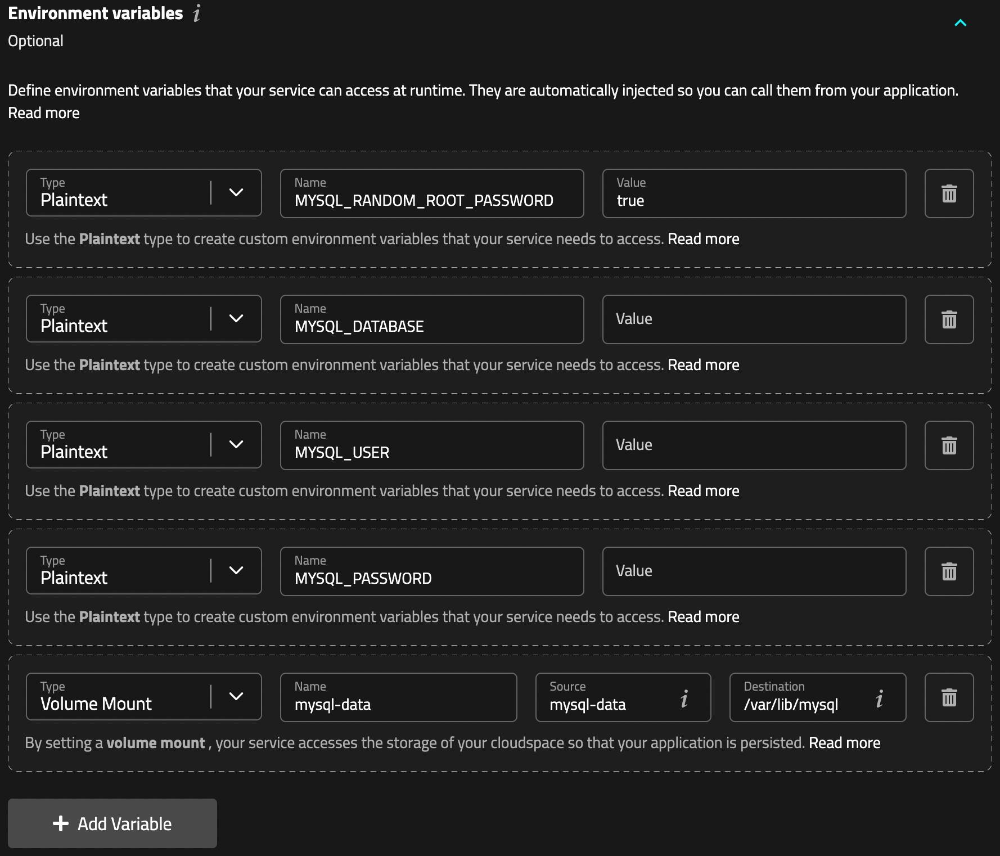

이전 포스트에서 적은 fly.io 와 비슷한 서비스를 제공하는 Mogenius 를 활용한 도커 컨테이너 배포에 대한 내용을 다룬다.

<!--truncate-->

## Fly.io 단점

Fly.io 는 무료로 사용할 수 있는 서비스이지만, 무료 플랜에서 256MB 의 메모리만 지원하는 단점이 있다.  
그래서 Spring Boot + JPA 를 사용하는 프로젝트를 배포할 때 OOM 에러가 발생하여 다른 서비스를 찾아보게 되었다.

## Mogenius

[Mogenius](https://mogenius.io/) 도 도커 컨테이너 배포를 지원하는 서비스로 쿠버네티스 기반으로 동작한다.  
저장소에 있는 Dockerfile 을 읽어서 이미지를 생성하고 배포한다.  
GitHub 과 연동하여 특정 브랜치에 커밋이 푸시되면 자동으로 배포가 동작한다.  
CD 설정을 직접 해야하는 fly.io 와 달리 자동으로 설정해주기 때문에 편리하다.

글 작성 시점으로 무료 플랜에서는 다음 햘당량을 받을 수 있다.

- 0.5 CPU Core
- 1GB RAM
- 5GB traffic
- 2GB storage

:::info
추후에 달라질 수 있는 내용이라 공식 사이트에서 직접 확인하는 것을 권장한다.
:::

메모리를 1GB 지원하기에 MySQL 컨테이너를 띄우기 용이하다.  
fly.io 에서는 결제정보를 입력해야 추가 사용량을 받을 수 있지만 Mogenius 회원가입만 해도 위의 사용량을 받을 수 있다.  
특히 fly.io 에서 잘못 사용하다가 무료 사용량이 초과해 원치않는 비용이 청구될 수 있지만 Mogenius 에는 그런 걱정이 없다.

다만 Mogenius 는 fly.io 와 달리 작성일 기준으로 독일 리전만 지원한다.  
하지만 개발용도로 사용할 목적이라면 큰 문제는 아니다.

## MySQL 컨테이너

이번 포스트에서는 Spring Boot 웹서버와 MySQL 컨테이너를 배포하는 방법을 다룬다.

### 회원가입

먼저 [Sign Up](https://studio.mogenius.com/user/registration) 에 접속하여 회원가입을 한다.  
아직 소셜 로그인 기능은 없어서 직접 이메일 주소를 입력해야 한다.  
Sign Up 버튼을 누르면 입력한 이메일로 인증 메일이 오는데, 인증을 완료하면 로그인이 가능하다.


### Cloudspace 생성

로그인을 완료하면 Cloudspace 를 생성을 위한 페이지에 접속하게 된다.  
`Create Cloudspace` 버튼을 눌러서 다음으로 진행한다.


원하는 cloudspace 이름을 입력하고, `Free Plan` 이 선택된 것을 확인하고 `Create now` 버튼을 누른다.


### Service 생성

이후 cloudspace 대시보드 페이지에 접속하게 되는데 리로스 할당량, 사용중인 서비스 등을 확인할 수 있다.
중간에 `Stages` 항목을 볼 수 있는데 이는 개발/운영 같은 배포환경을 의미한다라고 생각하면 된다.
무료 플랜에서는 Production Stage 만 사용할 수 있기에 크게 신경 쓸 내용은 없다.
현재는 Production Stage 에 아무런 서비스가 없으며 `Add` 를 누른다.

서비스는 하나의 컨테이너라고 생각하면 되며 현재 3가지 방법으로 생성할 수 있다.

- `Bring your own code`: GitHub 저장소를 활용해 배포
- `Use a template`: Mogenius 에서 제공하는 템플릿을 활용해 샘플 컨테이너 배포
- `Container Imgae`: DockerHub 같은 컨테이너 저장소의 이미지를 활용해 배포

첫 번째 방법은 저장소에 있는 Dockerfile 을 활용하며 두 번째는 Mogenius 에서 제공하는 샘플용 저장소를 활용한다.  
Dockerfile 을 활용해 커스텀한 설정이 필요한 경우가 아니라면 세 번째 방법을 사용할 수 있다.
공식 mysql 이미지를 그대로 사용할 것이기에 `Container Image` 를 선택한다.


### 컨테이너 이미지 설정

이제 컨테이너 설정을 하게되는데 사실 docker 에 익숙한 사람이라면 문서없이도 설정할 수 있을 정도로 간단하다.  
`Service Name` 에 원하는 서비스 이름을 넣어주고 `Container Image` 에는 사용할 이미지를 입력한다.  
[mysql](https://hub.docker.com/_/mysql) 공식 이미지를 사용할 것이기에 `mysql` 을 입력한다.  
원하는 경우 태그까지 넣어서 특정 버전으로 고정할 수도 있다.


#### Resource limits

Settings 의 Resource limits 에 컨테이너에 할당할 자원량을 배정할 수 있다.  
Mogenius 는 유효한 이메일 계정만 있으면 제한없이 계정을 만들 수 있으므로 여러 컨테이너를 각각 다른 계정을 활용해 띄울 수 있다.  
그래서 모든 할당량을 다 배정해도 무방하다.


#### Environment Variables

Environment Variables 에는 컨테이너 내부에서 사용할 환경변수와 volume mount 설정을 할 수 있다.  
`Add Variable` 을 눌러 각 항목을 추가하며 Type 을 선택해 환경변수나 volume mount 를 추가할 수 있다.

Plaintext 을 선택해 평문으로 환경변수를 넣어줄 수 있으며 `Volumn Mount` 를 선택해 mysql data 를 저장할 디렉토리를 지정할 수 있다.  
다음과 같은 설정을 추가한다.

> 좌측 메뉴의 `File Browser` 를 통해 손쉽게 볼륨 데이터를 확인할 수 있다.

- Plaintext

| Name                       | Value     | 설명                                 |
| -------------------------- | --------- | ------------------------------------ |
| MYSQL_RANDOM_ROOT_PASSWORD | true      | 랜덤하게 root 비밀번호를 생성한다.   |
| MYSQL_DATABASE             | 원하는 값 | 생성할 데이터베이스 이름을 지정한다. |
| MYSQL_USER                 | 원하는 값 | 생성할 사용자 이름을 지정한다.       |
| MYSQL_PASSWORD             | 원하는 값 | 생성할 사용자 비밀번호를 지정한다.   |

- Volumn Mount

| Name       | Source     | Destination    |
| ---------- | ---------- | -------------- |
| mysql-data | mysql-data | /var/lib/mysql |



#### Ports

Port 설정은 컨테이너 내부포트를 외부로 노출하기 위한 용도로 쓰인다.  
사실 하나의 cloudspace 에서 웹과 디비 서비스를 추가해 사용한다면 컨테이너 끼리만 통신하게 설정할 수 있다.  
보안을 강화하려면 디비는 외부로 노출하지 않는것이 좋지만 웹을 다른 cloudspace 에서 띄우는 경우라 설정하였다.  
Type 은 `TCP` 를 선택하고 외부 포트는 `3306` 을 입력하고 `Expose` 에 체크된 것을 확인한다.


### 외부 접속 url 확인

`Create Service` 버튼을 눌러 컨테이너를 생성하면 외부에서 접속할 수 있는 주소와 포트가 설정되며 이를통해 접속할 수 있다.  
서비스 상세 페이지에서 `Hostname` 을 누르고 `External hostname` 항목에 보이는 url 을 기억해둔다.


## Spring Boot 컨테이너 생성 및 MySQL 연동

이제 Spring Boot 컨테이너를 생성하고 MySQL 컨테이너와 연동해보자.

> 이번 글에서 예제로 사용할 저장소는 [santa-close-server](https://github.com/santa-close/santa-close-server) 이다.

### 저장소 설정

우선 도커 이미지를 빌드하기 위한 Dockerfile 을 저장소 루트에 생성한다.  
예제 프로젝트는 gradle 과 멀티모듈을 사용하며 server-app 모듈을 빌드하고 생성한 jar 파일을 실행하도록 설정하였다.

:::caution
Mogenius 는 보안을 위해 컨테이너를 root 계정으로 실행하는 것을 허용하지 않는다.  
따라서 Dockerfile 에서 root 가 아닌 게정으로 프로그램을 실행하도록 설정해야 한다.
:::

```dockerfile
# 빌드 stage
FROM gradle:jdk17 AS build
COPY --chown=gradle:gradle . /home/gradle/src
WORKDIR /home/gradle/src
# 빌드 수행
RUN gradle build --no-daemon -x test

# 실행 stage
FROM ghcr.io/graalvm/jdk:ol8-java17-22.2.0
ENV LC_ALL=C.UTF-8
# app 유저 생성
RUN useradd app
USER app
# jar 파일 복사
COPY --from=build /home/gradle/src/server-app/build/libs/server-app.jar app.jar
# jar 파일 실행
ENTRYPOINT ["java", "-Djava.security.egd=file:/dev/urandom", "-jar", "app.jar"]
```

디비접속 정보와 같은 항목은 환경변수를 통해 설정할 수 있게 다음과 같은 파일이 존재한다.

```yaml title="server-app/src/main/resources/application-live.yml"
spring:
  datasource:
    driver-class-name: com.mysql.cj.jdbc.Driver
    url: ${DATABASE_URL}
    username: ${DATABASE_USERNAME}
    password: ${DATABASE_PASSWORD}
# 그 외 다른 환경변수들..
```

### 서비스 등록

이번에는 `Bring your own code` 를 선택해 웹서버를 추가해보자.  
`Service name` 에 원하는 값을 넣어주고 `Repository` 에서 GitHub 계정을 연결해 저장소를 선택할할 수 있도록 만든다.

:::info
GitHub 계정 연동없이 public 저장소 url 을 활용할 수 있지만 CI/CD 가 설정되지 않는다.
:::

연결이 완료되었으면 `Git Repository` 항목에서 배포를 원하는 저장소를 선택하고 `Git Branch` 에서 자동빌드를 원하는 브랜치를 선택한다.  
Dockerfile 이 프로젝트 루트가 아닌 다른곳에 있거나 빌드를 실행할 디렉토를 다르게 가져가려면 `Dockerfile Name`, `Docker Context` 를 수정한다.


`Environment Variables` 에서는 앞서 application-live.yml 에서 필요로하는 환경변수를 등록하면 된다.  
추가로 `SPRING_PROFILES_ACTIVE` 의 값을 `live` 로 설정해 spring 프로필을 `live` 로 설정한다.

value 에 일부 특수문자가 들어가는 경우 환경변수 등록이 안되는 경우가 있는데 그럴 때에는 `Key Vault` 를 활용한다.  
쿠버네티스의 secret 과 비슷한 기능으로 민감한 정보를 암호화해 저장한 후 컨테이너 내부에서는 복호화한 값을 사용하게 된다.


값을 추가한 후 환경변수 메뉴에서 해당 key 를 사용하도록 설정해야한다.


Ports 항목에서 내부 포트는 8080 Type 은 HTTPS 로 설정하도록 한다.  
이러면 외부에서 https 접속할 수 있는 url 을 얻을 수 있고 http -> https 리디렉트 설정까지 자동으로 이루어진다.


`Create Service` 버튼을 누르면 모든 설정이 완료된다.  
이후 생성된 url 을 통해 서버가 정상적으로 동작하는지 확인해본다.

## 마무리

지금까지 Mogenious 를 사용한 컨테이너 배포를 살펴보았다.  
아직 서비스가 생긴지 얼마 지나지 않아 서비스가 지속적으로 유지될지 여부는 불투명하지만 그 전까지는 유용하게 사용할 수 있을거같다.  
아직 문서가 부족한 편이지만 설정 자체가 간단한 편이라 큰 어려움 없이 진행할 수 있을거라 생각한다.  
추가로 비슷한 기능을 제공하는 [Render](https://render.com) 라는 서비스도 있는데 추후에 살펴보도록 하겠다.
