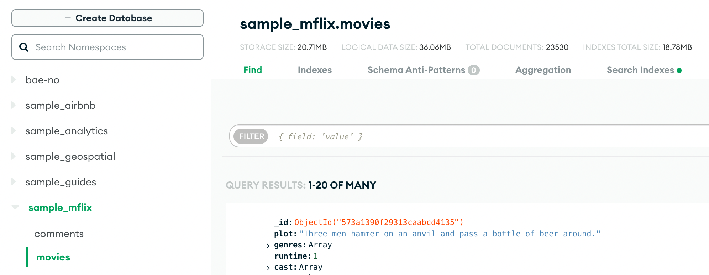

이번 포스트는 MongoDB Atlas 를 활용해 페이지네이션을 구현할 때 정렬을 relevance 기반이 아닌 컬럼을 기준으로 할 때의 문제와 개선점을 다룬다.

<!--truncate-->

## 예제 데이터

먼저 예제로 활용할 데이터를 만들어보자.  
Atlas 에서는 샘플 데이터를 제공하고 쉽게 생성할 수 있으므로 이를 활용해보자.  
`Database Deployments` 페이지에서 `...` 을 선택하고 `Load Sample Dataset` 버튼을 누르면 샘플 데이터가 생성된다.  
여러 데이터베이스가 생성되는데 그 중 `sample_mflix` 의 `movies` 컬렉션을 사용하였다.

:::info
MongoDB Atlas 에서는 회원가입만 해도 무료 클러스터를 제공하므로 비용걱정없이 테스트 환경을 구축할 수 있다.
:::


해당 컬렉션은 영화에 대한 정보를 담고있으며 대략 23000 개의 문서가 존재한다.



## Search Index 생성

Atlas Search 를 사용하기 위해서는 먼저 검색용 인덱스를 생성해야한다.  
먼저 `Search` 페이지에서 `Create Search Index` 버튼을 선택한다.


인덱스 설정방법으로 `Visual Editor` 와 `JSON Editor` 가 있는데 `JSON Editor` 를 선택한다.  
`Database and Collection` 에서는 `sample_mflix.movies` 를 선택하고 `Index Name` 을 `default` 로 설정한다.


에디터 항목에는 아래와 같은 내용을 넣어준다.  
총 4개의 필드에 대한 인덱스를 생성하게 된다.

```json
{
  "mappings": {
    "dynamic": false,
    "fields": {
      "fullplot": {
        "type": "string"
      },
      "released": {
        "type": "date"
      },
      "runtime": {
        "representation": "int64",
        "type": "number"
      },
      "title": {
        "type": "string"
      }
    }
  }
}
```

## Relevance 기반 정렬

검색엔진을 사용할 때에는 정렬을 검색어와 관련성이 높은 순서로 정렬하는 것이 일반적이다.  
Atlas Search 에서는 이를 `relevance` 라고 부르며 자동으로 이를 기준으로 score 를 계산해 내림차순 정렬한다.  
예를들어 `title` 컬럼에 대해 `star wars` 검색어에 매칭되는 문서 상위 10개를 가져온다고 해보자.

```js
db.movies.aggregate([
  {
    $search: {
      text: {
        path: "title",
        query: "star wars",
      },
    },
  },
  { $skip: 0 },
  { $limit: 10 },
  {
    $project: {
      title: 1,
      score: { $meta: "searchScore" }, // score 를 결과에 포함
    },
  },
]);
```


결과의 score 를 보면 내림차순으로 정렬되어 있는것을 확인할 수 있다.  
검색어에 매칭되는 개수가 많은 경우 페이지 번호를 크게 한 경우를 가정해보자.  
다음은 검색어를 `the` 로 설정한 경우 매칭되는 문서는 5500 개 정도인데 5000 번째 이후 데이터 10개를 요청하는 상황이다.

```js
db.movies.aggregate([
  {
    $search: {
      text: {
        path: "title",
        query: "the",
      },
    },
  },
  { $skip: 5000 },
  { $limit: 10 },
  {
    $project: {
      _id: 0,
      title: 1,
      score: { $meta: "searchScore" },
    },
  },
]);
```

대략 400ms 정도 걸리는데 환경에 따라 다르겠지만 보통은 크게 문제가 되지 않는 시간이다.  
이처럼 일반적인 `relevance` 기반 정렬에서는 큰 문제가 발생하지 않는다.

## 컬럼기반 정렬

이제 특정 컬럼을 기준으로 정렬하는 상황을 가정해보자.  
`fullplot` 이 `the` 검색어에 매칭되고 `runtime` 컬럼을 기준으로 내림차순 정렬하는 상황이다.

```js
db.movies.aggregate([
  { $search: { text: { path: "fullplot", query: "the" } } },
  { $sort: { runtime: -1 } }, // runtime 내림차순 정렬
  { $skip: 0 },
  { $limit: 10 },
  { $project: { _id: 0, title: 1, runtime: 1 } },
]);
```


첫 페이지를 요청하는 경우이지만 1.4초 정도의 시간이 걸린다.  
하나 눈여겨 볼 점은 **skip 의 값에 관계없이 일정한 시간이 걸린다는 것**이다.  
이는 skip 에 관계없이 **항상 검색어에 매칭되는 모든 문서를 가져와 정렬**을 한다는 것을 의미한다.

| skip  | time  |
| ----- | ----- |
| 0     | 1.457 |
| 100   | 1.403 |
| 1000  | 1.322 |
| 10000 | 1.435 |

## Atlas Search

앞서 정의한 Search Index 에 `runtime` 컬럼을 추가했음에도 정렬속도가 느리다는 점이 이상하게 느껴질 수 있다.  
이는 Search Index 의 특성과 Atlas Search 의 내부구조로 인해 발생하는 문제이다.  
Atlas Search 클러스터의 각 노드에는 `mongot` 와 `mogond` 라 불리는 두 개의 프로세스가 존재한다.

- `mongot`: Apache Lucene 기반의 검색엔진
- `mongond`: NoSQL 데이터베이스


두 프로세스가 다루는 데이터는 서로 다르고 저장하는 형태도 다르다.

- `mongot`: Search Index
- `mongond`: Document, B-Tree Index

`mongot` 는 검색을 위한 역인덱스를 사용하는 Search Index 를 다루며 `mongond` 는 컬렉션 데이터와 B-Tree 인덱스를 다룬다.  
앞서 문제가 발생하는 aggregation 을 수행할 때 `$search` 는 `mongot` 에게 처리하고 `$sort` 이후는 `mongond` 에게 처리한다.

```js
db.movies.aggregate([
  // mongot 에서 수행
  /* highlight-next-line */
  { $search: { text: { path: "fullplot", query: "the" } } },
  // mongond 에서 수행
  /* highlight-start */
  { $sort: { runtime: -1 } },
  { $skip: 0 },
  { $limit: 10 },
  { $project: { _id: 0, title: 1, runtime: 1 } },
  /* highlight-end */
]);
```

`$search` stage 에서는 역인덱스를 참조해서 검색을 수행하기에 **결과로 문서전체가 아닌 오직 `object id` 와 `score` 같은 메타정보**를 반환한다.  
이를 `mongod` 가 받아서 컬렉션을 조회한 후 이후 stage 를 수행한다.  
이로인해 `fullplot` 이 `the` 에 매칭되는 id 가 20000 개라고 가정하면 해당하는 모든 문서를 조회한후 정렬을 수행한다.

결론적으로 **데이터의 필터링과 정렬을 수행하는 프로세스가 다르기 때문에 문제가 발생**한다.  
예를들어 다음쿼리는 오직 `mongod` 만 사용하는데 이 경우 성능문제가 발생하지 않는다.

```js
db.movies.createIndex({ runtime: 1 }); // B-Tree Index
db.movies.find({ fullplot: /the/ }).sort({ runtime: -1 }).skip(20000).limit(10); // 100~200ms
```

## Score 를 활용하는 필드기반 정렬

두 프로세스가 모두 사용하는 쿼리의 속도를 개선하려면 정렬을 `mongot` 에서 수행해야한다.  
`mongot` 는 오직 `score` 를 기반으로 정렬을 수행하기에 정렬하고자 하는 필드의 값이 `score` 에 반영되도록 해야한다.  
이를 위해 `path score function` 또는 `near operator` 를 사용해 해결할 수 있다.

### path score function

Atlas search 에서는 `relevance` 기반으로 계산된 score 를 조작할 수 있는 방법들을 제공한다.  
그 중 하나가 `path score function` 으로 score 를 문서의 특정필드의 값으로 바꿔준다.  
score 는 숫자타입이므로 path 에 사용할 필드도 숫자타입이어야한다.

```js
db.movies.aggregate([
  {
    $search: {
      text: {
        path: "fullplot",
        query: "the",
        /* highlight-start */
        score: {
          function: {
            path: {
              value: "runtime", // runtime 을 score 로 사용
              undefined: 0, // runtime 이 null 이거나 값이없으면 0으로 설정
            },
          },
        },
        /* highlight-end */
      },
    },
  },
  { $skip: 0 },
  { $limit: 10 },
  {
    $project: {
      _id: 0,
      title: 1,
      runtime: 1,
      score: { $meta: "searchScore" }, // score 를 결과에 포함
    },
  },
]);
```


결과를 보면 `score` 가 `runtime` 과 동일하다는 것을 확인할 수 있다.  
이처럼 `path score function` 은 **숫자타입의 필드를 내림차순 정렬**할 때 유용하게 사용할 수 있지만 그 외의 조건에는 사용할 수 없다는 단점이있다.

### near operator

near operator 는 숫자, 날짜, 좌표데이터를 활용해 score 를 계산하는 operator 로 계산식은 다음과 같다.


여기서 각 항목의 의미는 다음과 같다.

- `pivot` : 임의의 숫자
- `distance` : 특정 필드와 `origin` 사이의 거리
- `origin` : 기준값

계산식을 잘보면 분자와 분모에 모두 `pivot` 이 존재하고 `distance` 는 0 이상의 수이기 때문에 score 는 0 보다크고 1 보다 같거나 작은 값을 가진다.  
`pivot` 은 사실 정렬에 영향을 주지 않는 항목이며 `origin` 을 어떻게 설정하느냐에 따라 정렬순서가 결정된다.  
만약 `runtime` 을 오름차순으로 정렬하고 싶다면 `origin` 을 0 으로 설정하면 된다.

```js
db.movies.aggregate([
  {
    $search: {
      compound: {
        /* highlight-start */
        // near operator 로 계산한 score 는 최종 score 에 반영
        must: [
          {
            near: {
              origin: 0, // runtime 이 0 에 가까울 수록 높은 score 를 가진다
              pivot: 1,
              path: "runtime",
            },
          },
        ],
        // text operator 로 계산된 score 를 무시하기 위해 filter 를 사용
        filter: [{ text: { path: "fullplot", query: "the" } }],
        /* highlight-end */
      },
    },
  },
  { $skip: 0 },
  { $limit: 10 },
  {
    $project: {
      _id: 0,
      title: 1,
      runtime: 1,
      score: { $meta: "searchScore" }, // score 를 결과에 포함
    },
  },
]);
```


near 로 날짜타입으로 정렬할 수도 있고 다음은 `released` 를 최신순으로 정렬하는 쿼리이다.

```js
db.movies.aggregate([
  {
    $search: {
      compound: {
        must: [
          {
            near: {
              /* highlight-start */
              origin: ISODate("2030-01-01T00:00:00.000+00:00"),
              pivot: 10000000,
              path: "released",
              /* highlight-end */
            },
          },
        ],
        filter: [{ text: { path: "fullplot", query: "the" } }],
      },
    },
  },
  { $skip: 0 },
  { $limit: 10 },
  {
    $project: {
      _id: 0,
      title: 1,
      released: 1,
      score: { $meta: "searchScore" }, // score 를 결과에 포함
    },
  },
]);
```


:::info
내림차순 정렬에서는 origin 값을 정렬필드가 도달할 수 없는 큰 값으로 설정해야한다.  
`movices` 컬렉션은 `released` 값이 '2016-03-23' 이후 데이터는 없기에 `origin` 을 적당히 큰 2030 년으로 설정했다.  
추후에 2030 년 이후 데이터가 추가되는 상황을 가정한다면 `origin` 을 더 큰 값으로 설정해야 할것이다.

다만 `origin` 을 너무 큰 값으로 설정하는 경우 score 가 double 형에 담을 수 없을정도로 작아져서 제대로 계산이 되지않는 상황이 발생할 수 있다.  
이런 경우 `pivot` 값 또한 큰 값으로 넣어주어서 score 가 커질 수 있도록 해야한다.
:::

## 참고자료

- [Atlas Search Architecture](https://www.mongodb.com/docs/atlas/atlas-search/atlas-search-overview/#fts-architecture)
- [Atlas Search Scoring](https://www.mongodb.com/docs/atlas/atlas-search/scoring)
