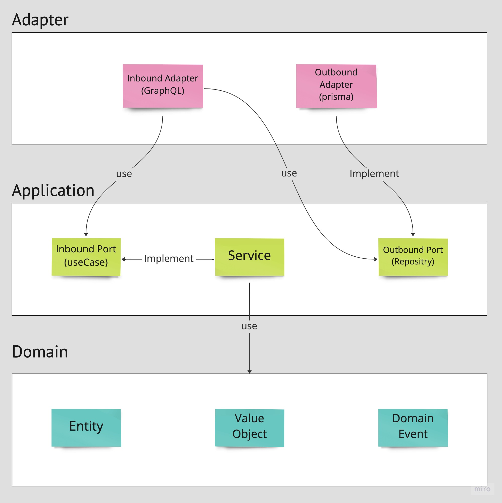
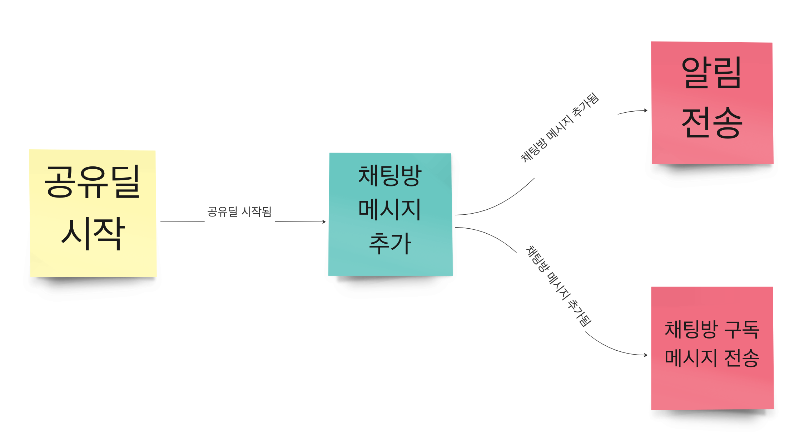

사이드 프로젝트로 진행하고 있는 [배달비 노노 백엔드 서버](https://github.com/bae-no/bae-no-server)에 대한 소개와 기술적인 고민에 대한 내용을 담았다.

<!--truncate-->

## 프로젝트 소개

배달비 노노 프로젝트는 이름 그대로 주문 음식의 배달비를 줄일 수 있는 기회를 제공해준다.  
근처에 있는 사람들끼리 모여 같이 주문한 후 배달비를 나눠서 지불하는 방식이다.

애플리케이션 형태로 제공하며 사용자는 본인 주변에 있는 공유딜을 찾아 참여한 후 채팅을 통해 서로 소통하여 주문 및 정산을 진행한다.  
간단히 말해, 짧은 주기를 가지는 채팅방 어플리케이션이라고 볼 수 있다.


## 개발 스택

백엔드 서버의 개발 스택은 다음과 같이 이루어져 있다.

- Nest.JS
- GraphQL
- MongoDB
- Prisma

Nest.js에서 주로 REST로만 개발을 진행해봐서 이번에 GraphQL을 사용해보고 싶었다.  
MongoDB는 회사에서 검색엔진으로 사용하면서 처음 사용해보았는데 그 경험이 좋았고 채팅방 이력을 저장하기 좋은 구조라고 생각해 선택하였다.  
Prisma도 이번에 처음 사용해보았고 예전부터 사용해온 TypeORM, MikroORM과 비교해 어떤점이 좋을지 경험하고자 선택하였다.

## 프로젝트 구조

업무에서 계속 사용해온 계층형 아키텍쳐대신 헥사고날 아키텍쳐라고 불리는 포트와 어댑터 패턴을 사용했다.  
전체적인 디렉토리 구조는 [만들면서 배우는 클린 아키텍처](http://www.yes24.com/Product/Goods/105138479)를 참고해서 만들었다.  
파일명도 일반적인 Nest.js컨벤션 대신 JVM에서 많이 사용하는 패턴을 사용했다.

```
sample
├── SampleModule.ts
├── adapter
│   ├── in
│   │   └── gql
│   │       ├── SampleMutationResolver.ts
│   │       ├── SampleQueryResolver.ts
│   │       ├── SampleSubscriptionResolver.ts
│   │       ├── input
│   │       │   └── CreateSampleInput.ts
│   │       └── response
│   │           └── SampleResponse.ts
│   └── out
│       └── persistence
│           ├── SampleOrmMapper.ts
│           ├── SampleQueryRepositoryAdapter.ts
│           └── SampleRepositoryAdapter.ts
├── application
│   ├── port
│   │   ├── in
│   │   │   ├── SampleCommandUseCase.ts
│   │   │   ├── SampleQueryUseCase.ts
│   │   │   └── dto
│   │   │       └── CreateSampleCommand.ts
│   │   └── out
│   │       ├── SampleQueryRepositoryPort.ts
│   │       └── SampleRepositoryPort.ts
│   └── service
│       ├── SampleCommandService.ts
│       └── SampleQueryService.ts
└── domain
    └── Sample.ts
```

src 디렉토리 아래에 모듈별로 디렉토리를 만들고 그 안에 위와 같은 구조로 파일을 만들었다.  
모듈 안에는 크게 domain, application, adapter로 나누었고 각각 다음과 관련된 로직이 들어있다.

- domain: 도메인 모델과 비즈니스 로직
- application: 도메인 모델을 사용하는 비즈니스 로직
- adapter: GraphQL, Notification, DB등 인프라와 관련된 로직

시간이 지나면 언제든지 변경될 수 있는 요소는 adapter에 모아두고, 도메인과 비즈니스 로직은 application과 domain에 위치한다.  
application에는 외부에서 사용할 `inbound port`인터페이스와 Service에서 사용하는 `outbound port`인터페이스가 있다.  
adatper는 `outbound port`를 구현하고 `inbound port`를 사용해 GraphQL과 같은 api요청과 응답로직을 구현한다.  
domain은 모두 순수한 클래스만 가지고 있으며 핵심적인 비즈니스 로직만을 가지고 있다.



## fp-ts

[fp-ts](https://gcanti.github.io/fp-ts/)는 대수적 자료형을 제공하는 라이브러리로 `Option`, `Task`, `Either` 등의 유용한 타입을 제공한다.  
예전부터 여러 프로그래밍 패러다임을 같이 사용해보고 싶었고 어떤 장단점이 있을지 궁금했다.

이전 `santa-close`프로젝트에서 `spring + kotlin arrow`를 사용했지만 제대로 활용하지 못했다.  
이번에는 대부분의 메소드 내부구현은 `fp-ts`를 활용해 순수 메소드로 만들고, 실제 응답값을 반환해야 하는 resolver에서만 사이드 이펙트가 발생하도록 만들었다.  
대부분의 메소드가 비동기 로직을 담고있고 에러가 발생할 수 있기에 `TaskEither`를 주로 사용했다.

각 패러다임을 활용하는 부분은 다음과 같다.

- OOP: 의존성 주입, 상태와 행위의 결합
- FP: 에러처리, 병렬처리, 부작용 제거

## 느낀점 및 고민

프로젝트를 진행하면서 느낀점과 고민을 정리해보았다.

### fp-ts 의존성

`fp-ts`는 외부 라이브러리이기에 어느 영역까지 사용을 허용할지 고민이 많았다.  
예를들어 도메인 클래스의 유효성 검증 메소드를 생각해보자.  
검증에 실패하면 일반적인 경우에는 다음과 같은 도메인 에러를 던지는 코드를 작성할 것이다.

```typescript
class PhoneVerification {
  // ...생략
  verify(code: string, now = new Date()): void {
    if (this.code !== code) {
      throw new MismatchedCodeException();
    }

    if (this.isExpired(now)) {
      throw new ExpiredCodeException();
    }
  }
}
```

위 메소드를 사용하는 곳은 서비스 영역인데 순수메소드 형태를 유지하기 위해 `tryCatch`를 사용해 `Either`로 만들어야 하는 불편함이 존재한다.  
또한 메소드의 구현부를 읽어야만 해당 메소드가 어떤 에러를 던지는지 파악할 수 있다는 단점이 있다.  
이는 **메소드의 시그니쳐만 읽어도 어떤 에러가 발생하는지 파악**할 수 있는 `Either`의 장점을 포기해야 하는 상황이었다.

하지만 도메인 클래스 내부에서 `Either`를 반환하게 만들면 `fp-ts`라는 외부 라이브러리에 대한 의존성이 생기므로 가장 순수해야 할 영역이 오염된다.  
물론 `Either`와 같은 대수적 자료형은 직접 클래스 형태로 구현할 수 있지만 라이브러리에서 제공하는 여러 유틸리티 함수와 복잡한 타입추론까지 직접 구현해야 한다.

```typescript
// 외부 의존성
import { Either, left, right } from "fp-ts/Either";

class PhoneVerification {
  // ...생략
  verify(
    code: string,
    now = new Date(),
  ): Either<ExpiredCodeException | MismatchedCodeException, void> {
    if (this.code !== code) {
      return left(new MismatchedCodeException());
    }

    if (this.isExpired(now)) {
      return left(new ExpiredCodeException());
    }

    return right(undefined);
  }
}
```

여러 고민끝에 다음과 같은 결론을 내렸다.

`Haskell`과 같은 순수 함수형 언어에서는 `Either`와 같은 대수적 자료형을 기본제공하기에 도메인 내부에서 사용하는데 문제가 없다.  
그래서 `fp-ts`의 자료형들을 **node.js의 확장된 내장타입**으로 생각하고 사용하기로 했다.  
물론 외부 라이브러리이기에 미래에 언제든지 교체될 수 있는 가능성이 있지만, Node의 **String, Number, Boolean과 같은 교체되기 힘든 타입과 같은 영역**을 다루기에 사용해도 괜찮다는 생각이 들었다.

### 모니터링과 로깅

`fp-ts`를 사용하는 경우 모니터링과 로깅에 신경써야 하는 부분이 있다.  
보통 데이터베이스 조회와 같은 비동기 로직은 사이드 이팩트를 발생하므로 `TaskEither`를 사용하게된다.  
`TaskEither`는 promise를 사용하는 로직에 대한 추상화로 아직 어떠한 값을 가지고 있지 않는다.

보통 `TaskEither`를 반환하는 함수들을 합성해 최종적으로 하나의 함수를 만들며 이 함수를 실행할 때 비동기 로직이 실행된다.  
따라서 `TaskEither`를 반환하는 메소드의 실행시간을 측정하면 **함수의 합성에 걸리는 시간만 포함하지 실제 비동기 로직에 대한 시간은 포함하지 않는다**.

예를들어 datadog을 모니터링에 사용하는 경우 아래 코드처럼 span을 생성해 실행시간을 측정해보면 데이터베이스 상태와 관계없이 매우 짧은 일정한 시간을 가진다.

```typescript
import tracer from "dd-trace";

class ChatQueryRepositoryAdapter {
  override unreadCount(
    shareDealId: string,
    userId: string,
  ): TaskEither<DBError, number> {
    return tracer.trace("ChatQueryRepositoryAdapter.unreadCount", () =>
      pipe(
        tryCatchDB(() =>
          this.prisma.chat.count({
            where: {
              shareDealId,
              userId,
              message: { is: { unread: true } },
            },
          }),
        ),
      ),
    );
  }
}
```

또한 에러가 발생할 때 해당 에러객체에 대한 로그를 출력할 때 스택트레이스가 제대로 나오지 않는 문제가 있다.  
에러 인스턴스가 생성된 시점의 스택은 나오지만 생성 전까지 호출한 함수의 스택은 나오지 않는다.  
이는 `Error.captureStackTrace`을 사용하는 것으로 해결할 수 있다.

```typescript
export abstract class BaseException extends Error {
  protected constructor(message: string) {
    super(message);
    Error.captureStackTrace(this, this.constructor);
  }
}
```

위 클래스를 상속받아 도메인 에러클래스를 만들어 사용하면 된다.

### 의존성 주입

Nest.js를 사용하면서 얻을 수 있는 가장 큰 혜택은 의존성 주입이라고 생각한다.  
`@Injectable` 데코레이터를 사용해 원하는 클래스를 주입가능한 클래스로 만들 수 있으며 동시에 생성자에 선언한 항목을 런타임에 주입받을 수 있다.  
포트와 어댑터 패턴을 적용한 환경이라면 보통 어댑터는 포트 인터페이스를 구현하며 또 다른 포트 인터페이스를 주입받아 사용한다.

```typescript
import { Injectable } from "@nestjs/common";

@Injectable()
export class ShareDealCommandService implements ShareDealCommandUseCase {
  // 포트 인터페이스 구현
  constructor(
    private readonly shareDealRepositoryPort: ShareDealRepositoryPort, // 포트 인터페이스 주입
  ) {}
}
```

JVM이라면 포트를 interface로 정의하고 어댑터가 해당 interface를 구현하는 것이 일반적이다.  
TypeScript에서는 동일하게 interface를 지원하지만 Nest.js의 provider로 사용할 수 없는 문제가 있다.  
TypeScript의 interface는 컴파일 타임에만 사용되고 트랜스파일 단계에서 무시되기 때문에 Nest.js가 해당 interface를 인식하지 못한다.

이를 해결하기 위해 `@Inject` 데코레이터를 사용하거나 interface대신 abstract class를 사용하는 방안이 있다.  
개인적으로 `@Inject` 데코레이터를 사용하는 것을 선호하지 않는데 다음과 같은 이유 때문이다.

- `@Inject` 데코레이터를 사용하는 클래스는 Nest.js에 의존성이 생긴다.
- 데코레이터에 지정하는 token과 매칭되는 interface를 잘못 지정해도 컴파일 타임에는 에러가 발생하지 않는다.
- 매번 생성자 파라미터에 데코레이터 + 인터페이스를 선언해야 하는 번거로움이 있다.

특히 두 번째 이유는 **코드를 잘못 작성하고 있다는 피드백을 런타임까지 가야 받을 수 있는 점**은 치명적이라고 생각하기에 abstract class를 사용하였다.

```typescript
import { Injectable } from "@nestjs/common";

@Injectable()
export class ShareDealCommandService {
  constructor(
    // token과 매칭되는 interface를 잘못 지정해도 에러가 발생하지 않는다.
    @Inject(CHAT_REPOSITORY_PORT_TOKEN)
    private readonly shareDealRepositoryPort: ShareDealRepositoryPort,
  ) {}
}
```

### Nest.js 의존성

프로젝트를 진행하면서 각 클래스가 Nest.js와의 의존성도 최대한 줄이려고 노력하였다.  
즉 비스니스 로직을 포함하는 클래스는 최대한 순수하게 가져갈 수 있도록 하였다.  
예를들면 환경변수를 사용하는 클래스가 있다면 보통은 Nest.js의 `ConfigService`를 주입받아 사용한다.

```typescript
import { Injectable } from "@nestjs/common";
import { ConfigService } from "@nestjs/config";

@Injectable()
export class ShareDealCommandService {
  constructor(private readonly configService: ConfigService) {}
}
```

이는 위 클래스의 유닛 테스트에서도 `ConfigService`를 직접 만들어 주입해야 함을 의미한다.  
만약 미래에 Nest.js 대신 다른 프레임워크를 적용하려고 할 때 수정해야 하는 항목이 많아지게 된다.

이를 위해 `ConfigService`를 추상화한 `ConfigServicePort`를 만드는 방법이 있지만 이번에는 원하는 환경변수 값을 직접 주입하는 방법을 사용하였다.  
Nest.js에서는 의존성 주입에 사용하는 provider를 만들기 위한 여러가지 방법을 제공하는데 그 중 `useFactory`를 사용하였다.

```typescript
export class JwtStrategy {
  // 원하는 환경변수를 직접 선언한다.
  constructor(private readonly jwtSecret: string) {}
}

@Module({
  providers: [
    {
      provide: JwtStrategy,
      inject: [ConfigService],
      useFactory: (configService: ConfigService) =>
        // 모듈 선언부에서 직접 configService를 활용해 원하는 환경변수를 주입한다.
        new JwtStrategy(configService.getOrThrow("JWT_SECRET")),
    },
  ],
  exports: [PushMessagePort],
})
export class PushMessageModule {}
```

모듈 선언 파일에서는 Nest.js의 의존성을 가지는게 전혀 문제가 되지 않으므로 이곳에서 configService를 사용하였다.

추가로 유닛 테스트에서도 가능하면 `@nestjs/testing` 패키지를 사용하지 않고 직접 의존성을 주입하였다.

```typescript
describe("ChatQueryService", () => {
  // stub과 mock을 활용해 의존성 생성
  const shareDealQueryRepositoryPort = mock<ShareDealQueryRepositoryPort>();
  const chatQueryRepositoryPort = mock<ChatQueryRepositoryPort>();
  const userQueryRepositoryPort = mock<UserQueryRepositoryPort>();
  const eventEmitter = new StubEventEmitter();
  // 직접 의존성 주입
  const shareDealCommandService = new ChatQueryService(
    shareDealQueryRepositoryPort,
    chatQueryRepositoryPort,
    userQueryRepositoryPort,
    eventEmitter,
  );
});
```

더 극단적으로 의존성을 제거하려면 `@Injectable` 데코레이터조차 사용하지 않고 모듈 선언부에서 주입해주는 방법도 있다.  
하지만 이는 의존성이 하나 추가 될 때마다 모듈 선언부도 같이 수정해야 하는 번거로움이 있으며 앞서 이야기한 Nest.js의 장점을 제대로 활용하지 못한다고 생각한다.  
그래서 해당 데코레이터의 사용만 허용하였으며 추후에 다른 프레임워크를 쓴다고 해도 데코레이터명이나 import경로만 수정하면 되기에 변경의 어려움은 없을거라고 생각한다.

### Prisma

Prisma를 사용하면서 좋았던 점은 ORM을 위한 엔티티 클래스를 따로 만들지 않아도 된다는 것이었다.  
TypeORM과 같은 라이브러리를 사용했다면 도메인 클래스와 더불어 엔티티 클래스도 만들어야 하지만 Prisma는 스키마 파일만 작성해주면 된다.

또한 mongoDB와 함께 사용하는 경우 스키마 파일에서 DDD에서 이야기하는 Aggregate와 Value Object를 일부 추론할 수 있는점도 장점이라고 생각한다.  
RDB를 사용한다면 도메인 클래스의 구조와 RDBMS에 저장되는 구조가 다르지만 NoSQL을 사용한다면 둘 간의 차이를 줄일 수 있다.

```prisma
model ShareDeal { // Aggregate
  id           String          @id @default(auto()) @map("_id") @db.ObjectId
  createdAt    DateTime        @unique @default(now())
  updatedAt    DateTime        @updatedAt
  title        String
  zone         ShareZone       // value object
  participants ParticipantInfo // value object
}

type ParticipantInfo {
  ids       String[] @db.ObjectId
  max       Int
  current   Int
  remaining Int
}
```

Prisma를 사용하는 경우 GraphQL과의 연동이 편리하다는 장점이 있지만 이번 프로젝트에는 활용하지 못했다.  
두 라이브러리간의 연동은 표현 영역과 인프라 영역간의 강한 결합을 의미하며 다른 의존성으로 교체하는 것을 어렵게 만들기 때문이다.

또한 Primsa에는 아직 geometry관련 기능이 존재하지 않는 아쉬움이 있다.  
이번 프로젝트에서 사용자 위치 기준으로 가까운 공유딜을 정렬하는 요구사항이 있는데 이를 위해 raw query를 사용해야 했다.

### 도메인 이벤트

방장이 공유딜을 시작하는 경우 다음과 같은 로직이 수행되야 한다.

- 공유딜의 상태를 `START`로 변경한다.
- 채팅방에 시작 메시지를 추가한다.
- 채팅방을 구독(Graphql Subscription)하는 사용자들에게 메시지를 전송한다.
- 참여자들에게 알림(FCM)을 보낸다.

위 로직을 하나의 서비스 메소드에서 처리할 수 있지만 공유딜의 상태를 변경하는 핵심로직과 알림같은 부가로직이 섞이게 된다.  
또한 공유딜과 채팅방은 서로 다른 Aggregate로 설계하여 하나의 트랜잭션으로 처리할 수 없었다.

이를 해결하기 위해 내부이벤트를 사용하였다.  
또한 채팅방에 시작 메시지를 추가하는 작업과 알림작업 또한 이벤트를 사용해 분리하였다.



위와 같은 작업을 통해 각 영역간의 결합도를 낮출 수 있었지만 공유딜이 시작할 때 어떤일이 발생하는지 파악하기 어려워진다는 단점이 존재한다.  
추가로 공유딜의 상태만 변경되고 채팅방에 메시지가 추가되지 않는 상황에 대한 처리가 필요하다.  
이번 프로젝트에는 이와 같은 상황에 대한 처리를 하지 않았지만 실무였다면 반드시 고려해야 한다.
