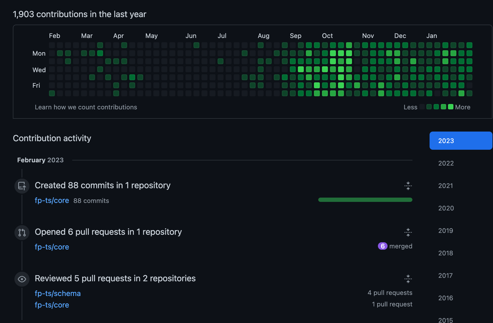
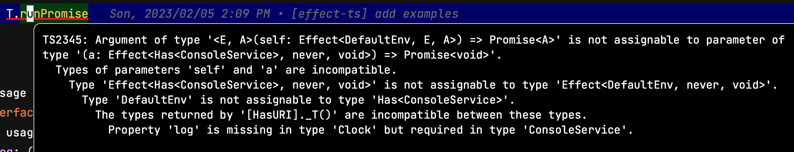

대수적 자료형을 제공하는 Typescript 라이브러리인 fp-ts의 메인테이너 [Giulio Canti](https://github.com/gcanti)의 최근 활동을 보면 [fp-ts](https://github.com/fp-ts)그룹 내의 저장소에 작업을 하는것을 볼 수 있다.



그 중에서 [core](https://github.com/fp-ts/core) 저장소를 보면 해당 프로젝트의 목적이 `@effect` 생태계와의 통합을 위한 것이라고 한다.  
core 라이브러리는 대수적 자료형을 위한 인터페이스와 `Option`, `Either`와 같은 기본 자료형을 제공하며 효과를 다루기 위해 기존에 사용한 `Task`, `TaskEither`는 effect를 사용할 것을 권장하고 있다.

해당 라이브러리에 관심이 생겨 관련 문서를 찾아보았지만 자료가 많지 않았고 공식문서조차 매우 부실한 상태이다.  
다행히 프로젝트의 주요 메인테이너인 [mikearnaldi](https://github.com/mikearnaldi)가 발표한 여러 영상이 있어 이를 활용하였다.  
이번 글에서는 발표 영상중 하나인 [Write Efficient & Testable code with effect-ts](https://www.youtube.com/watch?v=Oy7fr2_WBFI)의 내용을 정리해보았다.

<!--truncate-->

## 테스트 가능한 코드

테스트 가능한 코드는 보통 다음과 같은 성질이 있다.

- 모듈성
- 단일 목적
- 명시적
- 낮은 결합도
- 순수와 비순수의 분리
- 간결함

함수형 프로그래밍은 보통 테스트 가능한 코드를 작성을 쉽게 만들어주지만 항상 그런것은 아니다.  
잘못 설계된 함수형 코드는 여전히 다른 패러다임으로 만든 코드만큼이나 어려울 수 있다.  
`Effect-TS`는 처음부터 테스트 가능한 코드를 작성하기 위해 설계한 라이브러리이며, 스칼라 언어의 [ZIO](https://zio.dev/)라이브러리를 TypeScript로 포팅한 것이다.

## 순수하지 않은 함수

주어진 이름을 출력하는 간단한 hello world 함수를 생각해보자.

```ts
function helloWorld(name: string) {
  console.log(`hello world: ${name}!`);
}
```

위와 같은 함수는 함수형 프로그래밍에서 말하는 순수함수가 아니며 다음과 같은 문제가 있다.

- 전역 상태인 `console`을 변경한다.
- 유의미한 값을 반환하지 않는다.
- 구현부를 보지 않고는 함수가 에러를 던질 가능성이 있는지 알 수 없다.
- 내부적으로 `console`을 사용하고 있다는 사실을 내부 구현을 보지 않고는 알 수 없다.

위와 같은 성질로 인해 이 함수는 테스트 하기 어렵다.

## 개선하기

이 함수의 문제점들을 하나씩 개선해보자.

### 유의미한 값을 반환하기

우선 이 함수를 다음과 같이 수정하면 유의미한 반환값을 가지도록 할 수 있다.

```ts
function helloWorld(name: string) {
  return () => {
    console.log(`Hello world: ${name}!`);
  };
}
```

이제 helloWorld 함수는 **콘솔에 문자열을 출력하는 효과를 가진 함수**를 반환한다.  
콘솔에 문자열을 출력하기 위해서는 helloWorld가 반환한 함수를 실행해야 한다.

```ts
const call = helloWorld("Mike");

call(); // Hello world: Mike!
```

함수를 값으로 생각한다면 이 함수는 동일한 name을 주면 항상 동일한 효과를 가진 함수를 반환하므로 순수함수라고 할 수 있다.

### 에러 발생 가능성을 명시적으로 표현하기

helloWorld 함수는 에러를 던질 가능성이 없으며 Either를 사용해 명시적으로 표현할 수 있다.

```ts
// effect-ts의 Either 모듈을 import한다.
import * as E from "@effect-ts/core/Either";

function helloWorld(name: string) {
  return (): E.Either<never, void> => {
    console.log(`Hello world: ${name}!`);
    return E.right(undefined); // 항상 성공하므로 right를 반환한다.
  };
}
```

helloWorld가 반환하는 효과의 타입은 `Either<never, void>`인데 generic type의 첫번째 인자는 에러 타입을 의미하며 두번째 인자는 성공 타입을 의미한다.  
에러의 타입이 never이면 에러를 던지지 않는것을 의미한다.

### console 의존성 제거하기

console과 같은 외부 의존성을 함수 내부에서 직접 사용하기 보다 함수의 인자로 받아서 사용할 수 있다.

```ts
import * as E from "@effect-ts/core/Either";

// IO 효과를 표현하기 위한 타입
type IO<A> = () => A;

// console 의존성에 대한 인터페이스
interface ConsoleService {
  Console: {
    log: (message: string) => IO<E.Either<never, void>>;
  };
}

function helloWorld(name: string) {
  return ({ Console }: ConsoleService) => Console.log(`Hello world: ${name}!`);
}

const program = helloWorld("Mike");

// 의존성 주입
const call = program({
  Console: {
    log: (message: string) => () => {
      console.log(message);
      return E.right(undefined);
    },
  },
});

// 효과 실행
call(); // Hello world: Mike!
```

이제 helloWorld 함수는 외부 의존성을 인자로 받아서 사용하므로 테스트 가능한 코드가 된다.

```ts
it("test hello world", () => {
  // given
  const program = helloWorld("Mike");
  const messages = [];
  const call = program({
    Console: {
      log: (message: string) => () => {
        messages.push(message);
        return E.right(undefined);
      },
    },
  });

  // when
  call();

  // then
  expect(messages).toEqual(["Hello world: Mike!"]);
});
```

하지만 이 함수는 의존성 주입과 효과 실행을 위해 두 번의 연속적인 함수 호출이 필요하다는 단점이 있다.  
또한 함수형 프로그래밍에서 주로 활용하는 함수의 합성을 활용하기 어려운 구조를 가지고 있다.

## Effect-TS 활용하기

이제 본격적으로 `Effect-TS`를 활용해 helloWorld 함수를 더 개선해보자.

### 의존성과 에러 타입을 하나의 반환값으로 합치기

우선 helloWorld 함수의 의존성과 에러 타입을 하나의 반환값으로 합치는 방법을 알아보자.  
`Effect-TS`에서는 `Effect<R, E, A>`라는 타입을 제공하며 각 generic type의 의미는 다음과 같다.

- `R` : 의존성 타입
- `E` : 에러 타입
- `A` : 성공 타입

이는 fp-ts의 `ReaderTaskEither<R, E, A>`타입과 유사하지만 더 type-safe하며 다양한 combinator를 제공한다.  
이제 기존에 정의한 `ConsoleService` 인터페이스를 수정해보자.

```ts
import * as T from "@effect-ts/core/Effect";

interface ConsoleService {
  log: (message: string) => T.Effect<unknown, never, void>;
}
```

log의 반환타입이 Effect로 변경되었고 의존성 타입이 `unknown`이다.  
이는 효과를 실행하기 위해 어떠한 의존성도 요구하지 않는다는 의미이다.  
console에 의존하는 Effect를 만들기 위해서는 라이브러리에서 제공하는 추가적인 모듈을 사용해야 한다.

```ts
import * as T from "@effect-ts/core/Effect";
import { tag } from "@effect-ts/core/Has";

interface ConsoleService {
  log: (message: string) => T.Effect<unknown, never, void>;
}

// 서비스 태그 만들기
const ConsoleService = tag<ConsoleService>();

// 서비스 태그를 통해 Effect 생성하는 함수 구현
const log = (message: string) =>
  T.accessServiceM(ConsoleService)((service) => service.log(message));
```

`tag`함수는 프로그램 환경에서 필요한 여러 의존성(서비스)들을 구분하기 위한 태그를 만들어준다.  
`accessServiceM`의 용도가 이해하기 어려울 수 있는데 간단히 말하면 인자로 받는 서비스 태그를 활용해 새로운 Effect를 생성하는 함수이다.

> 앞으로 `tag 생성` -> `accessServiceM 호출` 과정이 반복되기 때문에 Effect를 만들기 위한 boilerplate 코드라고 생각해도 된다.

`log` 함수의 타입을 살펴보면 다음과 같다.

```ts
const log: (message: stirng) => Effect<Has<ConsoleService>, never, void>;
```

함수의 반환타입의 의존성이 `Has<ConsoleService>`로 변경된 것을 확인할 수 있다.  
`Has`타입은 여러 의존성이 비슷한 함수를 가질 때 타입이 제대로 추론되지 않는 문제를 해결하기 위해 사용된다.

### 효과 실행하기

`Effect-TS`는 생성한 효과를 실행하기 위한 함수를 제공한다.

```ts
import { pipe } from "@effect-ts/core";
import * as T from "@effect-ts/core/Effect";

const ConsoleService = tag<ConsoleService>();

function helloWorld(name: string) {
  return log(`Hello world: ${name}!`);
}

// T.Effect<Has<ConsoleService>, never, void>
const program = helloWorld("Mike");

pipe(
  program,
  // 의존성 제공하기
  T.provideService(ConsoleService)({
    log: (message: string) => T.succeedWith(() => console.log(message)),
  }),
  // promise로 변환
  T.runPromise
);
```

`provideService`는 주어진 효과에 의존성을 제공하는 함수이며, `runPromise`는 주어진 효과를 실행하는 Promise를 생성한다.  
만약 의존성을 제공하지 않고 바로 `runPromise`를 사용할 시 타입에러가 발생하게 된다.



### 효과 합성

지금까지 단일 효과를 생성하고 실행하는 방법을 살펴보는데 일반적인 프로그램에서는 여러 효과가 필요한 경우가 많다.  
이런 경우에는 여러 효과를 합성하여 최종적으로 하나의 효과를 만들어 실행하게 된다.

정적 타입기반 함수형 언어에서는 보통 효과를 포함하는 함수들 간의 합성을 위해 `Monad`를 사용한다.  
`Effect`타입 또한 `Monad`구현체로 `chain`함수를 사용해 합성할 수 있다.

```ts
import { pipe } from "@effect-ts/core";
import * as T from "@effect-ts/core/Effect";

// Mike와 John을 순차적으로 출력하는 효과를 합성
const program = pipe(
  helloWorld("Mike"),
  T.chain(() => helloWorld("John"))
);

pipe(
  program,
  T.provideService(ConsoleService)({
    log: (message: string) => T.succeedWith(() => console.log(message)),
  }),
  T.runPromise
);
// Hello world: Mike!
// Hello world: John!
```

함수형 패러다임에 익숙하지 않는 사람에게는 위와같은 합성형태가 이해하기 어려울 수 있다.  
이를 위해 `Effect-TS`에서는 generator 함수를 활용해 명령형 코드를 작성할 수 있도록 지원한다.  
마치 Promise를 사용할 때 `async/await`를 사용하는 것과 같은 방식으로 사용할 수 있다.

```ts
import * as T from "@effect-ts/core/Effect";
import { pipe } from "@effect-ts/core";

const program = T.gen(function* (_) {
  yield* _(helloWorld("Mike"));
  yield* _(helloWorld("John"));
  yield* _(helloWorld("sam"));
});

// Effect를 Promise로 생각한다면 다음과 같은 코드가 된다.
async function program() {
  await helloWorld("Mike");
  await helloWorld("John");
  await helloWorld("sam");
}

pipe(
  program,
  T.provideService(ConsoleService)({
    log: (message: string) => T.succeedWith(() => console.log(message)),
  }),
  T.runPromise
);
```

`async/await`보다는 사용방법이 다소 복잡해 보이지만 `if, for, while` 등의 제어문을 사용할 수 있는 장점이 있다.

## 예제

지금까지 소개한 내용을 바탕으로 다음과 같은 프로그램을 작성해보자.

```
0에서 1사이의 랜덤한 숫자를 가져와 0.5보다 크면 에러를 반환하고 아니면 숫자를 출력한다.
```

먼저 랜덤한 숫자를 만들기 위해 `Math.random`을 사용하는 것을 생각할 수 있다.  
하지만 이러한 무작위성은 테스트를 어럽게 만드는 요소이므로 의존성으로 분리해야 한다.

```ts
interface RandomService {
  rand: T.Effect<unknown, never, number>;
}

const RandomService = tag<RandomService>();

// Effect<Has<RandomService>, never, number>
const rand = T.accessServiceM(RandomService)((service) => service.rand);
```

`rand`변수는 `RandomService`를 의존성으로 가지고 에러가 발생하지 않으며 number를 반환하는 효과이다.

이제 랜덤한 값이 0.5보다 큰 경우 발생하는 에러 클래스를 직접 정의해보자.

```ts
import { Tagged } from "@effect-ts/system/Case";

export class BadRandomValue extends Tagged("BadRandomValue")<{
  readonly value: number;
}> {}
```

`Tagged`함수를 사용해 커스텀 클래스를 만들고 있는데 이는 하나의 효과가 여러 유형의 에러를 가질 때 이를 type-safe하게 처리하기 위해 사용한다.  
Typescript의 tagged union과 같은 비슷한 역할을 한다고 생각하면 된다.  
에러 클래스를 위해 `Tagged`를 반드시 사용할 필요는 없으며 순수 클래스를 사용해도 된다.

기존에 작성한 `log`함수와 `T.gen`을 사용해 다음과 같이 프로그램을 작성할 수 있다.

```ts
// Effect<Has<ConsoleService> & Has<RandomService>, BadRandomValue, void>
const program = T.gen(function* (_) {
  // 랜덤한 숫자를 가져온다.
  const value = yield* _(rand);

  if (value > 0.5) {
    // 조건에 맞지 않으면 BadRandomValue 에러효과를 반환한다.
    return yield* _(T.fail(new BadRandomValue({ value })));
  }

  // 조건에 맞으면 값을 출력한다.
  yield* _(log(`got: ${value}`));
});

// pipe와 chain을 사용한다면 아래와 같이 작성할 수 있다.
const program = pipe(
  rand,
  T.chain((value) =>
    value <= 0.5 ? log(`got: ${value}`) : T.fail(new BadRandomValue({ value }))
  )
);
```

`program`의 최종 타입을 보면 의존성에 자동으로 `ConsoleService`와 `RandomService`가 추가되었음을 확인 할 수 있다.  
이는 fp-ts의 `ReaderTaskEither`에서는 제공하지 않는 기능으로 보다 더 type-safe한 프로그래밍을 할 수 있게 해준다.

## 테스트 코드

이제 위 프로그램을 테스트해보자.

```ts
import { Exit, pipe } from "@effect-ts/core";
import * as T from "@effect-ts/core/Effect";

it("0.5 보다 크면 에러를 반환한다", async () => {
  // given
  const fakeRandom = T.provideService(RandomService)({
    rand: T.succeed(0.6), // 0.6을 항상 반환하게 고정
  });
  const fakeConsole = T.provideService(ConsoleService)({
    log: (message: string) => T.succeedWith(() => console.log(message)),
  });

  // when
  const result = await pipe(program, fakeRandom, fakeConsole, T.runPromiseExit);

  // then
  expect(Exit.untraced(result)).toEqual(
    Exit.fail(new BadRandomValue({ value: 0.6 }))
  );
});
```

이 코드는 에러가 발생하는 경우에 대한 테스트로 각 의존성들을 fake로 대체한 것을 확인할 수 있다.  
이를 통해 테스트하기 어려웠던 영역을 단위 테스트 할 수 있게 되었다.

성공하는 케이스도 같은 방식으로 테스트할 수 있다.

```ts
it("0.5 보다 작으면 화면에 출력한다", async () => {
  // given
  const fakeRandom = T.provideService(RandomService)({
    rand: T.succeed(0.3),
  });
  const messages: string[] = [];
  const fakeConsole = T.provideService(ConsoleService)({
    log: (message: string) => T.succeedWith(() => messages.push(message)),
  });

  // when
  const result = await pipe(program, fakeRandom, fakeConsole, T.runPromiseExit);

  // then
  expect(result).toEqual(Exit.succeed(undefined));
  expect(messages).toEqual(["got: 0.3"]);
});
```

fakeConsole은 주어진 메시지를 실제 콘솔에 출력하는 대신 배열에 저장하도록 하여 출력 메시지를 검증할 수 있게 만들어준다.

## 마무리

지금까지 Effect-TS의 소개와 이를 활용한 코드를 살펴보았다.  
`fp-ts`의 `TaskEither`를 사용하던 것과 비교해보면 `Effect`를 사용하면 더욱 type-safe하고 테스트하기 쉬운 코드를 작성할 수 있다는 것을 확인할 수 있었다.  
또한 이번 글에서는 소개하지 않았지만 에러의 스택트레이스가 자세하게 출력되는 점과 `opentelemetry`와의 연동을 통해 모니터링에 대한 지원도 제공한다는 점도 장점으로 꼽을 수 있다.  
문서화가 부족한 점은 아쉽지만, ZIO를 사용해본 경험이 있는 사람이라면 쉽게 적응할 수 있을 것 같다.
