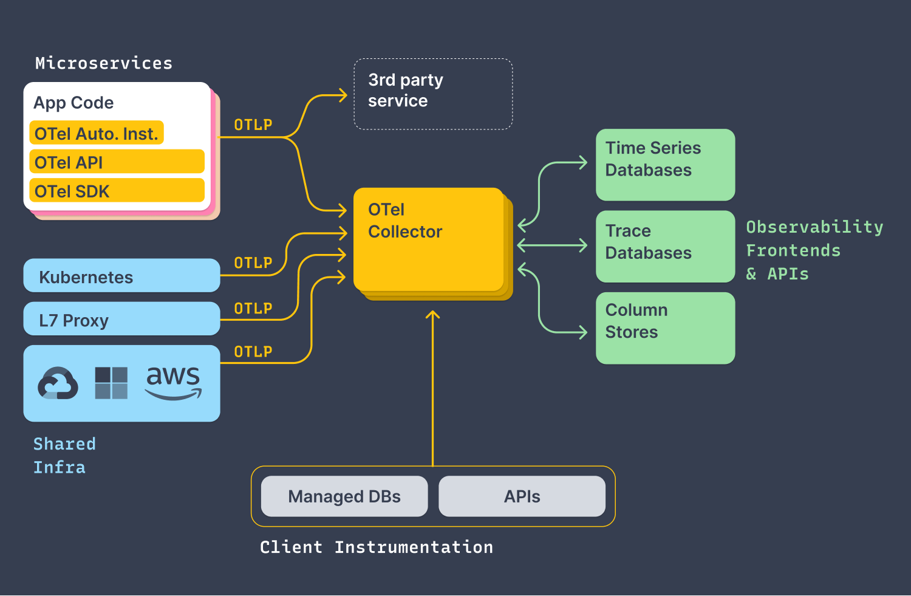
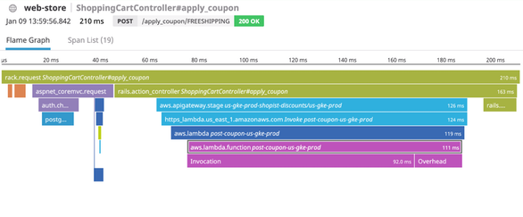
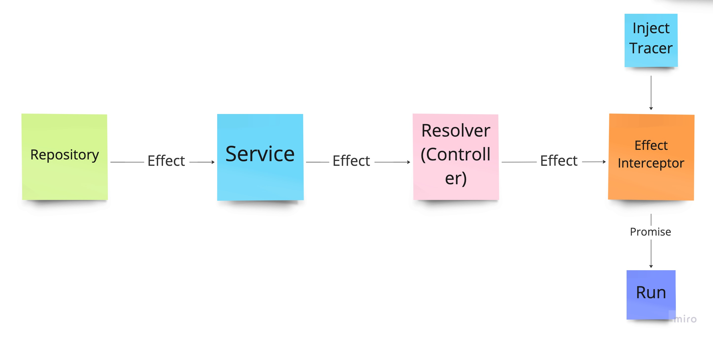
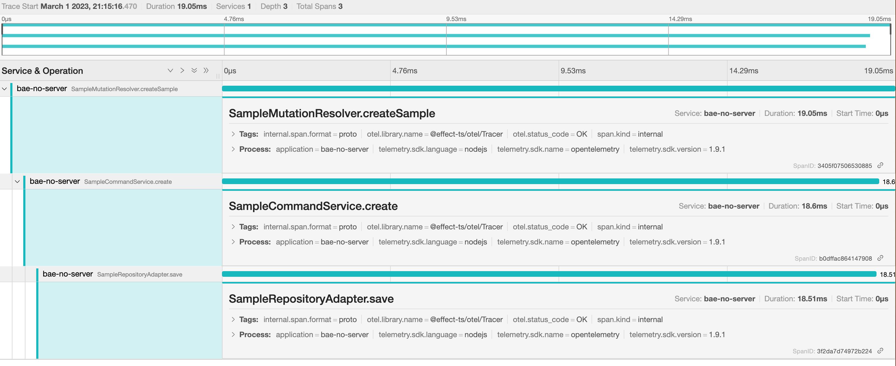

요즘에는 웹 어플리케이션의 모니터링을 위해 Datadog과 같은 도구를 사용한다.
최근에 작업중인 사이드 프로젝트도 모니터링을 위해 Datadog을 사용하려고 했다.
하지만 APM(Application Performance Monitoring)과 같은 기능은 유료로 제공되기에 무료 솔루션을 찾아보았다.

그 과정에서 [Open Telemetry](https://opentelemetry.io)이라는 프로젝트를 알게 되었다.
오픈소스이며 내가 원하는 기능을 제공하고 있었고, 또한 이전 포스트에서 소개한 [Effect-TS](https://github.com/Effect-TS/effect)는 Open Telemetry에 대한 지원이 잘 되어있었다.
그래서 이를 활용해 Nest.js 환경에서 각 계층에 대한 span을 aop를 통해 자동으로 생성하고, 이를 jaeger로 수집하는 방법을 설명하고자 한다.

:::info
포스트에 소개한 내용은 다음 저장소에 적용되어 있다.
[https://github.com/bae-no/bae-no-server](https://github.com/bae-no/bae-no-server)
:::

<!--truncate-->

## Open Telemetry

OpenTelemetry는 모니터링을 위한 오픈소스 프로젝트로 metrics, traces, logs 등의 데이터를 수집, 처리, 전송하는 API, 라이브러리, 에이전트 등을 제공한다.
프로젝트 저장소를 살펴보면 다양한 프로그래밍 언어와 프레임워크에 대한 지원을 제공하고 있는것을 확인할 수 있다.
모니터링에 대한 표준을 제공하고 있으며, Datadog, New Relic과 같은 서비스들도 OpenTelemetry 포맷을 지원하고 있다.



이번 포스트에서는 OpenTelemetry의 tracing기능을 중심으로 설명하고자 한다.
tracing은 각 계층의 span을 생성하여 어떤 서비스의 어떤 영역에서 연산이 얼마나 오래 걸렸는지, 또는 어떤 에러가 발생했는지 추적할 수 있게해준다.
이를 통해 서비스의 병목지점을 찾아내고, 문제를 해결할 수 있는 단서를 얻을 수 있다.



Open Telemetry는 하나의 요청이 여러 서비스를 거치면서 처리되는 경우도 고려한 분산 추적을 지원한다.
이를 위해 하나의 요청은 고유한 trace id를 가지며, 다른 서비스로 이동할 때마다 HTTP 헤더에 trace id를 포함시켜 전달한다.
이는 `propagation`이라는 용어로 불리며 사용자는 Open Telemetry에서 제공하는 SDK를 사용하여 손쉽게 적용할 수 있다.

SDK를 통해 수집한 데이터를 시각화 하기위해 보통 `jaeger`, `zipkin`과 같은 시스템을 사용한다.
이번 포스트에서는 jaeger를 사용하는 방법을 설명하고자 한다.

## Node.js용 Open Telemetry 패키지 설치하기

이제 본격적으로 tracing을 위한 환경을 구성해보자.
먼저 Node.js용 Open Telemetry 패키지가 꽤 많은데 다음 패키지를 설치한다.

```shell
pnpm install "@opentelemetry/api" \
    "@opentelemetry/auto-instrumentations-node" \
    "@opentelemetry/core" \
    "@opentelemetry/exporter-jaeger" \
    "@opentelemetry/exporter-trace-otlp-http" \
    "@opentelemetry/instrumentation" \
    "@opentelemetry/resources" \
    "@opentelemetry/sdk-node" \
    "@opentelemetry/sdk-trace-base" \
    "@opentelemetry/sdk-trace-node" \
    "@opentelemetry/semantic-conventions"
```

이제 다음과 같은 코드를 작성한다.

```typescript
import { diag, DiagConsoleLogger, DiagLogLevel } from "@opentelemetry/api";
import { getNodeAutoInstrumentations } from "@opentelemetry/auto-instrumentations-node";
import { W3CTraceContextPropagator } from "@opentelemetry/core";
import { OTLPTraceExporter } from "@opentelemetry/exporter-trace-otlp-http";
import { registerInstrumentations } from "@opentelemetry/instrumentation";
import { Resource } from "@opentelemetry/resources";
import { BatchSpanProcessor } from "@opentelemetry/sdk-trace-base";
import { NodeTracerProvider } from "@opentelemetry/sdk-trace-node";
import { SemanticResourceAttributes } from "@opentelemetry/semantic-conventions";

export const initTelemetry = (config: {
  appName: string;
  telemetryUrl: string;
}): NodeTracerProvider => {
  // open telemetry를 사용하면서 발생하는 문제를 콘솔에 출력해준다.
  diag.setLogger(new DiagConsoleLogger(), DiagLogLevel.WARN);

  // span에 추가할 메타정보를 설정한다. 보통 서비스 이름은 필수로 설정한다.
  const resource = Resource.default().merge(
    new Resource({
      [SemanticResourceAttributes.SERVICE_NAME]: config.appName,
      application: config.appName,
    })
  );

  // tracing을 위한 provider를 생성한다.
  const provider = new NodeTracerProvider({ resource });

  // tarcing정보를 OTLP프로토콜을 사용하여 전송하기 위한 exporter를 생성한다.
  const exporter = new OTLPTraceExporter({
    url: config.telemetryUrl,
    timeoutMillis: 15000,
    concurrencyLimit: 10,
  });

  // span을 배치단위로 전송하는 span processor를 설정한다.
  provider.addSpanProcessor(
    new BatchSpanProcessor(exporter, {
      maxQueueSize: 2048,
      maxExportBatchSize: 512,
      scheduledDelayMillis: 5000,
      exportTimeoutMillis: 30000,
    })
  );

  // W3C 표준 propagation을 사용한다.
  provider.register({
    propagator: new W3CTraceContextPropagator(),
  });

  // Node.js용 여러 instrumentations 플러그인 등록
  registerInstrumentations({
    instrumentations: getNodeAutoInstrumentations(),
  });

  return provider;
};
```

`initTelemetry` 함수는 tracing을 위한 설정이 있으며 웹 서버를 실행하기 전에 호출해야 한다.
그래야 instrumentations 플러그인에서 제공하는 span 생성을 위한 초기세팅이 정상적으로 동작한다.

`@opentelemetry/auto-instrumentations-node`패키지는 Node.js용 여러 instrumentation 플러그인을 하나로 묶어놓은 패키지이다.
패키지 설명을 보면 어떤 플러그인들이 있는지 확인할 수 있으며 내가 원하는 플러그인만 골라서 설정할 수도 있다.

위 패키지만 설치하면 기본적인 Node.js나 express 프레임워크 이벤트에 대한 span이 자동으로 생성된다.
하지만 내가 작성한 어플리케이션의 코드에 대한 span은 직접 작성해야 한다.

## Effect와 커스텀 span

이번 포스트에서는 커스텀 span을 생성하기 위해 Effect-TS를 사용하였다.
이유는 사이드 프로젝트 저장소의 모든 어플리케이션 메소드가 Promise가 아닌 Effect를 반환하기 때문이다.

Effect는 Promise와 유사한 타입이지만 즉시 평가되지 않는 특징이 있으며, 어떤 의존성이 필요하며 어떤 에러가 발생하는지 타입 시스템으로 표현할 수 있다.
하나의 요청은 서비스의 각 계층(컨트롤러, 서비스, 리포지토리)에서 새로운 Effect를 생성하고 이는 최종적으로 인터셉터에서 Promise로 평가된다.



`Effect-ts`에서는 Effect를 사용하는 로직에 대한 span을 생성하기 위한 기능을 제공한다.
해당 기능을 사용하면 새로운 Effect가 생성되는데 `Has<Tracer>`가 의존성에 추가된다.
해당 의존성은 평가하기 직전에 주입해야 하므로 인터셉터에서 그 역할을 수행한다.

## Effect를 위한 tracer 설정

먼저 라이브러리의 Open Telemetry 지원을 위해 `@effect-ts/otel` 패키지를 설치한다.

```shell
pnpm install "@effect-ts/core" "@effect-ts/otel"
```

`initTelemetry` 함수를 정의한 곳에 이어서 아래 코드를 추가한다.

```typescript
export const NodeProviderLayer = (provider: NodeTracerProvider) =>
  L.fromEffect(OT.TracerProvider)(
    T.succeed({
      [OT.TracerProviderSymbol]: OT.TracerProviderSymbol,
      tracerProvider: provider,
    })
  );

const dummyProps = {} as any;
export const DummyTracing = OT.Tracer.has({
  [OT.TracerSymbol]: OT.TracerSymbol,
  tracer: {
    startSpan: () => ({
      setAttribute: () => null,
      setStatus: () => null,
      end: () => null,
    }),
    ...dummyProps,
  },
});

// 환경변수 여부에 따라 실제 tracer를 사용할지 dummy tracer를 사용할지 결정한다.
export const liveTracer = process.env.OTLP_TRACE
  ? pipe(
      initTelemetry({
        // 서비스 이름
        appName: "bae-no-server",
        // span 전송을 위한 jaeger 서버 주소
        telemetryUrl: "http://localhost:4318/v1/traces",
      }),
      (provider) =>
        T.provideSomeLayer(OT.LiveTracer["<<<"](NodeProviderLayer(provider)))
    )
  : T.provide(DummyTracing);
```

Effect-TS에 관련된 설명은 제외하고 중요한 점은 `liveTracer`를 만들어 Effect를 평가할 때 주입하게 된다는 것이다.

```typescript title="EffectInterceptor.ts"
import { T, pipe } from "@app/custom/effect";
import { liveTracer } from "@app/monitoring/init";
import type {
  CallHandler,
  ExecutionContext,
  NestInterceptor,
} from "@nestjs/common";
import { Injectable } from "@nestjs/common";
import type { Observable } from "rxjs";
import { mergeMap } from "rxjs";

@Injectable()
export class EffectInterceptor implements NestInterceptor {
  intercept(_: ExecutionContext, next: CallHandler): Observable<any> {
    return next.handle().pipe(
      mergeMap(async (value) => {
        // 컨트롤러가 반환한 값이 Effect인 경우에만 실행한다
        if (value instanceof T.Base) {
          // liveTracer를 주입하여 Effect를 Promise로 평가한다.
          return pipe(value, liveTracer, T.runPromise);
        }

        return value;
      })
    );
  }
}
```

## 직접 커스텀 span 생성

span을 위한 tracer에 대한 설정은 끝났으니 이제 커스텀 span을 생성해보자.
라이브러리에서 제공하는 `withSpan` 함수를 직접 사용하면 다음과 같이 작성하면 된다.

```typescript
import { OT, T } from "@app/custom/effect";

const spanName = "my-span";
const effect = T.succeedWith(() => {
  // 생략된 어플리케이션 로직...
  return "result";
});

const newEffect = OT.withSpan(spanName)(effect);
```

이제 `newEffect`를 평가하면 작성한 로직에 대한 `my-span`이라는 이름의 span이 생성될 것이다.

이처럼 간단하게 커스텀 span을 작성할 수 있지만 우리가 작성한 모든 어플리케이션 메소드마다 `withSpan`을 추가하기에는 번거롭다.
보통 스프링에서는 이를위해 AOP를 사용하는데 Nest.js에서는 제대로 지원하지 않는다.
하지만 `DiscoveryService`와 커스텀 데코레이터를 사용하면 스프링의 AOP와 유사한 기능을 구현할 수 있다.

:::info
Nest.js 공식문서에는 인터셉터가 AOP에 영감을 받았다고 나와있다.
하지만 스프링에서 제공하는 AOP와는 다르게 오직 컨트롤러 영역에서만 적용할 수 있다.
:::

## 커스텀 데코레이터

먼저 AOP를 적용하기 위해 어떤 메소드에 관심사를 적용할지 구분할 수 있는 기능이 필요하다.
이를 위해 커스텀 데코레이터를 만들어 해당 데코레이터가 붙은 항목에게 메타데이터를 추가한다.

```typescript title="Service.ts"
import { applyDecorators, Injectable, SetMetadata } from "@nestjs/common";

export const SERVICE_METADATA = Symbol("Service");

export const Service = (): ClassDecorator =>
  applyDecorators(SetMetadata(SERVICE_METADATA, "Service"), Injectable);
```

```typescript title="Repository.ts"
import { applyDecorators, Injectable, SetMetadata } from "@nestjs/common";

export const REPOSITORY_METADATA = Symbol("Repository");

export const Repository = (): ClassDecorator =>
  applyDecorators(SetMetadata(REPOSITORY_METADATA, "Repository"), Injectable);
```

보통 Nest.js에서는 컨트롤러를 제외한 나머지 계층의 클래스에는 모두 `@Injectable` 데코레이터를 사용한다.
하지만 Nest에서 사용하는 내부적인 인스턴스도 `@Injectable`이 붙어있기 때문에 이를 구분하기 위해 `@Service`와 `@Repository` 데코레이터를 만들었다.
물론 하나의 커스텀 데코레이터로도 충분히 구현할 수 있지만 스프링처럼 계층별로 고유한 데코레이터를 사용하는 것이 더 명확하다고 생각한다.

이제 생성한 데코레이터를 사용하여 각 계층 클래스의 `@Injectable` 데코레이터를 대체한다.

```typescript
// @Injectable() -> @Service()
@Service
export class UserService {
  // 생략
}
```

## AOP 구현

이제 `DiscoveryService`를 사용한 AOP를 구현해보자.

```typescript title="OTELModule.ts"
import { OT, T } from "@app/custom/effect";
import { REPOSITORY_METADATA } from "@app/custom/nest/decorator/Repository";
import { SERVICE_METADATA } from "@app/custom/nest/decorator/Service";
import type { OnModuleInit } from "@nestjs/common";
import { Module } from "@nestjs/common";
import {
  DiscoveryModule,
  DiscoveryService,
  MetadataScanner,
} from "@nestjs/core";
import type { InstanceWrapper } from "@nestjs/core/injector/instance-wrapper";
import { RESOLVER_TYPE_METADATA } from "@nestjs/graphql";

@Module({
  imports: [DiscoveryModule],
})
export class OTELModule implements OnModuleInit {
  constructor(
    private readonly discoveryService: DiscoveryService,
    private readonly metadataScanner: MetadataScanner
  ) {}

  onModuleInit() {
    this.getProviders().forEach((provider) => {
      const instance = provider.instance;
      const prototype = Object.getPrototypeOf(instance);
      const methods = this.metadataScanner.getAllMethodNames(prototype);

      methods.forEach((method) => {
        const spanName = `${provider.name}.${method}`;

        // span을 붙이는 로직을 추가해서 메소드를 오버라이드한다.
        prototype[method] = this.wrap(prototype[method], spanName);
      });
    });
  }

  private getProviders(): InstanceWrapper[] {
    // 모든 컨트롤러, 서비스, 리포지토리 인스턴스를 가져온다.
    return this.discoveryService
      .getProviders()
      .filter((provider) => this.isSpanTarget(provider));
  }

  private isSpanTarget(wrapper: InstanceWrapper): boolean {
    // 원하는 메타데이터가 존재하는지 확인한다.
    // RESOLVER_TYPE_METADATA은 GraphQL을 사용하는 경우 모든 리졸버 클래스에 생성된다.
    return (
      wrapper.metatype &&
      (Reflect.hasMetadata(REPOSITORY_METADATA, wrapper.metatype as any) ||
        Reflect.hasMetadata(RESOLVER_TYPE_METADATA, wrapper.metatype as any) ||
        Reflect.hasMetadata(SERVICE_METADATA, wrapper.metatype as any))
    );
  }

  private wrap(prototype: Record<any, any>, spanName: string) {
    const method = {
      // To keep function.name property
      [prototype.name]: function (...args: any[]) {
        const value = prototype.apply(this, args);

        // Effect를 반환한 경우에만 span을 생성한다.
        if (value instanceof T.Base) {
          return OT.withSpan(spanName)(value);
        }

        return value;
      },
    }[prototype.name];

    // 기존에 존재한 metadata 복사
    const source = prototype;
    Reflect.getMetadataKeys(source).forEach((key) => {
      const meta = Reflect.getMetadata(key, source);
      Reflect.defineMetadata(key, meta, method as any);
    });

    return method;
  }
}
```

`DiscoveryService`의 `getProviders()` 메소드를 사용하면 모든 컨트롤러, 서비스, 리포지토리 인스턴스를 가져올 수 있다.
이후 `isSpanTarget()` 메소드를 사용하여 원하는 메타데이터가 존재하는 항목만 필터링한다.
그리고 각 인스턴스의 메소드를 순회하면서 `wrap()` 메소드를 사용하여 메소드를 오버라이드한다.
이제 위 모듈을 `AppModule`에 추가하면 모든 작업이 완료된다.

## jaeger 실행

서버를 실행하기 전에 span을 수집, 시각화 할 수 있는 jaeger를 실행해야 한다.
docker-compose를 사용하면 간단하게 실행할 수 있다.

```yaml title="docker-compose.yml"
services:
  jaeger:
    image: jaegertracing/all-in-one
    container_name: jaeger
    ports:
      - 16686:16686
      - 4318:4318
    environment:
      - COLLECTOR_OTLP_ENABLED=true
```

OTLP 프로토콜을 사용하므로 4318 포트를 열어주었고 웹페이지에 접근하기 위해 16686 포트도 열어주었다.
이제 다음 명령어를 통해 jaeger를 실행한다.

```bash
docker-compose up -d
```

## 확인

이제 서버를 실행하고 임의의 api를 실행하면 jaeger 웹페이지(http://localhost:16686)에서 커스텀 span을 확인할 수 있다.


