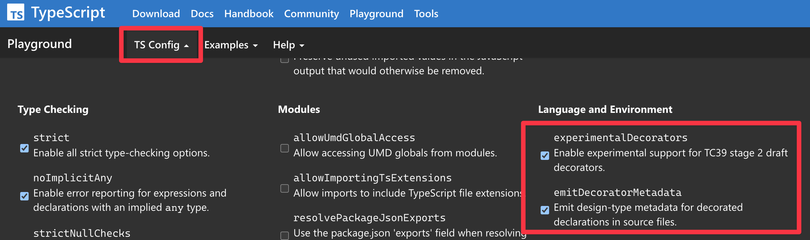

최근 Nest.js의 기본 기능을 직접 구현해보는 스터디를 진행하였다.  
스터디 목표는 Nest.js의 `@Controller`, `@Injectable`, `@Module` 등의 데코레이터를 만들고, DI를 구현해 간단한 API 서버를 올리는 기능을 구현하는 것이었다.  
또한 최대한 Nest.js의 코드를 참고하지 않고 직접 구현해보려고 노력했다.

이 과정에서 의존성 주입을 위한 Injector를 구현하기 위해 특정 클래스가 가지고 있는 의존성을 파악하는 방법을 찾아야했다.  
또한 구현 과정에서 순환참조 문제를 해결해야했고, 이를 위해 Nest.js에서 제공하는 `forwardRef`가 어떤 원리도 동작하는지 알아보았다.

이번 포스트에서는 그 중에서 Injector의 의존성 주입 대상을 찾는 방법을 소개한다.

> 스터디 저장소: https://github.com/joyfulprogrammers/nest-clone

<!--truncate-->

## Injector

Nest.js에서 의존성 주입을 위한 여러 클래스가 존재하는데 그 중의 하나가 Injector이다.  
Injector는 Nest.js의 내장 클래스, 모듈에 등록한 여러 controllers, providers의 인스턴스를 생성한다.  
만약 특정 클래스가 다른 클래스의 인스턴스를 필요로 한다면, Injector는 이를 생성하여 주입한다.

일반적으로 의존성 주입 대상은 생성자의 파라미터를 통해 지정하는데, 다음과 같은 코드를 자주 보았을 것이다.

```ts
import { Injectable } from "@nestjs/common";

@Injectable()
export class UserRepository {}

@Injectable()
export class UserService {
  constructor(private readonly userRepository: UserRepository) {}
}
```

위 코드에서 다음과 같은 의문이 생길 수 있다.

> Nest.js는 어떻게 `UserService`의 생성자 파라미터가 `UserRepository`인지 알 수 있을까?

소스코드 레벨에서는 생성자 파라미터 타입이 `UserRepository`인 것을 알 수 있지만, 런타임에서는 해당 파일이 JavaScript로 컴파일되어 실행하므로 타입에 대한 정보가 사라진다.  
실제로 위 코드에서 `@Injectable()` 데코레이터를 제거하고 컴파일한 결과를 확인해보면 다음과 같다.

```js
"use strict";
class UserRepository {}
class UserService {
  constructor(userRepository) {
    this.userRepository = userRepository;
  }
}
```

위와 같은 코드에서는 파라미터의 변수명만 남아있고 어떤 인스턴스를 주입해야하는지 알 수 있는 정보가 없다.

## reflect-metadata

`reflect-metadata`는 클래스, 속성, 매개변수 등에 메타데이터를 추가할 수 있도록 도와주는 라이브러리이다.  
ES6에 추가된 `Reflect` 객체를 확장해 메타데이터를 다룰 수 있는 메소드를 제공한다.  
여기서 말하는 메타데이터의 예로 클래스 메소드, 생성자의 파라미터 타입, 반환 타입이 있다.  
이러한 데이터는 **런타임에서 클래스의 프로퍼티나 메소드의 타입정보**를 알 수 있도록 도와준다.

이 라이브러리는 `class-transformer`, `TypeORM`, `TSyringe` 등의 데코레이터 기반 라이브러리에서 주로 사용하는 것을 확인할 수 있다.  
위 라이브러리의 설치 가이드 문서를 보면 보통 다음과 같은 안내사항이 있다.

- 진입부 파일 상단에 다음 코드를 추가한다.

```ts
import "reflect-metadata";
```

- `tsconfig.json`의 `compilerOptions`에 `experimentalDecorators`와 `emitDecoratorMetadata`를 활성화한다.

```json
{
  "compilerOptions": {
    "experimentalDecorators": true,
    "emitDecoratorMetadata": true
  }
}
```

`experimentalDecorators`는 이름 그대로 실험적인 기능인 데코레이터를 사용할 수 있도록 해주는 옵션이라는 것을 알 수 있다.  
하지만 `emitDecoratorMetadata`가 어떤 역할을 하고 `reflect-metadata`를 import 해야하는 이유를 파악하기는 어렵다.  
이에 대한 내용을 소개하기 전에 먼저 데코레이터에 대해 알아보자.

## 데코레이터

데코레이터는 클래스, 속성, 메소드, 매개변수 등에 추가적인 정보를 부여하기 위해 사용하는 기능이다.  
데코레이터는 `@` 기호를 사용하여 적용할 수 있으며, **파일 로드 시 즉시 실행되는 함수**라고 생각하면 된다.

```ts
const classDecorator: ClassDecorator = (target) => {
  console.log("class decorator", target.prototype);
};

const methodDecorator: MethodDecorator = (target, propertyKey) => {
  console.log("method decorator", target, propertyKey);
};

const propertyDecorator: PropertyDecorator = (target, propertyKey) => {
  console.log("property decorator", target, propertyKey);
};

const parameterDecorator: ParameterDecorator = (
  target,
  propertyKey,
  parameterIndex
) => {
  console.log("parameter decorator", target, propertyKey, parameterIndex);
};

@classDecorator
class TestClass {
  @propertyDecorator
  public testProperty: string;

  @methodDecorator
  public testMethod(@parameterDecorator testParameter: string): string {
    return testParameter;
  }
}
```

해당 코드를 [TypeScript Playground](https://www.typescriptlang.org/play)에서 실행해보면 다음과 같은 결과를 확인할 수 있다.

```
[LOG]: "property decorator",  TestClass: {},  "testProperty"
[LOG]: "parameter decorator",  TestClass: {},  "testMethod",  0
[LOG]: "method decorator",  TestClass: {},  "testMethod"
[LOG]: "class decorator",  TestClass: {}
```

상단에 선언한 데코레이터들은 사실상 모두 함수이며 클래스의 특정 위치에 `@` 기호를 사용하여 적용하였다.  
해당 함수를 호출하는 코드가 없음에도 불구하고, 함수가 실행되어 콘솔에 로그가 출력되는 것을 확인할 수 있다.  
각 함수마다 받는 파라미터는 조금씩 다르지만 보통 다음과 같은 정보를 전달받는다.

- `target`: 데코레이터가 적용된 클래스의 prototype 또는 클래스 자체
- `propertyKey`: 데코레이터가 적용된 속성의 이름
- `parameterIndex`: 데코레이터가 적용된 함수, 메소드 매개변수의 위치(0부터 시작)

데코레이터 기반 라이브러리들은 위와 같은 정보를 `reflect-metadata`에서 제공하는 `Reflect.defineMetadata` 메소드를 통해 메타데이터로 저장하기 위해 사용한다.

> Reflect.defineMetadata 대신 자체 내부 전역변수를 사용하는 라이브러리도 있다.

```ts
const injectable: ClassDecorator = (target) => {
  Reflect.defineMetadata(
    "key", // 이후 메타데이터를 가져오기 위해 사용할 키
    "injectable", // 저장할 메타데이터
    target // 메타데이터를 저장할 대상
  );
};
```

위와 같은 코드에서는 `target`에 해당하는 클래스 외에 얻을 수 있는 정보가 없기에 유용한 메타테이터를 저장하기 어렵다.  
그래서 보통 라이브러리들은 **데코레이터를 반환하는 함수를 만들어 해당 함수의 파라미터를 활용해 추가 정보를 사용자가 전달**할 수 있도록 한다.  
다음은 Nest.js의 `@Module` 데코레이터의 예시이다.

```ts
function Module(moduleMetadata: ModuleMetadata): ClassDecorator {
  return (target) => {
    Reflect.defineMetadata("module", moduleMetadata, target);
  };
}

// 라이브러리 사용자가 직접 추가 정보를 전달할 수 있다.
@Module({
  imports: [],
  providers: [],
  controllers: [],
})
class AppModule {}
```

:::info
흔히 Nest.js의 `@Module`, `@Injectable`을 데코레이터라고 부르지만, 엄밀히 말하면 **데코레이터 팩토리**이다.
:::

저장한 메타데이터는 이후 `Reflect.getMetadata` 메소드를 사용해 가져올 수 있다.

```ts
const moduleMetadata = Reflect.getMetadata("module", AppModule);
console.log(moduleMetadata); // { imports: [], providers: [], controllers: [] }
```

## 의존성 정보 저장하기

이제 포스트 초반에 언급한 상황을 생각해보자.

```ts
@Injectable()
export class UserService {
  constructor(private readonly userRepository: UserRepository) {}
}
```

**`UserService` 클래스의 생성자의 첫 번째 파라미터에 `UserRepository`를 주입해야 한다는 정보**를 저장하려면 어떻게 해야할까?

다음과 같은 `@Inject` 데코레이터 팩토리를 생각해 볼 수 있다.

```ts
function Inject(cls: any): ParameterDecorator {
  return (target, propertyKey, parameterIndex) => {
    Reflect.defineMetadata("inject", { parameterIndex, cls }, target);
  };
}

export class UserService {
  constructor(
    // target(UserService)에 "inject"를 키로하는 메타데이터({ parameterIndex: 0, cls: UserRepository }) 를 저장
    @Inject(UserRepository) private readonly userRepository: UserRepository
  ) {}
}
```

이제 `Reflect.getMetadata`를 사용해 해당 정보를 가져올 수 있다.

```ts
const injectMetadata = Reflect.getMetadata("inject", UserService);
console.log(injectMetadata);
// { parameterIndex: 0, cls: [class UsersRepository] }
```

:::info
Nest.js에서는 같은 이름의 `@Inject`데코레이터 팩토리를 제공하며 위 코드에서 `inject`에 해당하는 메타데이터 키를 `SELF_DECLARED_DEPS_METADATA`와 같은 상수로 정의해 사용한다.  
다만 속성 기반 주입같은 기능을 위한 로직이 있어서 위 코드보다 더 복잡하다.
:::

하지만 여전히 `@Inject` 데코레이터 팩토리를 사용하지 않고도 어떻게 의존성 정보를 알아낼 수 있는지는 의문으로 남는다.

## emitDecoratorMetadata

이제 tsconfig.json의 `emitDecoratorMetadata` 옵션을 살펴보자.  
[공식 문서](https://www.typescriptlang.org/tsconfig#emitDecoratorMetadata)를 보면 다음과 같은 설명이 있다.

_Enables experimental support for emitting type metadata for decorators which works with the module reflect-metadata._

설명을 보면 `reflect-metadata` 라이브러리와 함께 사용하는 옵션이며 데코레이터를 위한 타입 메타데이터를 생성한다고 한다.  
여기서 `타입 메타데이터`가 무엇인지 알아보기 위해 [TypeScript Playground](https://www.typescriptlang.org/play)에서 다음과 같은 코드를 작성해 js로 컴파일한 결과를 살펴보자.

```ts
const methodDecorator: MethodDecorator = (target, propertyKey) => {};

class TestClass {
  @methodDecorator
  public testMethod(foo: number, bar: string): boolean {
    return true;
  }
}
```

:::tip
`TS Config` 탭에서 아래 옵션들을 체크해야 한다.

:::

```js
"use strict";
var __decorate =
  (this && this.__decorate) ||
  function (decorators, target, key, desc) {
    // 구현부 코드 생략
  };
// highlight-start
var __metadata =
  (this && this.__metadata) ||
  function (k, v) {
    if (typeof Reflect === "object" && typeof Reflect.metadata === "function")
      return Reflect.metadata(k, v);
  };
// highlight-end
const methodDecorator = (target, propertyKey) => {};
class TestClass {
  testMethod(foo, bar) {
    return true;
  }
}
__decorate(
  [
    methodDecorator,
    // highlight-start
    __metadata("design:type", Function),
    __metadata("design:paramtypes", [Number, String]),
    __metadata("design:returntype", Boolean),
    // highlight-end
  ],
  TestClass.prototype,
  "testMethod",
  null
);
```

> 위 코드에서 음영으로 표시된 부분이 `emitDecoratorMetadata` 옵션을 체크했을 때 추가되는 코드이다.

`__decorate` 함수는 런타임에 즉시 실행되며 첫 번째 파라미터로 전달된 데코레이터들을 차례대로 실행한다.  
함수의 나머지 파라미터로 지정한 값들(`TestClass.prototype`, `"testMethod"`, `null`)은 각 데코레이터를 호출할 때 해당 데코레이터가 요구하는 파라미터의 개수에 맞춰 인자로 전달한다.

`__metadata` 함수는 `Reflect`객체에 `metadata`라는 함수가 존재하는지 확인하고, 존재한다면 `metadata` 함수를 호출한다.  
여기서 `Reflect.metadata`는 `reflect-metadata`에서 제공하는 데코레이터 팩토리이다.  
해당 팩토리가 반환한 데코레이터는 `Reflect.defineMetadata`를 사용해 팩토리의 파라미터로 받은 메타데이터를 저장한다.

여기서 중요한 점은 **`__metadata` 함수는 `reflect-metadata`가 사전에 import 되어있지 않으면 아무런 동작을 하지 않는다**는 것이다.
이것이 바로 데코레이터 기반 라이브러리가 `reflect-metadata`를 사전에 import하도록 안내하는 이유이다.

만약 `reflect-metadata`가 import 되어있는게 확실한 경우라면 다음과 같은 코드를 작성해도 같은 결과를 얻을 수 있다.

```ts
import "reflect-metadata";

const methodDecorator: MethodDecorator = (target, propertyKey) => {};

class TestClass {
  @methodDecorator
  @Reflect.metadata("design:type", Function)
  @Reflect.metadata("design:paramtypes", [Number, String])
  @Reflect.metadata("design:returntype", Boolean)
  public testMethod(foo: number, bar: string): boolean {
    return true;
  }
}
```

`Reflect.metadata`와 팩토리에 전달하는 파라미터는 ts compiler가 **원본 코드에서 데코레이터가 달린항목**에 대해서만 자동으로 생성해준다.  
위 코드에서는 `testMethod`에 `@methodDecorator`가 달려있으므로 생성해주었다.  
어떤 데코레이터냐에 따라 다르지만 보통 다음과 같은 항목을 생성한다.

- `design:type`: 데코레이터가 달린 항목의 타입
- `design:paramtypes`: 메소드의 파라미터 타입들을 담는 배열
- `design:returntype`: 메소드의 반환 타입

이를 통해 다음과 같은 코드를 통해 `testMethod`의 여러 타입정보를 알 수 있다.

```ts
Reflect.getMetadata("design:type", TestClass.prototype, "testMethod");
// Function
Reflect.getMetadata("design:paramtypes", TestClass.prototype, "testMethod");
// [Number, String]
Reflect.getMetadata("design:returntype", TestClass.prototype, "testMethod");
// Boolean
```

만약 생성자 파라미터에 대한 타입 정보를 알고 싶다면 해당 클래스에 `클래스 데코레이터` 또는 생성자에 `파라미터 데코레이터`를 적용한다.  
이를 통해 `Nest.js`의 provider로 등록할 클래스에 `@Injectable`를 붙여야 하는 이유는 **`@Inject`를 사용하지 않은 생성자의 파라미터 타입 정보를 출력하기 위해**서라는 것을 알 수 있다.

```ts
@Injectable()
class TestService {
  constructor(private readonly repository: TestRepository) {}
}
```

```js
TestService = __decorate(
  [
    classDecorator,
    // highlight-next-line
    __metadata("design:paramtypes", [TestRepository]),
  ],
  TestService
);
```

## Injector 코드 살펴보기

이제 `Nest.js`의 `Injector` 클래스가 위 기능을 어떻게 활용하는지 살펴보자.  
해당 클래스에는 `loadInstance`라는 메소드가 있는데, 첫 번째로 파라미터로 받은 `wrapper`에 대한 인스턴스를 생성하고 의존성이 있다면 주입까지 해준다.

:::info
글 작성 시점 [최신커밋](https://github.com/nestjs/nest/blob/85966703ac57a5b263ab5807033f6ac78548c0ef/packages/core/injector/injector.ts) 기준이며 추후 변경될 수 있다.  
이해를 돕기위해 핵심로직을 파악하기 위한 코드만 남기고 나머지는 생략하거나 간략화했다.
:::

```ts
  public async loadInstance<T>(
    wrapper: InstanceWrapper<T>,
    collection: Map<InstanceToken, InstanceWrapper>,
    moduleRef: Module,
    contextId = STATIC_CONTEXT,
    inquirer?: InstanceWrapper,
  ) {
    // 일부 코드 생략
    const callback = async (instances: unknown[]) => {
      // 콜백을 통해 받은 의존성들의 인스턴스를 활용해 wrapper의 인스턴스를 생성한다.
      await this.instantiateClass(
        instances,
        wrapper,
        targetWrapper,
        contextId,
        inquirer,
      );
    };
    // wrapper의 생성자에 지정한 의존성들의 인스턴스를 가져온후 callback으로 넘겨준다.
    await this.resolveConstructorParams<T>(
      wrapper,
      moduleRef,
      inject as InjectionToken[],
      callback,
      contextId,
      wrapper,
      inquirer,
    );
  }
```

`loadInstance`의 핵심기능은 `resolveConstructorParams`을 통해 생성자에 지정한 의존성들의 인스턴스를 가져오고 `instantiateClass`를 통해 wrapper의 인스턴스를 생성하는 것이다.

이제 `resolveConstructorParams`의 코드를 살펴보자.

```ts
  public async resolveConstructorParams<T>(
    wrapper: InstanceWrapper<T>,
    moduleRef: Module,
    inject: InjectorDependency[],
    callback: (args: unknown[]) => void | Promise<void>,
    contextId = STATIC_CONTEXT,
    inquirer?: InstanceWrapper,
    parentInquirer?: InstanceWrapper,
  ) {
    // wrapper의 의존성에 대한 정보를 가져온다.
    const [dependencies] = this.getClassDependencies(wrapper);

    const resolveParam = async (param: unknown, index: number) => {
      // 주어진 parma에 대한 인스턴스를 만든 후 반환하는 코드가 있다.
    };

    // 의존성들의 인스턴스를 가져온다.
    const instances = await Promise.all(dependencies.map(resolveParam));

    // 의존성 인스턴스들을 callback으로 넘겨준다.
    await callback(instances);
  }
```

`getClassDependencies`메소드가 의존성에 대한 타입정보를 가져오는 것으로 유추할 수 있으니, 해당 코드를 살펴보자.

```ts
  public getClassDependencies<T>(
    wrapper: InstanceWrapper<T>,
  ): [InjectorDependency[], number[]] {
    // ctorRef에는 wrapper 클래스의 prototype이 아니라 클래스 그 자체가 할당된다.
    const ctorRef = wrapper.metatype as Type<any>;
    return [
      this.reflectConstructorParams(ctorRef),
      this.reflectOptionalParams(ctorRef),
    ];
  }

  public reflectConstructorParams<T>(type: Type<T>): any[] {
    // highlight-start
    const paramtypes = [
      // PARAMTYPES_METADATA는 'design:paramtypes'를 의미한다.
      ...(Reflect.getMetadata(PARAMTYPES_METADATA, type) || []),
    ];
    // highlight-end
    const selfParams = this.reflectSelfParams<T>(type);

    selfParams.forEach(({ index, param }) => (paramtypes[index] = param));
    return paramtypes;
  }
```

해당 메소드는 `reflectConstructorParams`를 호출하며 해당 메소드를 보면 `Reflect.getMetadata`를 통해 `design:paramtypes`정보를 가져오는 것을 알 수 있다.

## 더 읽을거리

### useFactory

Nest.js는 커스텀 프로바이더를 위한 여러 옵션을 제공하는데 그 중 하나가 `useFactory`이다.  
의존성 인스턴스를 만드는 팩토리 함수를 직접 지정할 때 사용하며 다음과 같은 형태로 사용한다.

```ts
@Module(
  providers: [
    {
      provide: SlackService,
      inject: [ConfigService],
      useFactory: (configService: ConfigService) => {
        return new SlackService(configService.get('SLACK_TOKEN'));
      }
    }
  ]
)
class AppModule {}
```

`useFactory`에 지정한 함수는 파라미터를 통해 인스턴스를 만들기 위해 필요한 의존성을 주입받을 수 있다.  
이 경우 `inject`옵션을 추가로 사용해 `[ConfigService]`를 넣어주어야 하며 그렇지 않으면 에러가 발생한다.

클래스의 생성자에는 특별한 경우가 아니라면 `@Inject`를 사용하지 않아도 되지만, `useFactory`에서는 `inject`옵션이 필수인 이유를 지금까지 살펴본 내용을 통해 이해할 수 있다.  
바로 `useFactory`에 지정한 팩토리는 **데코레이터를 달 수 없는 일반 함수이고 따라서 런타임에 파라미터의 타입정보를 알 수 없기 때문**이다.

### emitDecoratorMetadata의 제약사항

지금까지 `emitDecoratorMetadata`옵션을 통해 여러 타입정보를 추가해주는 것을 살펴보았는데 몇 가지 한계가 존재한다.

- `union type`을 사용한 경우 `Object` 타입으로 출력한다.
- `utility type`, `generic type`을 사용한 경우 `Object` 타입으로 출력한다.
- Promise, Array타입을 사용한 경우 내부 타입에 대한 정보는 추가하지 않는다.

다음과 같은 코드를 살펴보자.

```ts
const methodDecorator: MethodDecorator = () => {}

class A {}

class Test {
  @methodDecorator
  method(
    a: string | number,
    b: Promise<string>,
    c: Array<string>,
    d: number[],
    e: Partial<A>
  ) {}
}
```

컴파일한 결과는 다음과 같다.

```js
__decorate([
    methodDecorator,
    __metadata("design:type", Function),
    // highlight-next-line
    __metadata("design:paramtypes", [Object, Promise, Array, Array, Object]),
    __metadata("design:returntype", void 0)
], Test.prototype, "method", null);
```

`design:paramtypes` 항목을 보면 정확한 타입정보를 출력해주지 않는 것을 알 수 있다.  
이러한 문제로 인해 데코레이터 기반 라이브러리는 팩토리 파라미터에 타입정보를 사용자가 지정하도록 안내한다.

- class-transformer: `@Type(() => User)`
- @nestjs/swagger: `@ApiProperty({ type: () => User })`
- TypeORM: `@Column({ type: 'timestamp' })`
- MikroORM: `@Property({ type: 'date' })`

### TypeScript 5.0 Decorator

최근 TypeScript 5.0 이상에서는 새로운 형태의 데코레이터를 지원한다.  
하지만 이번 포스트에서는 해당 내용을 다루지는 않았는데 다음과 같은 이유 때문이다.

- 메소드 파라미터 데코레이터 미지원
- `emitDecoratorMetadata` 옵션 미지원

메소드 파라미터 데코레이터는 현재 `ECMAScript proposals stage 0` 단계에 있기에 미래에 지원될 가능성이 있다.  
하지만 `emitDecoratorMetadata` 옵션을 지원하지 않기에, 사용자가 명시적으로 타입을 지정해주지 않는 이상 런타임에 타입정보를 알 수 있는 방법이 없는 상태이다.  
이러한 이유로 Nest.js에서는 기존 형태의 데코레이터를 여전히 사용할 것으로 예상한다.
