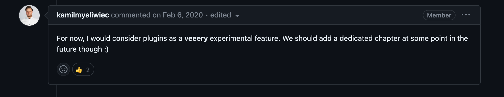

Nest.js 공식문서를 살펴보면 REST, GraphQL, WebSocket 등 다양한 기능을 제공하는걸 알 수 있다.  
하지만 공식문서에는 없는 작지만 숨겨진 기능들이 존재한다.  
이번 포스트에서는 이러한 기능 중 하나인 CLI Plugin에 대한 소개와 직접 플러그인을 만드는 방법을 소개한다.

<!--truncate-->

## CLI Plugin 공식문서

Nest.js의 공식문서에는 `CLI Plugin`이라는 제목을 가진 두 개의 문서가 존재한다.

- [openapi/cli-plugin](https://docs.nestjs.com/openapi/cli-plugin)
- [graphql/cli-plugin](https://docs.nestjs.com/graphql/cli-plugin)

`@nestjs/swagger`와 `@nestjs/graphql` 패키지를 설치하면 사용할 수 있는 기능이다.  
문서를 살펴보면 요청이나 응답 DTO를 선언할 때 각 프로퍼티에 필수로 작성하는 데코레이터를 생략할 수 있게 해준다고 한다.  
예를 들면 swagger를 사용할 때 다음과 같이 작성해야 하는 코드를

```ts
export class CreateUserDto {
  @ApiProperty()
  email: string;

  @ApiProperty()
  password: string;

  @ApiProperty({ enum: RoleEnum, default: [], isArray: true })
  roles: RoleEnum[] = [];

  @ApiProperty({ required: false, default: true })
  isEnabled?: boolean = true;
}
```

아래와 같이 더 간결하게 작성할 수 있다.

```ts
export class CreateUserDto {
  email: string;
  password: string;
  roles: RoleEnum[] = [];
  isEnabled?: boolean = true;
}
```

공식문서에는 각 CLI Plugin의 사용법만 소개하며, 직접 플러그인을 만드는 방법은 나와있지 않다.  
GihHub 이슈를 살펴보면 커스텀 플러그인을 만드는 방법에 대한 문서를 제공하면 좋겠다는 요청이 있다.

https://github.com/nestjs/docs.nestjs.com/issues/975

2020년에 올라온 이슈이지만 아직 해결되지 않았고, 메인테이너는 이 기능이 매우 실험적이며 추후 문서를 제공할 예정이라는 답변을 달았다.



최근에 개발한 [라이브러리](https://github.com/r2don/nest-http-interface)에 이 기능을 적용해볼 수 있겠다는 생각이 들었다.  
이 라이브러리도 swagger처럼 각 메서드에 특정 데코레이터를 넣어주어야 하는데, CLI Plugin을 직접 만들어 적용하면 이 과정을 생략할 수 있을 것 같았다.  
이를 위해 Nest.js 코드를 분석해 직접 플러그인을 만들었으며, 이번 포스트에서 그 과정을 공유하고자 한다.

> 만약 추후에 공식문서가 업데이트 된다면 이 포스트 대신 공식문서를 참고하도록 하자.

## AST Transformer

본격적인 내용에 앞서 Nest.js 공식문서에서 언급하는 CLI Plugin이 어떤 역할을 하는지 살펴보자.

플러그인이 동작하는 시점은 `nest build` 명령어를 실행할 때로, TypeScript로 작성한 코드를 JavaScript로 변환하기 이전 또는 이후에 특정 변환작업을 수행한다.  
`@nestjs/graphql`, `@nestjs/swagger` 패키지에서 제공하는 CLI Plugin들은 모두 우리가 작성한 DTO 파일 코드를 변환하며, 그 결과를 JavaScript로 트랜스파일을 수행한다.

이러한 변환작업은 TypeScript AST를 사용해 수행한다.  
AST는 Abstract Syntax Tree의 약자로, 코드를 추상화한 트리 구조를 의미한다.  
TypeScript 컴파일러는 작성한 코드를 AST로 변환한 뒤, 이를 기반으로 트랜스파일을 수행한다.

CLI Plugin은 TypeScript의 내장 컴파일러 API를 활용해 원본 AST를 변환하는 기능(transformer)을 제공한다.  
따라서 CLI Plugin을 만들기 위해서는 TypeScript AST에 대한 이해가 필요하다.

:::info
TypeScript AST와 transform에 대해 더 자세히 알고 싶다면 다음 링크를 참고하자.

- [TypeScript Compiler Internals](https://basarat.gitbook.io/typescript/overview)
- [typescript-transformer-handbook](https://github.com/itsdouges/typescript-transformer-handbook)

:::

사실 npm에는 AST transformer를 쉽게 만들 수 있도록 도와주는 패키지가 존재한다.

- ttypescript (deprecated): https://github.com/cevek/ttypescript
- ts-patch: https://github.com/nonara/ts-patch

CLI Plugin은 이러한 패키지 도움없이 Nest.js를 사용하는 프로젝트에서 AST tansformer를 제공한다고 생각하면 된다.

## CLI Plugin 코드분석

이제 커스텀 플러그인을 만들기 위해 Nest.js 코드를 분석해보자.

> 글 작성 시점의 Nest.js 코드를 기준으로 설명하므로 미래에 변경될 수 있다.

### 저장소

먼저 Nest.js 프로젝트를 빌드할 때 사용하는 `nest build` 명령어가 수행하는 코드가 어디에 있는지 찾아보자.  
Nest.js는 여러 GitHub 저장소로 구성되어 있기에, 어떤 저장소를 찾아야 하는지 알아야 한다.

공식문서를 보면 `nest` 명령어를 사용하려면 `@nestjs/cli` 패키지를 설치해야 한다고 한다.  
따라서 [nestjs/nest-cli](https://github.com/nestjs/nest-cli) 저장소를 살펴봐야 한다는 것을 알 수 있다.  
해당 저장소에서 `plugin`으로 파일명을 검색하면 [plugins-loader.ts](https://github.com/nestjs/nest-cli/blob/master/lib/compiler/plugins/plugins-loader.ts) 파일을 찾을 수 있다.

### plugins-loader.ts

이 파일은 `PluginsLoader` 클래스와 `load` 메서드가 있는데 이름에서 알 수 있듯이 플러그인을 로드하는 역할을 한다.  
`load` 메서드의 인자는 총 두 개로 중요한 부분은 첫 번째 인자인 `PluginEntry[]`이다.

```ts
export class PluginsLoader {
  public load(
    plugins: PluginEntry[] = [],
    extras: { pathToSource?: string } = {},
  );
}
```

해당 파일에 `PluginEntry`의 정의도 존재한다.

```ts
type PluginEntry = string | PluginAndOptions;
type PluginOptions = Record<string, any>;

interface PluginAndOptions {
  name: "string";
  options: PluginOptions;
}
```

해당 타입을 보면 CLI Plugin 공식문서에 안내하는 플러그인 설정값과 동일하다는 것을 알 수 있다.  
바로 `nest-cli.json` 파일의 `compilerOptions.plugins`의 값의 타입이 `PluginEntry[]`이다.
즉 `load` 메서드는 `nest-cli.json` 파일의 `compilerOptions.plugins`의 값을 참고해 각 플러그인을 로드한다.

```json title="부가 옵션 없음"
{
  "collection": "@nestjs/schematics",
  "sourceRoot": "src",
  "compilerOptions": {
    "plugins": ["@nestjs/swagger"]
  }
}
```

```json title="부가 옵션 존재"
{
  "collection": "@nestjs/schematics",
  "sourceRoot": "src",
  "compilerOptions": {
    "plugins": [
      {
        "name": "@nestjs/swagger",
        "options": {
          "classValidatorShim": false,
          "introspectComments": true
        }
      }
    ]
  }
}
```

플러그인을 로드하는 핵심코드는 `PluginsLoader` 클래스의 `resolvePluginReferences` private 메서드에 존재한다.

```ts
const PLUGIN_ENTRY_FILENAME = "plugin";

class PluginsLoader {
  private resolvePluginReferences(pluginNames: string[]): NestCompilerPlugin[] {
    const nodeModulePaths = [
      join(process.cwd(), "node_modules"),
      ...module.paths,
    ];

    return pluginNames.map((item) => {
      try {
        try {
          const binaryPath = require.resolve(
            join(item, PLUGIN_ENTRY_FILENAME),
            {
              paths: nodeModulePaths,
            },
          );
          return require(binaryPath);
        } catch {}

        const binaryPath = require.resolve(item, { paths: nodeModulePaths });
        return require(binaryPath);
      } catch (e) {
        throw new Error(`"${item}" plugin is not installed.`);
      }
    });
  }
}
```

해당 메서드는 `compilerOptions.plugins`의 값에서 추출한 플러그인 이름을 인자로 받아 `require` 함수를 통해 코드를 가져온다.  
어떤 경로로 가져오는지 살펴보면 우선 현재 디렉터리의 `node_modules` 디렉터리와 `module.paths` 값 기준으로 `플러그인 이름/plugin` 또는 `플러그인 이름`으로 찾는다.  
즉 **플러그인 이름을 가진 디렉터리가 `node_modules` 하위에 존재해야 하며, `plugin.js` 또는 `index.js` 파일이 플러그인의 진입점**이 된다.

### plugin.js

실제로 [nestjs/swagger](https://github.com/nestjs/swagger) 저장소의 루트에는 `plugin.js` 파일이 존재하는 것을 확인할 수 있다.

```js title='plugin.js'
"use strict";
function __export(m) {
  for (var p in m) if (!exports.hasOwnProperty(p)) exports[p] = m[p];
}
exports.__esModule = true;
const plugin = require("./dist/plugin");
__export(plugin);

/** Compatibility with ts-patch/ttypescript */
exports.default = (program, options) => plugin.before(options, program);
```

해당 파일의 주 내용은 `dist/plugin` 모듈을 export하는 것이다.  
즉 `dist/plugin/index.js` 파일이 필요한데 저장소에 해당 파일과 매칭하는 `lib/plugin/index.ts` 파일이 존재한다.  
이 파일은 다시 `lib/plugin/compiler-plugin.ts` 파일을 export하는데, 바로 이 파일에 플러그인 메인 로직이 존재한다.  
이처럼 플러그인 로직은 TypeScript로 적성하며 JavaScript로 빌드한 결과를 `plugin.js`가 export하는 구조를 가진다.

### NestCompilerPlugin

`plugin.js`가 어떤 요소를 export 해야하는지 확인하려면 `resolvePluginReferences` 메서드의 반환값을 살펴보면 된다.  
반환 타입은 `NestCompilerPlugin[]`이며 다음과 같다.

```ts title="plugins-loader.ts"
import * as ts from "typescript";

type Transformer = ts.TransformerFactory<any> | ts.CustomTransformerFactory;

export interface NestCompilerPlugin {
  before?: (options?: PluginOptions, program?: ts.Program) => Transformer;
  after?: (options?: PluginOptions, program?: ts.Program) => Transformer;
  afterDeclarations?: (
    options?: PluginOptions,
    program?: ts.Program,
  ) => Transformer;
}
```

`plugin.js`는 `before`, `after`, `afterDeclarations` 라는 이름의 함수를 export해야 한다.  
각 항목이 필수요소는 아니지만, 전부 export 하지 않았다면 빌드 시 다음과 같은 에러가 발생한다.

```
The "플러그인 이름" plugin is not compatible with Nest CLI.
Neither "after()" nor "before()" nor "afterDeclarations()" function have been provided.
```

해당 에러를 발생하는 코드도 `plugins-loader.ts` 파일에 존재한다.

```ts
pluginRefs.forEach((plugin, index) => {
  if (!plugin.before && !plugin.after && !plugin.afterDeclarations) {
    throw new Error(CLI_ERRORS.WRONG_PLUGIN(pluginNames[index]));
  }
  // 생략
}
```

따라서 커스텀 CLI Plugin을 만들려면 위 세 함수 중 하나 이상을 `NestedCompilerPlugin` 인터페이스에 맞춰 구현한 후 `plugin.js` 파일에서 export 해야 한다.

### transformer

각 함수는 동일한 인자를 가지는데 첫 번째는 앞서 소개한 플러그인의 부가 옵션값인 `PluginOptions`이고, 두 번째는 TypeScript 컴파일러 API를 사용하기 위한 `ts.Program` 객체이다.

함수의 반환 타입은 `Transformer`인데 이는 `typescript` 패키지에서 제공하는 `TransformerFactory` 또는 `CustomTransformerFactory` 타입이다.  
두 가지 타입의 union 이지만 Nest.js에서 제공하는 플러그인은 모두 `TransformerFactory` 타입을 반환한다.  
`TransformerFactory`는 AST transformer를 생성하는 함수이며 `typescript` 패키지의 `CustomTransformers` 타입정의를 통해 그 역할을 확인할 수 있다.

```ts title="typescript.d.ts"
interface CustomTransformers {
  /** Custom transformers to evaluate before built-in .js transformations. */
  before?: (TransformerFactory<SourceFile> | CustomTransformerFactory)[];
  /** Custom transformers to evaluate after built-in .js transformations. */
  after?: (TransformerFactory<SourceFile> | CustomTransformerFactory)[];
  /** Custom transformers to evaluate after built-in .d.ts transformations. */
  afterDeclarations?: (
    | TransformerFactory<Bundle | SourceFile>
    | CustomTransformerFactory
  )[];
}
```

CLI Plugin의 세 함수와 동일한 이름을 가지며 각 함수가 사용되는 시점은 다음과 같다.

- before: TypeScript 컴파일러가 JavaScript로 트랜스파일하기 이전에 실행
- after: TypeScript 컴파일러가 JavaScript로 트랜스파일한 뒤 실행
- afterDeclarations: TypeScript 컴파일러가 `.d.ts` 파일을 생성한 뒤 실행

`TransformerFactory`의 정의도 해당 파일에 존재한다.

```ts title="typescript.d.ts"
/**
 * A function that is used to initialize and return a `Transformer` callback, which in turn
 * will be used to transform one or more nodes.
 */
type TransformerFactory<T extends Node> = (
  context: TransformationContext,
) => Transformer<T>;
/**
 * A function that transforms a node.
 */
type Transformer<T extends Node> = (node: T) => T;
```

`TransformerFactory`는 `Transformer`라는 함수를 반환하는 고차함수라 복잡할 수 있는데, 그냥 `TransformerContext`와 `Node`를 인자로 받아 `Node`를 반환하는 함수라고 생각하면 된다.  
여기서 말하는 `Node`는 TypeScript AST의 노드를 의미한다.

> `TransformerContext`는 transformer를 구현할 때 필요한 유용한 정보를 제공하는 객체이다.

`CustomTransformers`의 각 옵션을 보면 이 Node 타입을 `SourceFile`로 명시하고 있다.  
즉 AST transformer는 `SourceFile`를 인자로 받아 `SourceFile`를 반환하는 함수라고 할 수 있다.  
따라서 이 함수는 빌드 과정에서 트랜스파일 대상에 해당하는 모든 TypeScript 파일에 대해 각각 실행된다.

### 필터링

사실 대부분의 경우 모든 TypeScript 파일에 대해 AST transformer를 실행할 필요가 없다.
Nest.js의 두 CLI Plugin도 특정 DTO 파일에만 적용할 수 있는데, 이를 플러그인의 부가 옵션으로 제공한다.

```json
{
  "compilerOptions": {
    "plugins": [
      {
        "name": "@nestjs/swagger",
        "options": {
          "dtoFileNameSuffix": [".dto.ts", ".entity.ts"]
        }
      }
    ]
  }
}
```

`nestjs/swagger` 저장소의 `lib/plugin/compiler-plugin.ts` 파일의 `before` 함수를 확인하면 어떻게 필터링을 적용하는지 알 수 있다.  
`before` 함수의 첫 번째 인자를 통해 플러그인 옵션을 파싱하고 `SourceFile`의 `fileName`을 통해 조건에 만족하는지 확인해 필터링을 적용한다.

```ts title="compiler-plugin.ts"
export const before = (options?: Record<string, any>, program?: ts.Program) => {
  options = mergePluginOptions(options);

  return (ctx: ts.TransformationContext): ts.Transformer<any> => {
    return (sf: ts.SourceFile) => {
      // 파일명이 특정 조건에 만족하는 경우에만 transformer 실행
      if (isFilenameMatched(options.dtoFileNameSuffix, sf.fileName)) {
        return modelClassVisitor.visit(sf, ctx, program, options);
      }
      // 만족하지 않으면 원본 AST 그대로 반환
      return sf;
    };
  };
};
```

## 예제

이제 직접 CLI Plugin을 사용하는 예제 프로젝트를 만들어보자.

`nest-cli`는 기본적으로 `node_modules` 기준으로 플러그인을 찾기 때문에 플러그인 코드를 npm 패키지로 배포하는게 가장 간단하다.  
하지만 이번 예제에서는 npm 패키지를 배포하지 않고 로컬에서 플러그인을 실행하는 방법을 소개한다.

> 예제 코드는 [GitHub](https://github.com/jbl428/study-note/tree/master/nodejs/nestjs-cli-plugin)에 올려두었다.

### 프로젝트 생성

먼저 Nest.js 프로젝트를 생성한다.

```bash
nest new nestjs-cli-plugin
```

> 명령어를 실행하면 패키지 관리자를 선택해야 하는데 어떤 것을 선택해도 상관없다.

### 로컬 플러그인 설정

프로젝트 루트에 `plugin` 디렉터리에 생성하고 이곳에 플러그인 코드를 작성할 예정이다.

```bash
mkdir plugin
```

해당 디렉터리에 TypeScript로 플러그인 로직을 작성하지만 CLI Plugin은 JavaScript로 빌드된 코드를 사용해야 한다.  
이를 위해 프로젝트 루트에 플러그인 용 tsconfig 파일을 생성한다.

```json title="tsconfig.plugin.json"
{
  "extends": "./tsconfig.json",
  "compilerOptions": {
    "outDir": "./node_modules/my-plugin"
  },
  "files": [
    "plugin/index.ts",
    "plugin/compiler-plugin.ts"
  ]
}
```

`plugin` 디렉터리의 `index.ts`와 `compiler-plugin.ts` 파일을 빌드하며, 결과물은 `node_modules/my-plugin` 디렉터리에 생성하는 설정이다.  
플러그인 이름은 `my-plugin` 으로 설정된다.

:::caution
플러그인 이름은 외부 패키지와 중복되지 않도록 주의해야 한다.  
만약 node_modules에 플러그인을 빌드하는 방식이 이상하게 느껴진다면, 우선 다른 디렉터리에 빌드하고 `node_modules`에 링크하는 방식을 사용해도 된다.  

관련 문서: https://stackoverflow.com/questions/14381898/local-dependency-in-package-json
:::

:::tip
`plugin` 디렉터리가 기존 Nest.js 빌드대상에 포함하지 않도록 하기위해 `tsconfig.build.json` 파일에 `exclude` 옵션을 추가할 수도 있다.

```json title="tsconfig.build.json"
{
  "extends": "./tsconfig.json",
  "exclude": ["node_modules", "test", "dist", "**/*spec.ts", "plugin"]
}
```
:::

### 플러그인 연동

`nest-cli`가 커스텀 플러그인을 실행하기 위해 `nest-cli.json` 파일을 수정한다.

```json title="nest-cli.json"
{
  "$schema": "https://json.schemastore.org/nest-cli",
  "collection": "@nestjs/schematics",
  "sourceRoot": "src",
  "compilerOptions": {
    "deleteOutDir": true,
    "plugins": [
      {
        "name": "my-plugin",
        "options": {
          "option1": true,
          "option2": "value"
        }
      }
    ]
  }
}
```

`compilerOptions.plugins`에 플러그인 이름과 부가 옵션을 넣어주었다.  
`name` 옵션은 `tsconfig.plugin.json` 파일에서 설정한 플러그인 이름과 동일해야 한다.  
`options`는 선택사항으로 플러그인 동작을 제어할 수 있는 옵션값을 넣어준다.

`nest build` 실행 전에 플러그인을 먼저 빌드하기 위해 `package.json` 파일의 `scripts`를 수정한다.

```json title="package.json"
{
  "scripts": {
    "prebuild": "tsc -p tsconfig.plugin.json",
    "build": "nest build"
  }
}
```

### 플러그인 코드

이제 플러그인 코드를 작성한다.  
플러그인은 단순히 `nest-cli.json` 파일에 설정한 옵션을 출력하고 변환을 수행할 각 파일의 경로를 출력한다.

```ts title="plugin/index.ts"
export * from './compiler-plugin';
```

```ts title="plugin/compiler-plugin.ts"
import type ts from 'typescript';

export const before: (
  options: Record<string, any> | undefined,
  program: ts.Program,
) => ts.TransformerFactory<ts.SourceFile> | ts.CustomTransformerFactory = (
  options,
  program,
) => {
  console.log('options', options);

  return (ctx) => {
    return (sourceFile) => {
      console.log('sourceFile', sourceFile.fileName);

      return sourceFile;
    };
  };
};
```

### 실행

이제 `nest build` 명령어를 실행하면 플러그인이 정상적으로 실행되는 것을 확인할 수 있다.

```bash
npm run build
> nest build

options { option1: true, option2: 'value' }
sourceFile /nestjs-cli-plugin/src/app.service.ts
sourceFile /nestjs-cli-plugin/src/app.controller.ts
sourceFile /nestjs-cli-plugin/src/app.module.ts
sourceFile /nestjs-cli-plugin/src/main.ts
```

주어진 옵션과 프로젝트에 존재하는 각 TypeScript 파일의 경로가 출력되었다.  
이제 `compiler-plugin.ts` 파일을 수정해 각 파일의 AST를 변환하는 코드를 작성하면 된다.

:::tip
Nest.js의 CLI Plugin은 보통 `visitor.ts`로 끝나는 파일에 AST transformer 로직이 존재한다.  
해당 파일들의 코드를 참조하면 어떻게 코드를 작성할지 감을 잡을 수 있다.

- [model-class.visitor.ts (swagger)](https://github.com/nestjs/swagger/blob/master/lib/plugin/visitors/model-class.visitor.ts)
- [model-class.visitor.ts (graphql)](https://github.com/nestjs/graphql/blob/master/packages/graphql/lib/plugin/visitors/model-class.visitor.ts)

:::
